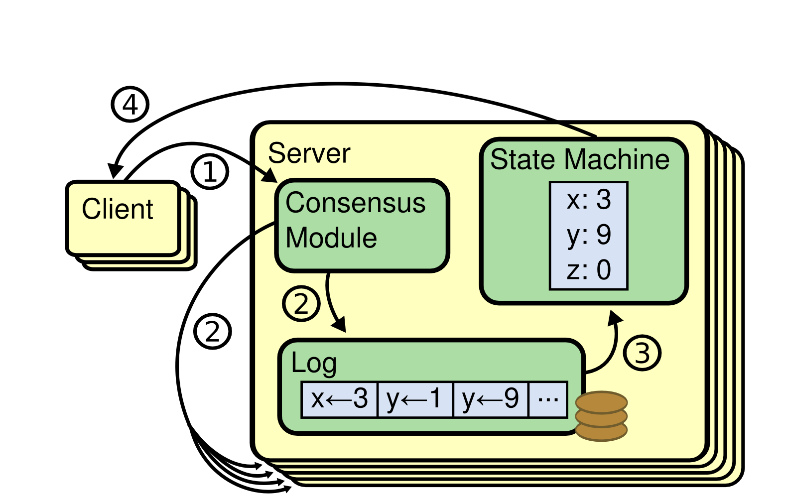

> Ongaro, Diego, and John Ousterhout. "In search of an understandable consensus algorithm." 2014 USENIX annual technical conference (USENIX ATC 14). 2014.

raft is a consensus algorithm for managing a replicated log.

consensus algorithms allow machines to collaborate and survive the failures of some members.

the goal of consensus algorithms is to replicate state.

this is usually done through a log and reproducible computation.

_desirable properties_

- safety: consistency even under network delays, partitions, packet loss, deduplication, reordering.
- availability: fully functional as long as the majority of servers are available.
- independence of timing: logs stay consistent even under extreme message delays.
- performance: a minority of slow servers doesn’t impact overall system performance.

raft is an alternative to paxos that is just as efficient but a lot easier to understand.

_shortcomings of paxos_

- too many states
- symmetric peer-to-peer although it suggests weak-leadership as a possible performance optimization
- hard to understand and implement:
  - **single decree paxos**
    - protocol capable of reading agreement on a single decision (ie. single replicated log entry)
    - very hard to understand, is the only version of paxos described by lamport
  - **multi paxos**
    - multiple instances of the ‘single decree paxos’ for logs
    - inefficient: it’s always faster to elect a leader and then let the leader decide
    - there is no widely agreed upon practical implementation

# raft essentials

_components_

- **leader election**
  - strong leader: log entries only flow from leader to server.
  - election safety: only one leader can be elected per term. election must be done through randomized timers.
  - leader append only: leader only appends own logs and never deletes or overwrites (but it can do so for followers).
  - leader completeness: logs of leaders in next term must be a superset of logs of leaders in previous term.
- **log replication**
  - log matching: log uniqueness identified through index and term.
- **safety**
  - state machine safety: all servers must keep their state machine consistent by applying the exact same log indices in the same order (safety means correctness of results by using the state machine across all servers).
- **membership changes**
  - majorities of two different configurations must overlap during transitions

_server states_

a raft cluster contains multiple servers. each server has a role:

- leader:
  - there is only 1 leader per term
  - the leader is fully responsible for managing the replicated log.
  - clients send log entries to leader, leader replicates them on all servers and tells them when it’s safe to apply the log to their state machines.
  - leader forces others to agree, by replicating state
  - when leader dies, another one gets reelected.
- follower:
  - only respond to leader and candidate requests.
  - if a client requests something from a follower, it gets forwarded to the leader.
- candidate:
  - only exist during leader election, not normal operation.

_terms_

terms are the logical clock for the transitions:

- each term starts with an election.
- if no leader could be elected, then the next term follows immediately.
- the current term gets shared with each message. messages with wrong terms get rejected.

_rpc_

- every operation managed with remote procedure call
- after timeout, procedure gets restarted
- there are 2 procedures in total: `AppendEntries()`, `RequestVote()`

_leader election_

- leaders periodically send `AppendEntries()` heartbeat messages without a message body to maintain authority to all followers
- if followers time out on heartbeat (“election timeout”), they begin an election to choose a new leader:
  1. increment current term
  2. transition to candidate state
  3. vote for self, issue `RequestVote()` to all other servers
  4. wait until:
     - a) you won election
       - the majority of servers sent their single vote to you, you establish authority through heartbeat
     - b) another server establishes itself as the leader
       - you receive heartbeat of the leader with a higher term integer
     - b) timeout occurs
       - everyone times out, increments term, restarts election. timeout length and voting are randomized to prevent this from happening.

_log replication_

1. client sends request to leader.
   - the leader is the clusters’ interface.
   - client requests are commands for the state machine, responses are the result of the state machine.
2. leader sends `AppendEntries()` to replicate state across all machines - repeats if a follower times out.
3. leader waits until the log is committed / the majority have replicated the state
   - requirement: “log matching property”: log entry with same index, date must be identical and have the same predecessors.
   - consistency check: conflicting entries in followers will be overwritten with that of the leader (but a leader can only append it’s own log).
4. leader sends response back to client.

_safety / consistency_

- leader completeness constraint: upon election, leader must hold complete log of all previous terms – when compared to the majority of voters
  - on each `RequestVote()`, voter denies vote if it notices that its own log is more complete, by comparing the term of the last entry
- if a follower fails, the request will be retried indefinitely
  - `AppendEntries()` is idempotent, so receiving the same entry twice won’t have any effect on the second time
- safety doesn’t depend on timing as long as the leader is steady
  - system timing requirement: broadcastTime $\ll$ electionTimeout $\ll$ mtbf
    - broadcastTime (system property) = avg time for leader to receive all responses after parallel request.
    - electionTimeout (can be chosen) = timeout after which followers request a new leader.
    - mtbf (system property) = avg time between failures for a single server.
    - broadcastTime $\ll$ electionTimeout: or else the heartbeat messages won’t be received.
    - electionTimeout $\ll$ mtbf: or else no progress will be made as systems crash before commits.

_cluster membership changes_

- membership changes = machines joining and leaving cluster config (ie. for repair)
- risk: cluster splitting in 2 independent majorities each with their own leader.
- 2 phase design:
  - goal: having 0 downtime with a “joint consensus” phase to transition from the first to the second cluster config.
  - each server transitions individually.
  - any agreement between these phases requires 2 separate majorities.
  - in both phases log entries are replicated to all servers and any machine can be a leader.
