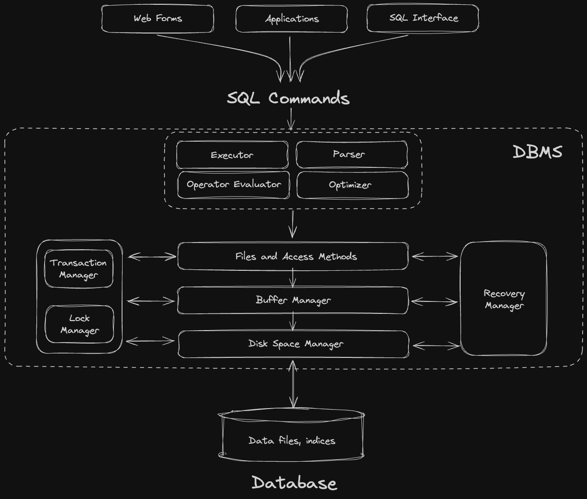
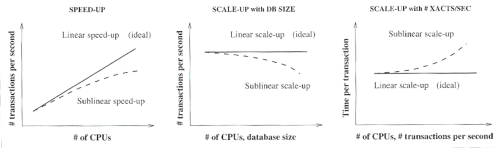

# storage

- https://15445.courses.cs.cmu.edu/fall2022/notes/03-storage1.pdf
- https://15445.courses.cs.cmu.edu/spring2024/schedule.html
- https://stackoverflow.com/questions/977829/linux-direct-access-to-the-hard-disk-in-c

_database_

- shorthand for: database system.
- consists of "**data files**" stored in the external storage.
- the external storage isn’t the database. it provides physical space for the database.

_file_

- shorthand for: data file / database file
- consist of raw data and meta data like tables, indexes, views, etc.
- created, managed and encoded in a way specific to the DBMS.
- persist on the external storage.

_page_

- shorthand for: data page / file page
- not formalized. can mean "an arbitrary number of blocks" or be synonymous with "block". there are 3 concepts of data pages in DBMS:
     - i) hardware page (usually 4 KB) → block.
     - ii) OS page (4 KB)
     - iii) database page (1-16 KB) → if larger than hardware page, it takes more steps to read/write to disk.
- **used to manage the database across one or more files**.
- can be logical store for data or be an indirection layer (index) that maps a page id to a file path and offset (called tuple ids TID, record ids RID).

_block_

- shorthand for: data block
- one data block corresponds to a specific number of bytes of physical space on disk.
- **unit of data that is transferred between disk and the DBMS’s buffer**.

_dbms_

- **disk space manager**:
     - lowest layer in dbms.
     - abstracts over "data files" in physical memory with "pages" that that can be referred to by their page-number.
     - it allocates/deallocates and reads/writes pages.
     - dbms usually provide 2 options:
          - storing data files in the os filesystem → ie. postgres
          - using a so-called "raw partition" on disk that is managed by the dbms itself to directly access the storage device (device management systems in the BIOS) for improved performance → ie. some oracle systems
- **buffer manager**:
     - abstraction: layers above may read/write from/to a page without worrying about whether this page is already available in main memory or has to be loaded yet. also, in case a page has been modified, the layers above do not need to worry about whether and when the modified contents of the page is saved to disk.
     - manages the transfer of blocks between disk and buffer/main memory, when pages are requested.
     - decides which existing pages to replace to make room for a new page (based on a replacement policy, ie. using dirty bits for write back).
- **files and access methods layer**:
     - abstraction: keeps track of which pages belong to a table (or index) and provides access to the records on a page via the RID (record ID, aka TID = tuple id).
     - implements the data structures and algorithms used to store and retrieve data (like b-trees for implementing indexes).
     - allows for high level operations like insert, delete, modify, and read on records.

---

_file organization_

- **file** (table) = list of records
- **record** (row) = tuple of data values
     - record types = standard types (num, char, bool), pointer to blob/clob (binary or character large object) stored in seperate page
     - unordered records = heap files, pile files. fast write, slow read
     - ordered records = slow write, fast read
     - record blocking:
          - $bfr$ = **blocking factor** (records per page)
               - $bfr = R/B$
               - $R$ = fixed record size
               - $B$ = page size
          - unused space: $B - (bfr \cdot R)$ bytes
- **spanned page** = when records are split up and we store pointers to different pages

_magnetic disks_

- **tracks**: concentric circles on disks. each disk has one arm.
- **blocks**: consist of multiple track sectors (circle arcs). the system reads/writes one block at a time.
- **access time**: $t_a = t_s + t_r + t_{tr}$
     - $t_s$ - seek time: moving arm to track
          - $t_{t2t}$ - seek time when switching between 2 tracks = usually ~0.2ms
     - $t_r$ - rotational delay: rotating disk to sector = ~$0.5 \cdot \frac{1}{rpm}$ because we need a half rotation on average
     - $t_{tr}$ - transfer time: reading/writing individual blocks

example:

- question: access time to read 1,000 blocks of size 8kB?
- stats: 4 disks, 8 heads, ~512kB/track, 600GB, 15k rpm, ~3.4ms seek time, 163MB/s transfer rate
- calculation for one block:
     - $t_s$ - seek time: 3.4ms
     - $t_r$ - rotational delay: 0.5 \* (1 / 15,000) \* 60 = 2ms
     - $t_{tr}$ - transfer time: 164MB/s or 164,000kB/s → 8kB block / 164,000s = ~0.049ms
     - total: 5.45ms
- calculation for 1000 blocks:
     - random access: 5.45ms \* 1000 = 5,45s
     - adjacent blocks: $t_s$ + $t_r$ + 1000 $t_{tr}$ + 15 $t_{t2t}$ = 58.4ms
          - assumptions:
               - 64 track sectors = ~512kB / 8kB
               - 16 tracks = 1000 blocks / 64 tracks
               - $t_{t2t}$ = 3.2ms = 0.2ms \* 15 switches

_solid state drives (ssd)_

- interconnected flash memory cards
- low latency: <0.01ms
     - no seek time
     - no rotational delay

_storage hierarchy_

- cpu registers: bytes, <1ns
- caches: kilobytes, megabytes, <10ns
- main memory: gigabytes, 70-100ns
- hard disks: terabytes, 3-10ms
- tape library: petabytes

# indexing

- https://www.postgresql.org/docs/current/sql-createindex.html

_index file_

- why? because pointers require less data than records
- **data file** = full records
- **index file** = tuples with (key value, pointer, anchor)
     - key value = primary keys / secondary keys (**clustering index**) used to order file
     - pointer = physical address to a block (**primary index**) / logical address with indirection (**secondary index**)
     - anchor (optional) = first record on page

_multi level indexes_

- write:
     - add indirection until top level fits on one index page.
- read:
     - single level = $O(log_{\text{2}}(n))$ on a sorted index file of length $n$
     - multi level = $\lfloor O(log_{\text{x}}(n)) \rfloor$ where $\text{x}$ is the branching factor of the tree (for a binary tree it would be 2)
- possible optimizations: sorting lexicographically, using multiple attributes

_index sequential access method ISAM_

- proprietary indexing method developed by IBM for mainframes
- single level: key, value (pointer to file page)
- multi level: static tree
     - if not enough space on write, add "overflow pages" to each note (search performance will degrade)

_b+tree_

- properties:
     - in practice only the b+tree is used, not the btree
     - always balanced, all leafs are same depth, log time read/write/delete, ≥50% node utilization (except the root node)
- internal node: $<P_1, K_1, \dots, P_{q-1}, K_{q}>$
     - tree of order $p$ means $q \leq p$. in this course we determine the node size by num of keys.
     - $K_i$ = key values (determins)
     - $P_i$ = pointer to subtree, with keys in range $[K_i, K_{i+1})$
- leaf node: $<<K_1,RID_1>, \dots, <K_i, RID_j>>$
     - $RID_i$ = id pointing to data records like: $<K_i, \text{record}_i>$
     - leafs also are connected as a doubly linked list
     - leafs can have data records or pointers to data pages
- search:
     - in this course: left $<$, right $\geq$
- add:
     - if page has too many ($\geq p$) keys: split
          1. determine key to split pages with $p/2$ entries.
          2. insert that new key with pointers to the 2 new pages in parent (might need to split pages recursively, but bounded by $\log$)
- remove:
     - if page has too little ($< p/2$) keys: merge
          1. steal value from neighbour, update parent
          2. if neighbour too small: merge, update parent
     - in practice: limited num of merges, only a flag gets set

_hash based indexes_

- hashmap with diskpages/buckets and linked list with buckets as nodes for collsions

_bitmap indexes_

- one bit for each address

_function indexes_

- use function to change key space

_implementation in postgres_

- keys autogenerated for each primary / secondary key
- index types: https://www.postgresql.org/docs/current/sql-createindex.html
     - `btree` is b+tree
     - `hash` is hash based index
     - bitmap index is sometimes generated for specific queries
     - each can change performance

# relational algebra

_relational algebra expressions_

- columns are attributes
- rows are tuples
- relations are sets of tuples in RA, but multisets / bags that can have duplicate entries in SQL
- basics:
     - $\sigma_{\text{p}}(\text{R})$ · **selection** → filter rows
     - $\pi_{\text{S}}(\text{R})$ · **projection** → filter columns
     - $\text{R}_1\times\text{R}_2$ · **cartesian product** → all possible tuple combinations in both sets
     - $\rho_V(\text{R}),\rho_{\text{A}\leftarrow\text{B}}(\text{R})$ · **renaming**
     - $\text{R}_1\cup\text{R}_2$ · **union** → merge all rows. both sets must have same columns
     - $\text{R}_1-\text{R}_2$ · **difference**
- derived:
     - $\text{R}_1\cap\text{R}_2$ · **intersection** → is equivalent to $\text{R}_1-(\text{R}_1-\text{R}_2)$
     - $\text{R}_1\div\text{R}_2$ · **division**
          - all tuples $t$ (from columns that are in $\text{R}_1$ but not in $\text{R}_2$) where $(t \times \text{R}_2) \in \text{R}_1$
          - $R(X,Y)\div S(Y)$ is equivalent to:
               - $=\pi_X(R\cap(\pi_X( R)\times S))$
               - $=\pi_X(R)-\pi_X\left(\left(\pi_X(R)\times S\right)-R\right)$
     - $\text{R}_1\bowtie\text{R}_2$ · **natural join** → match on common columns, take columns from both sides
     - $\text{R}_1\bowtie_{\theta}\text{R}_2$ · **theta join** → means $\sigma_{\theta}(\text{R}_1 \times \text{R}_2)$
     - $\text{R}_1\bowtie_{\theta}\text{R}_2$ · **equi join** → theta join where theta operation $\in \{=, \land \}$
     - $\text{R}_1\bowtie_{\theta}\text{R}_2$ · **non equi join** → theta join where theta operation $\in \{<. >, \leq, \geq, \neq\}$
     - $\text{R}_1\ltimes\text{R}_2$ or $\text{R}_1\rtimes\text{R}_2$ · **semi join** → means $\pi_{\text{R}_1} | \pi_{\text{R}_2} (\text{R}_1\bowtie\text{R}_2)$
     - $\text{R}_1\overline{\ltimes}\text{R}_2$ or $\text{R}_1\overline{\rtimes}\text{R}_2$ · **anti join** → means $\text{R}_1 | \text{R}_2 - (\text{R}_1\bowtie\text{R}_2)$
     - $\text{R}_1$ ⟕ $\text{R}_2$ or $\text{R}_1$ ⟖ $\text{R}_2$ · **outer join** → means $\bowtie$ with `NULL` for missing columns for one side
     - $\text{R}_1$ ⟗ $\text{R}_2$ · **full outer join** → means $\bowtie$ with `NULL` for missing columns for both sides
     - $\text{R}_1$ ⟗$_\theta$ $\text{R}_2$ · **theta outer join** → means $\sigma_{\theta}(\text{R}_1$ ⟗ $\text{R}_2)$
     - $\text{R}_1$ ⟗$_\theta$ $\text{R}_2$ · **equi outer join** → theta outer join where $\theta$ only consists of $\{=, \land \}$

_relational algebra equivalences_

- **cascading selections**: $\sigma_{c_1\wedge c_2\wedge...\wedge c_n}(R)\equiv\sigma_{c_1}(\sigma_{c_2}(...(\sigma_{c_n}(R))...))$
- **commutation laws**:
     - single operator
          - $R\times S\equiv S\times R$
          - $R\cup S\equiv S\cup R$
          - $R\cap S\equiv S\cap R$
          - $R\bowtie S\equiv S\bowtie R$
          - $R\Join_{\theta}S\equiv S\Join_{\theta}R$
     - combined operators
          - $\sigma_{c_1}(\sigma_{c_2}(R))\equiv\sigma_{c_2}\left(\sigma_{c_1}(R)\right)$
          - $\sigma_C(\pi_L(R))\equiv\pi_L\left(\sigma_C(R)\right)$
          - $\sigma_c(R\bowtie_\theta S)\equiv\sigma_c(R)\bowtie_\theta S$
          - $\pi_L({R}\bowtie_\theta S)\equiv\pi_{L_1}(R)\bowtie_\theta\pi_{L_2}(S)$ assuming that $L=L_1\cup L_2$
          - $\pi_L({R}\bowtie_\theta S)\equiv\pi_L(\pi_{L_1,M_1}(R)\bowtie_\theta\pi_{L_2,M_2}(S))$ assuming that $L=L_1\cup L_2$ → you can discard unnecessary projections for joins
- **associativity laws**:
     - $(R\times S)\times T\equiv R\times(S\times T)$
     - $(R\cup S)\cup T\equiv R\cup(S\cup T)$
     - $(R\cap S)\cap T\equiv R\cap(S\cap T)$
     - $(R\bowtie S)\bowtie T\equiv R\bowtie(S\bowtie T)$
     - $({R}\bowtie_0S)\bowtie_0T\equiv{R}\bowtie_0(S\ltimes_0T)$
- **simplifying selection with other operator**:
     - $\sigma_c({R}\times S)\equiv{R}\bowtie_cS$
     - $\sigma_c(R\cup S)\equiv\sigma_c(R)\cup\sigma_c(S)$
     - $\sigma_c(R\cap S)\equiv\sigma_c(R)\cap\sigma_c(S)\equiv\sigma_c(R)\cap S$
     - $\sigma_c(R-S)\equiv\sigma_c(R)-\sigma_c(S)\equiv\sigma_c(R)-S$
- **simplifying projection with other operator**:
     - $\pi_L(R\cup{S})\equiv\pi_L(R)\cup\pi_L(S)$
- **de morgan’s law**: for predicates
     - $\lnot(c_1\land c_2)\equiv(\lnot c_1)\lor(\lnot c_2)$
     - $\lnot(c_1\lor c_2)\equiv(\lnot c_1)\land(\lnot c_2)$

# operator evaluation

- $r_x$ or $|x|$ = number of tuples
- $b_x$ = number of occupied pages
- $bfr_x$ = blocking factor, records per page
     - $bfr = R/B$
     - $R$ = fixed record size
     - $B$ = page size
     - unused space: $B - (bfr \cdot R)$ bytes
- $sel_p$ = selectivity of predicate, % of tuples satisfying the predicate
- $s_p$ = selection size = $r_x \cdot sel_p$

_external sorting_

we can sort small files in-memory. but for big files we need external sorting.

- **initialization phase**: read each page of file into buffer, sort, write back as "level 0 run"s.
- **merge phase**: leave one memory buffer free, read in "level $i$ run" pages, merge in remaining memory buffer, write back files twice the size.
- runtime:
     - **two-way merge-sort**: $2b \cdot (1 + \lceil \log_2(b) \rceil)$
          - $2$ = each pass has a read and write operation
          - $b$ = number of file pages
          - $1 + \lceil \log_2(b) \rceil$ = sorting iterations / passes, assuming 3 buffer frames
     - **multi-way merge-sort**: $2b \cdot (1 + \lceil \log_{B-1}(b/B) \rceil)$
          - $B$ = number of buffer frames
          - $\lceil b/B\rceil$ = level 0 runs
          - $1 + \lceil \log_{B-1}(b/B) \rceil$ = sorting iterations / passes, where $B-1$ is the branching factor of the merging tree

_search_

we assume the select condition is $\text{Att} = \text{val}$

- **outputting a result**: $\lceil\frac{sel\cdot r}{bfr}\rceil$ = number of result pages
- **linear search**:
     - key values: $\approx b/2$
     - non-key values: $\approx b$
- **binary search (ordered files)**:
     - average for key values: $\approx \lceil\log_2(b)\rceil$
     - average for non-key values $\approx \log_2(b)+(\lceil\frac{sel\cdot r}{bfr}\rceil-1)$
          - $\log_2(b)$ = finding first tuple in a page. serves as starting point.
          - pages are sorted, so the matching tuples are chunked together. we read until we hit the first miss. while reading we might have to fetch $\lceil\frac{sel\cdot r}{bfr}\rceil\text{-}1$ more pages (probablility of hit per page subtracted by 1, because we fetched one page already).
- **index search**:
     - index-only-search vs. index-search: whether index is sufficient for search
     - clustered vs. unclustered: whether you have key attributes
     - b+tree: $\approx d$ tree depth or +1 if leafs or pointers
     - hash tree: $1$ without overflow pages

_join_

assume we want to equi join: $R \bowtie_{\text{A}=\text{B}} S$

- **nested loops join**
     - nested loop comparing 2 pages, output in another one
     - cost: $b_R + (b_R \cdot b_S)$
     - using 3 buffer frames
- **block nested loops join** (using $B$ frames)
     - read $B \text{-} 2$ pages from $R$ in parallel, compare each with one page from $S$. use 1 page for the output
     - cost: $b_R+\left\lceil\frac{b_R}{B-2}\right\rceil\cdot b_S$
     - using $B$ buffer frames
- **index nested loops join**
     - use index for $S$ for inner loop
     - cost: depends on index, for $d$-level b+tree it’s $b_R+(|R| \cdot d)$
- **sort-merge join**
     - sort pages based on join-attribute
     - sequentially move pointers on both pages, until you hit the first miss
- **hash join**
     - i) partition phase:
          - find a hash function that can map values in the join columns to a buffer frame index between $[1;B\text{-}1]$. → the buffer frames we map the rows to are called "buckets" and the 1 remaining buffer frame is used to read new pages in.
          - read each page $p_R$ of $R$ to memory. then hash the join value of each row to find the right bucket to store a pointer in. → if buffer frames overflow, write them back to disk.
          - repeat for $p_S$ of $S$.
          - total cost: $2 \cdot (b_R  + b_S)$ → factor of 2 because of initial reading and writing back the potentially full buckets to disk.
     - ii) probing phase:
          - assuming $R_i$ and $S_i$ are all rows in the $i$th-bucket (and $R_i$ is the smaller one of them): read $R_i$ to $B\text-2$ buffer frames. → if not possible, either hash recursively or try another algorithm. the 2 remaining buffer frames are used to read new $S_i$ pages in and store the final result.
          - read each page of $S_i$ into memory. then check each row for matches with $R_i$.
          - if a matching row is found, write it into the buffer frame dedicated to results.
          - total cost: $b_i  + b_s$
     - total cost of both phases: $3 \cdot (b_R  + b_S)$
- **hybrid hash join**
     - total cost: $\left(3-2\cdot\frac{k}{m}\right)(b_R+b_S)$ where $B\geq k\cdot\frac{b_R}m+(m-k)+1$
     - same as hash join but we try to fit more than just one $R_i$ into memory (assuming $R_i$ is the smaller one).
          - for these buckets we would save 1x write in the partition phase (no overflow) and 1x read in the probing phase. therefore saving 2/3 of the work.
     - if $R_i$ fits in memory then $k=m$ and the cost becomes: $b_R  + b_S$
          - $k/m$ = fraction of all buckets from that we’re able to keep in memory the entire time
          - $b_R$ or $b_S$ = total allocated memory in pages
          - $\frac{b_R}{m}$ or $\frac{b_S}{m}$ = average bucket size of equal size

_duplicate elimination_

- not part of relational algebra
- sort, remove repetitions / hash, remove collisions

_aggregation, group-by_

- some can be computed index-only

_pipelining computation_

- sequential evaluation of operators: write intermediate results back to disk
- pipelining: keep intermediate results in memory
     - usually implemented with "tuple at a time", using iterators to yield result for next function

# query optimization

_query evaluation_

- i) read query in high-level language
     - scan (identify tokens), parse and validate syntax
- ii) generate query execution strategy QES
     - generate relational algebra RA expression
     - optimize relational algebra expressions in query
          - a) rule-based optimization, independent of statistics
          - b) cost-based optimization
- iii) generate code
     - choose concrete implementation for query
- iv) execute query in runtime
     - can be interpreted or compiled

_rule-based, logical, heuristic optimization_

- simplify relational algebra, reduce i/o access:
     - replace $\times$ and $\sigma$ with $\bowtie$
     - apply $\sigma, \pi$ as early as possible - and apply the stronger filters first
     - remove unnecessary attributes early on
- huge search space:
     - there are $\frac{(2n)!}{n!}$ possible combinations of joining $n\text{+}1$ tables
     - dbms usually execute the "left-deep trees" because it allows pipelining and index nested loop joins.

_cost-based, physical optimization_

- use heuristics, search through as many equivalent query trees as possible
- cost function:
     - disk io (big databases) → most important in this course. how often do we have to read/write data file pages?
     - cpu cycles (small databases)
     - memory usage
     - communication (distributed databases)

_cardinality estimation_

- used in cost-based optimization: pruning search tree, based on size of intermediate results
- assume that values are independent of eachother
- sample query data from small inputs, extrapolate
- keep statistical data about tuple sizes and value distribution:
     - pick boundary values for buckets, create histogram
          - equi-width histograms: same bucket size
          - equi-height histograms: adapt bucke size for each range, so they all hold the same amount
     - selectivity:
          - example: theta join with only 1 match: $sel_{R.A=c}=\frac1{|R|} \implies sel_{\bowtie_{R.A=S.B}}=\frac1{|S|}$
          - estimate upper and lower bounds

_query optimization_

- nested subqueries:
     - uncorrelated: independent → inner query can be evaluated just once. express as join.
     - correlated: using attributes from outer query

_database tuning_

- indexes (b+tree, hash index) for attributes
- denormalization for time-critical joins
- materialized views for time-critical joins
     - use "incremental view maintenance" so it doesn’t get computed from scratch every time
- reduce table size:
     - fewer columns: vertical partitioning
     - fewer rows, despite duplicate schemata: horizontal partitionning
- don’t remove duplicates: use `UNION ALL`, avoid `DISTINCT`
- avoid strings, use constants for predicates

# hadoop

"apache hadoop" is a distributed filesystem based on:

- Ghemawat, Sanjay, Howard Gobioff, and Shun-Tak Leung. "The Google file system." Proceedings of the nineteenth ACM symposium on Operating systems principles. 2003.
- Dean, Jeffrey, and Sanjay Ghemawat. "MapReduce: simplified data processing on large clusters." Communications of the ACM 51.1 (2008): 107-113.

the hadoop landscape is mostly written in jvm languages.

*hdfs*

- https://hadoop.apache.org/docs/stable/hadoop-project-dist/hadoop-common/FileSystemShell.html
- user space file system: data has to be written back and forth between FS and HDFS
- blocks = default size is 128mb, replicated 3 times
- namenode = master, maintains system tree (where blocks are stored), file metadata, usually multiple active/standby nodes for higher availability
- datanode = worker, reads/writes data based on client or namenode instructions
	- 1 of 3 replicas syncs itself up with the 2 others on each update
- jobs = tasks as jar files.
    - jobtracker = master
    - tasktracker = worker, stores of intermediate data

*hive*

- hiveQL = sql-like interface for hadoop (reduced instruction set)
- compiles queries to jobs for underlying execution engine (mapreduce, apache tex, spark)
- enables 'schemata' for data, conflicts are detected on read
- hive database = namespace of all tables

*spark*

- in memory cluster computing platform
	- has many components, 'spark core' is the scheduler and manager
	- faster alternative to mapreduce
	- written in scala, lazy eval
	- let's you customize number of partitions/replicas based on key/value pairs of RDDs
	- can run on hadoop and access any of the hadoop data sources: HDFS, amazon s3, hive, hbase, etc.
- **node types**:
	- driver program = master, launches parallel programs on cluster, contains the 'sparkcontext', manages DAG of data-dependencies between jobs assigned to worker nodes
		- narrow dependency: each parent partition has ≤1 children. no interdependence between partitions.
		- wide dependency: arbitrary many data-dependent dependencies between parent and child partitions. requires shuffling (repartitioning, redistributing) data across nodes.
	- worker node = contains executor that runs tasks/jobs. each executor is an independent jvm
- **data types**:
	- resilient distributed dataset rdd = immutable collection of objects, default datastructure in spark, supports unstructured data
	- dataframes = has a schema. elements are of type row (you can't type check for columns), can be created from rdd. allows you to use spark-sql api
	- dataset = strongly typed jvm classes with compile time safety

# distributed databases

*distributed database management systems ddbms*

- scaling horizontally on multiple nodes.
- may achieve linear speed-up and scale-up if neither memory nor compute is shared between nodes.
- improved availability, performance, scalability, support for heterogeneous nodes.

*fragmentation*

- break relation into smaller fragments, stored at different sites
- requires completeness, non-redundancy of data
- requires local view: fragments should be identifiable without needing to see the entire dataset
- on allocation, fragments get distributed among nodes:
	- horizontal fragmentation/**sharding**: share subsets of rows
	- vertical fragmentation: share subsets of columns
	- mixed/hybrid fragmentation

*replication*

- replicas enable fault tolerance, load balancing, data locality
- a) primary-secondary replication:
	- primary node (as single source of truth), updates secondaries
	- secondary nodes can still process read-operations, even while primary is dead
- b) (multi-primary) peer-to-peer replication:
	- every peer can process update-requests, so they're all being processed in parallel

*coordination*

- = distributed concurrency control
- usually high overhead
- detecting deadlocks: through consensus protocols like two-phase-commit 2PC, where nodes decide whether to commit or to abort a distributed atomic transaction
- write write conflict: either lock or regularly check for inconsistency
- read write conflict: unrepeatable read. check with other nodes
- inconsistency window: time needed to restore state

*fault tolerance*

- = distributed recovery
- surviving failures of servers, links, messages, network (partition tolerance)
- recognize failures, minimze downtime

*transparency*

- = abstraction over distributed nature of data

*efficiency*

- = improving performance through spacial and temporal locality, load balancing

*consistency*

- strong consistency:
	- single node: transactions have ACID properties
	- cluster: system transparency
	- often traded off for more performance/throughput
- eventual consistency:
	- if no more updates arrive, system will at some point be consistent again
- causal consistency:
	- nodes will agree on operation-order based on their causal relations - ie. a read before a right is considered a potential cause of the write

*ACID*

- A = atomicity → all steps in a single database transaction are either fully-completed or reverted to their original state
- C = consistency → data meets integrity constraints
- I = isolation → lock on access: a new transaction, waits until the previous one finishes, before it starts operation
- D = durability → persistence even on failure

*BASE*

- https://aws.amazon.com/compare/the-difference-between-acid-and-base-database/
- BA = basically available → little downtime
- S = soft state → system doesn't have to be in consistent state all the time
- E = eventually consistent → if no more updates arrive, system will at some point be consistent again

*CAP theorem*

- C = single copy consistency → system behaves as if operations were processed one at a time on a single copy
- A = availability → every request received by a non-failing node in the cluster must result in a response
- P = partition tolerance → the system continues to operate despite dropped or delayed messages between the distributed nodes
- cap theorem = in a cluster, you can have at most 2 of the 3 properties (Seth Gilbert and Nancy Lynch, MIT)
	- C vs. A: network partitions can not be excluded
	- AP > CP: prefer availability over consistency
	- CA: impractical, would mean complete shutdown during a partition

*PACELC theorem*

- PAC → A-C trade-off in case of network partition
- ELC → 'E'lse trade-off between 'L'atency and 'C'onsistency
- this gives us 4 types:
	- PA/EC: where A>C in case of partition and C>L

*quorum consensus*

- read/write quorum: num replicas needed to contact for read/write operation to succeed

*logical clocks*

- lamport clock, scalar clock:
	- we increment a counter on special events
	- no total order: 2 processes can have the same number/time
- vector clock:
	- we keep a vector containing clocks of all nodes

# noSQL

*issues of relational databases*

- schema must be known, data must be structured
- data must be homogenous, can't be nested, can't be a graph
- not suitable for sparse data
- sharding is hard
- fewer integration databases, more application databases (ie. each service has it's own db instance in some docker instance)
- only 6.8% of the execution time is spent on "useful work" (M. Stonebraker et al.). the rest is spent on:
	- buffer management (34.6%): disk io
	- locking (16.3%) and latching (14.2%): concurrency access control
	- logging (11.9%): for durability guarantees
	- other stuff (16.2%)

*non relational databases*

- nosql = not only sql (no standardized query language)
- schema on read = we don't type check but expect a structure based on queries. hard to maintain.
- **weak/no transactions** = guarantees BASE instead of ACID properties. only suitable for non-critical transactional systems that don't need strong consistency.
- **aggregate** = bundle of objects for updates and transmission. they're bundled based on spacial/temporal locality. easier for distributed processing. need denormalization during data modelling.

*key-value store*

- = indexed by key
- data stored in arbitrary data structure, data type is only known to the application
- doesn't allow complex queries
- no locks: write-write conflicts are rare but may happen. a process scans for conflict.
- bucket (key, value, metadata) = logical entity, namespace for keys
- ie. riak kv, redis, dynamodb/voldemort, berkley db
	- riak is decentralized, written in erlang, has high availability, 3 basic operations (get, put, delete)
	- you can use tags to retrieve multiple objects, traverse by walking links, run full text search, mapreduce

*document store*

- = can understand formats like json, xml
- arbitrary document structure
- allows advanced queries, but not joins (for performance reasons)
- ie. mongodb [^mickens], couchdb

*column oriented databases*

- = columnar database
	- data stored in columns
	- technically not considered nosql
	- arbitrary combination of columns
	- better cache locality than fetching rows, fast vectorized operations (simd)
	- can use virtual ids: memory offset to find data, as long as it's fixed length or compressed
	- compression: makes sense because compute takes longer than memory access (run length encoding, bit vector encoding, dictionary encoding, null suppression for sparse data, lempel-ziv, huffman coding) – some operations can be done on compressed data directly
	- late materialization: combine columns as late as possible to avoid having to keep intermediate results in memory
	- ie. monetdb, apache kudu (on hadoop), druid (apache), vertica, sybaseIq
- = column family store/wide column store
	- indexing by id and then column name
	- is considered nosql
	- sorted strings table sst: immutable file format to store logs and data files. key/value string pairs sorted by key
	- ie. google file system gfs, hbase, bigtable, cassandra

*graph database*

- = entities and relationships
- aggregate-ignorant (like relational databases)
- fully acid compliant
- most of information is stored in relationships between id's of aggregates, optimized for graph traversal queries
- not suitable for sharding, but 'clusters' inside database can be cached by bringing some of their parts into the ram
- ie. neo4j (network exploration and optimization for java), tigergraph

[^mickens]: https://youtu.be/7Nj9ZjwOdFQ?si=6IQNB6Adw1NuDThX&t=513
