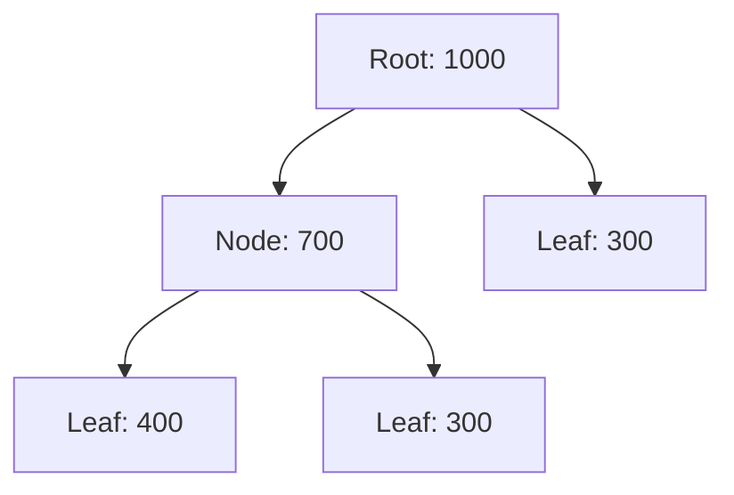
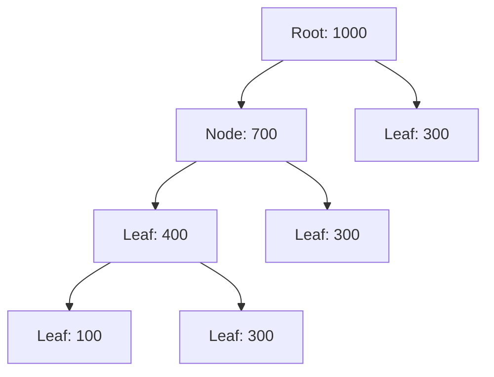
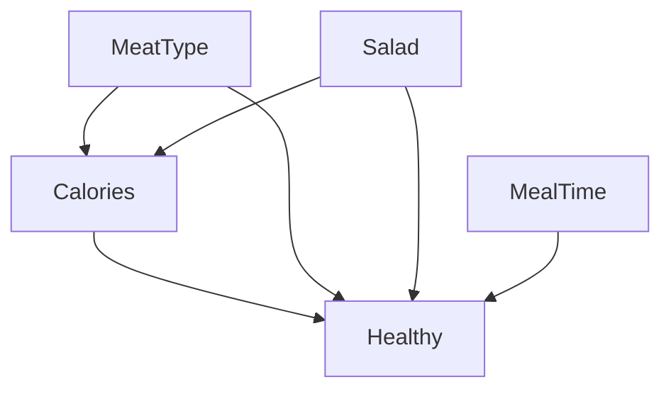

# 2024-01-23

<!-- these are the exact questions from a leak -->

**(1) question**: Suppose a convolutional neural network is trained on ImageNet dataset. This trained model is then given a completely white image as an input. The output probabilities for this input would be equal for all classes.

answer (boolean): False

- it's extremely unlikely but possible depending on the models architecture
- the probabilities would most likely be closest to the network's learned bias or skewed towards the class with the most uniform features

---

**(2) question**: AdaBoost minimises the residuals of the previous classifier.

answer (boolean): False

- misclassified samples in AdaBoost ≠ residuals of regression in gradient boosting
- adaBoost weighs misclassified samples higher, so the subsequent weak classifiers to pay more attention to those difficult samples.

how adaboost works:

- i. Initially, all training samples are assigned equal weights.
- ii. In each iteration:
	- a weak classifier is trained on the weighted training samples.
	- misclassified samples are given higher weights.
	- the classifier is added to the ensemble with a weight proportional to its accuracy.
- iii. the final prediction is made by taking a weighted majority vote of all the weak classifiers in the ensemble.

---

**(3) question**: Bootstrapping is used when training a Multi-Layer Perceptron.

answer (boolean): False

- bootstrap sampling most common in bagging
- bagging (bootstrap aggregating) = training multiple base models on different bootstrap samples of the training data (ie. random forrest)

---

**(4) question:** Decision trees can handle multi-class problems.

answer (boolean): True

- decision-trees are binary trees but their leafs are not constrained to just two classes

---

**(5) question**: GradientBoosting for classification always starts with the one-rule model

answer (boolean): False

- gradient-boosting does not necessarily have to start with a 1R-decision tree / decision stump (= decision tree with a single split).
- the initial **zero-rule model** can stand for any kind of simple rule-based classifier.

how it gradient boosting works:

- i. start with an initial model $F_0(x)$
	- this can be as simple as predicting the mean of the target values in the case of regression, or the logarithm of the odds for classification.
- ii. for each iteration:
	- compute the "pseudo-residuals", which are the gradients of the loss function, based on the current model's predictions.
	- fit a weak learner (usually a shallow decision tree) to these pseudo-residuals to minimize the residual error.
	- update the model by adding the new weak learner, scaled by a learning rate.
	- $F_m(x) = F_{m-1}(x) + \nu h_m(x)$
	- where:
		- $h_m(x)$ = new weak learner fitted to the pseudo-residuals
		- $\nu$ = learning rate
- iii. the final model is the sum of all the weak learners from each iteration.
- see: https://en.wikipedia.org/wiki/Gradient_boosting#Informal_introduction

---

**(6) question**: In AdaBoost the weights are randomly initialised.

answer (boolean): False

- all training samples are assigned equal weights

---

**(7) question**: PCA is a supervised feature selection method.

answer (boolean): False

- principal component analysis is unsupervised
- combines similar (correlated) attributes and creates new one
- assuming we have labels before doing unsupervised feature selection, then they should be hidden

---

**(8) question**: Tree pruning performed after training aims at decreasing the variance of the tree, while it can also decrease its performance on the train set.

answer (boolean): True

- first sentence: the general goal of pruning is to decrease variance / increase generalizability
- second sentence: pruning improves generalizability, at the cost of reduced accuracy during training
- for both cases it doesn't matter whether the pruning is done during or after training

definitions:

- prepruning = pruning during training
	- based on threshold for: samples in leaf, tree depth, information gain
- pruning = pruning during evaluation
	- reduced error pruning = replace subtree with majority-vote class, keep reasonable accuracy
	- cost complexity pruning = generate competing trees, compare by: error divided by num of leafs
	- pessimistic error pruning = traverse tree, remove redundancy

---

**(9) question**: Lasso regression cannot be used for feature extraction

answer (boolean): True

- lasso = least absolute shrinkage and selection operator → used for feature selection
- used to regularize polynomial regression models
- but it can hypothetically also be indirectly used for feature-extraction by selecting a subset of the features with non-zero coefficients

---

**(10) question**: Model based features used for metalearning are extracted directly from the data set

answer (boolean): False

- model-based features are typically learned from the model itself, not directly extracted from the dataset

---

**(11) question**: Gradient descent is always more efficient than Normal Equation (analytical approach) for linear regression

answer (boolean): False

- a counterexample from the slides: the analytical-solution to linear regression is slower than the iterative-solution through gradient descent
- but in practice it depends on the problem size and for smaller datasets the analytical solution could be faster
- see: https://datascience.stackexchange.com/a/14119/162429

---

**(12) question**: For the Monte Carlo method in reinforcement learning value estimates and policies are only changed on the completion of an episode.

answer (boolean): True

- Monte Carlo methods learn from complete episodes (similar to batches)

---

**(13) question**: The covering algorithm PRISM concentrates on all classes at a time to generate rules.

answer (boolean): False

- prism is a separate-and-conquer algorithm: it tries to find a rule per class at a time
- see: https://katie.cs.mtech.edu/classes/archive/f17/csci446/slides/23%20-%20Learning%20from%20Observations%20-%20Rules.pdf

---

**(14) question**: Suppose that you learned this linear model for the dataset "Regression2Features": $2 + 2 \cdot F_1 + 2 \cdot F_2$

Dataset "Regression2Features":

| $F_1$ | $F_2$ | Target |
| ----- | ----- | ------ |
| 3     | 7     | 13     |
| 5     | 2     | 14     |
| 6     | 2     | 14     |
| 5     | 5     | 17     |

The RMSE of this model in this training set is:

- a) 1.5
- b) 3
- c) 2
- d) None of the above

answer (single choice): None of the above

- predictions:
	- $p_1$ = 2 + 2 · 3 + 2 · 7 = 22
	- $p_2$ = 2 + 2 · 5 + 2 · 2 = 16
	- $p_3$ = 2 + 2 · 6 + 2 · 2 = 18
	- $p_4$ = 2 + 2 · 5 + 2 · 5 = 22
- squared error:
	- $\text{err}_1$ = (22 - 13)^2 = 81
	- $\text{err}_2$ = (16 - 14)^2 = 4
	- $\text{err}_3$ = (18 - 14)^2 = 16
	- $\text{err}_4$ = (22 - 17)^2 = 25
- root mean squared error RMSE: $\sqrt{\sum_i (p_i - a_i)^2 / n}$
	- $\sum_{i} \text{err}_i$ = 81 + 4 + 16 + 25 = 126
	- $n$ = 4
	- RMSE = sqrt(126 / 4) = 5.6124860802

---

**(15) question**: Suppose that you would apply the Naïve Bayes algorithm (without using Laplace correction) in dataset "Random3Features" to predict the class of the last instances based on the first seven training instances. Which class would be predicted for this instance?

Dataset "Random3Features":

| Instance | $F_1$ | $F_2$ | $F_3$ | Class |
| -------- | ----- | ----- | ----- | ----- |
| 1        | a     | y     | k     | –     |
| 2        | c     | y     | s     | –     |
| 3        | a     | y     | k     | +     |
| 4        | b     | n     | k     | –     |
| 5        | b     | y     | s     | +     |
| 6        | a     | n     | s     | +     |
| 7        | b     | n     | s     | –     |
| 8        | a     | n     | s     | ?     |

Options:

- a) –
- b) +
- c) + OR –

answer (single choice): The class $+$ is likelier

- using the bayes theorem with multiple events:
	- $p(A\mid BCD)=\frac{p(BCD\mid A) \cdot  p(A)}{p(BCD)}=\frac{p(B \mid A) \cdot p(C \mid A) \cdot p(D \mid A) \cdot p(A)}{p(BCD)}$
	- see: https://stats.stackexchange.com/questions/417277/bayesian-formula-for-multiple-events/417278#417278
- we want to know:
	- since they both have the same denominator knowing the nominator is sufficient to see which case is likelier
	- $p({+} \mid a, n, s) = \frac{p(a \mid +) \cdot p(n \mid +) \cdot p(s \mid +) \cdot p(+)}{p(a,n,s)} \propto p(a \mid +) \cdot p(n \mid +) \cdot p(s \mid +) \cdot p(+)$
	- $p({-} \mid a, n, s) = \frac{p(a \mid -) \cdot p(n \mid -) \cdot p(s \mid -) \cdot p(-)}{p(a,n,s)} \propto p(a \mid -) \cdot p(n \mid -) \cdot p(s \mid -) \cdot p(-)$
- prior probabilities for each class:
	- $p({+})$ = 3/7
	- $p({-})$ = 4/7
- conditional likelihoods for each feature value given the class:
	- $p(a \mid +)$ = 2/3
	- $p(a \mid -)$ = 1/4
	- $p(n \mid +)$ = 1/3
	- $p(n \mid -)$ = 2/4
	- $p(s \mid +)$ = 2/3
	- $p(s \mid -)$ = 2/4
- posterior probabilities:
	- $p({+} \mid a, n, s) \propto$ 2/3 · 1/3 · 2/3 · 3/7 = 0.0634920635
	- $p({-} \mid a, n, s) \propto$ 1/4 · 2/4 · 2/4 · 4/7 = 0.0357142857
	- meaning $p({+} \mid a, n, s)$ > $p({-} \mid a, n, s)$

---

**(21) question**: Which approaches can help to improve the performance of a neural network?

- a) Get more test data
- b) Use holdout instead of cross-validation
- c) Increase the number of training epochs
- d) Add dropout for testing
- e) Change the learning rate

answer (multiple choice): c and e

- options a, b, d suggest improvements during evaluation and not training
- c) Increase the number of training epochs
	- gives model more time to fit data
	- can help if model is underfitting
- e) Change the learning rate
	- adjusts speed of convergence in gradient descent
	- high learning rate can lead to overshooting, while a low learning rate can cause the model to converge too slowly

--- 

**(22) question**: Which of the following is a data augmentation method?

- a) Image normalisation
- b) SIFT
- c) Max Pooling
- d) Holdout method
- e) Convolution
- f) Cross Validation
- g) All of the above
- h) None of the above

answer (single choice): None of the above

- data augmentation = extend train-set by slightly modifying data (ie. flip, rotate, scale images, …)
- Image normalisation:
	- changes the range of pixel intensity values
- scale-invariant feature transform SIFT:
	- feature extraction technique (keypoints, descriptors)
- Max Pooling, Convolution:
	- part of CNN architecture
- Holdout method, Cross Validation:
	- model evaluation technique

---

**(23) question**: Which of the following statements is true for k-NN classifiers?

- a) The classification accuracy is better with larger values of k
- b) The decision boundary is smoother with smaller values of k
- c) The decision boundary is linear
- d) k-NN does not require an explicit training step

answer (single choice): d)

- a) The classification accuracy is better with larger values of k
	- more general and smoother decision boundaries, tendency to underfit
- b) The decision boundary is smoother with smaller values of k
	- more complex and irregular decision boundaries, tendency to overfit
- c) The decision boundary is linear
	- it follows the shape of the data-distribution
- d) k-NN does not require an explicit training step
	- knn is a lazy learner = no training, computation at prediction-step in $O(Nd)$

---

**(24) question**: Consider a k-armed bandit problem with k=5 actions, denoted 1,2,3,4, and 5. Consider applying to this problem a bandit algorithm using epsilon-greedy action selection, sample-average action-value estimates, and initial estimates of Q1(a) = 0, for all a. Suppose the initial sequence of actions and rewards is A1 = 2, R1 = -3 (in the first time step t1 action 2 is selected and the reward for this action is -3), A2 = 1, R2 = 2, A3 = 2, R3 = 2, A4 = 1, R4 = -1, A5 = 2, R5 = 4, A6 = 5, R6 = 3. On some of these time steps the epsilon case may have occurred, causing an action to be selected at random. On which time steps did this definitely occur? On which time steps could this possibly have occurred?

answer (open question): actions taken at $t_3$​, $t_5$​, and $t_6$​ are not greedy actions, indicating that AT LEAST those were chosen randomly based on epsilon.

- model:
	- k-bandit algorithm (stationary reward probability distribution)
	- epsilon-greedy action selection
	- sample-average action-value estimates
	- actions = $\{a_1, a_2, a_3, a_4, a_5\}$
	- update step: $Q(A) \leftarrow Q(A) + \frac 1 {N(A)} \cdot \Big[R-Q(A)\Big]$
- initial:
	- $N = [0, 0, 0, 0, 0]$
	- $Q = [0, 0, 0, 0, 0]$
- 1st step:  $\text{A: }a_2 \rightarrow \text{R: }-3$
	- $N[2]$ = 1
	- $Q[2]$ = 0 + 1/1 · (-3 - 0) = -3
		- or just -3/1 = -3
	- $N = [0, 1, 0, 0, 0]$
	- $Q = [0, \text-3, 0, 0, 0]$
- 2nd step:  $\text{A: }a_1 \rightarrow \text{R: }2$
	- $N[1]$ = 1
	- $Q[1]$ = 0 + 1/1 · (2 - 0) = 2
		- or just 2/1 = 2
	- $N = [1, 1, 0, 0, 0]$
	- $Q = [2, \text-3, 0, 0, 0]$
- 3rd step:  $\text{A: }a_2 \rightarrow \text{R: }2$
	- non-optimal step: $a_1$ had the highest expected value, with the lowest index 👈
	- $N[2]$ = 2
	- $Q[2]$ = -3 + 1/2 · (2 - (-3)) = -3 + 2.5 = -0.5
		- or just (2-3)/2 = -0.5
	- $N = [1, 2, 0, 0, 0]$
	- $Q = [2, \text-0.5, 0, 0, 0]$
- 4th step:  $\text{A: }a_1 \rightarrow \text{R: }-1$
	- $N[1]$ = 2
	- $Q[1]$ = 
		- or just (2-1)/2 = 0.5
	- $N = [2, 2, 0, 0, 0]$
	- $Q = [0.5, \text-0.5, 0, 0, 0]$
- 5th step:  $\text{A: }a_2 \rightarrow \text{R: }4$
	- non-optimal step: $a_1$ had the highest expected value, with the lowest index 👈
	- $N[2]$ = 3
	- $Q[2]$ = -0.5 + 1/3 · (4 - (-0.5)) = 1
		- or just (4+2-3)/3 = 1
	- $N = [2, 3, 0, 0, 0]$
	- $Q = [0.5, 1, 0, 0, 0]$
- 6th step:  $\text{A: }a_5 \rightarrow \text{R: }3$
	- non-optimal step: $a_2$ had the highest expected value, with the lowest index 👈
	- $N[5]$ = 1
	- $Q[5]$ = 0 + 1/1 · (3 - 0) = 3
		- or just 3/1 = 3
	- $N = [2, 3, 0, 0, 1]$
	- $Q = [0.5, 1, 0, 0, 1]$
- see: https://stats.stackexchange.com/questions/316911/how-to-understand-k-armed-bandit-example-from-suttons-rl-book-chapter-2 
- see: https://github.com/Sagarnandeshwar/Bandit_Algorithms

# 2023-10-20

<!-- these are the exact questions from a leak -->

**(1) question**: Usually state of the art AutoML systems use grid search to find best hyperparameters

answer: False

- the most common technique is bayesian optimization

---

**(2) question**: The $\varepsilon$-greedy action selection for the k-armed Bandit Problem does not try inferior action

answer: False

- exploration-exploitation tradeoff
- exploitation = choose actions based on rewards (greedy)
	- $A_t\doteq\arg\max_aQ_t(a)$
- exploration = but occasionally also try new actions
	- $\varepsilon$-greedy – try non optimal action with probability $\varepsilon$ 👈
	- optimistic greedy – larger initial values (for stationary problems)
	- upper confidence bound – adapt based on closeness to a max value:

---

**(3) question**: When k-nn is used for predicting numeric values the majority voting is applied

answer: False

- majority voting is for classification
- the mean is for regression

---

**(4) question**: F-score is an important performance metric that is used for evaluating regression techniques

answer: False

- classification metric
- f1 score: $2 \cdot \frac{\text{Prec} \cdot \text{Rec}}{\text{Prec} + \text{Rec}}$

---

**(5) question**: Chain Rule does not simplify calculation of probabilities in Bayesian Networks

answer: False

- this question isn't referring to the gradient chain-rule but the probability-theory chain-rule
- $P(X_1, X_2, \ldots, X_n) = \prod P(X_i | \text{Parents}(X_i))$
- it allows us to express the joint probability distribution of multiple variables as smaller conditional probability distributions

---

**(6) question**: "Off-the-shelf" is a transfer learning technique that uses the output of layers from a deep-learning architecture as input for a shallow model

answer: True

- off-the-shelf = using pre-trained models or layers that are readily available without modification
- one common approach in transfer learning is using the output of layers from a pre-trained deep learning model as input for a new model, which may be shallower

---

**(7) question**: A Perceptron with Soft Margin can solve the XOR-problem

answer: False

- probably a typo and they meant SVMs instead of perceptrons
	- the concept of a "Perceptron with Soft Margin" exists, but is not standard terminology in machine learning, and not taught in the lectures.
	- see: https://cseweb.ucsd.edu/~yfreund/papers/LargeMarginsUsingPerceptron.pdf
	- see: https://www.cs.cmu.edu/~avrim/ML10/lect0125.pdf
- a standard SVM with just a soft margin cannot solve the XOR problem
- it requires the use of the kernel trick with an appropriate kernel function (such as polynomial or RBF) to map the data into a higher-dimensional space where it becomes linearly separable
- the soft margin concept, while useful in many SVM applications, is not the primary factor in solving the XOR problem specifically

---

**(8) question**: Back propagation is a method for training a Perceptron

answer: False

- we apply the chain rule to propagate the error to nodes from previous layers in a multi-layer-perceptron – not in a single unit

---

**(9) question**: Categorical data should be normalized before training a knn

answer: False

- you can't normalize categorical data, you have to encode it first
- but should you one-hot encode your categorical features, you shouldn't z-score normalize them post-encoding, as normalizing them will destroy their meaning (they are binary flags in a zeroe'd out array)

---

**(10) question**: LSTM is a form of Deep Neural Network

answer: True

- LSTM $\in$ recurrent neural networks RNNs $\in$ deep learning

---

**(11) question**: The computation of bagging can be easily parallelized

answer: True

- bagging (bootstrap aggegating) = parallel evaluation of independent models
- boosting = sequential evaluation of models

---

**(12) question**: Tree pruning performed after training aims at decreasing the variance of the tree, while it can also decrease its performance on the train set

answer: True

- first sentence: the general goal of pruning is to decrease variance / increase generalizability
- second sentence: pruning improves generalizability, at the cost of reduced accuracy during training
- for both cases it doesn't matter whether the pruning is done during or after training

definitions:

- prepruning = pruning during training
	- based on threshold for: samples in leaf, tree depth, information gain
- pruning = pruning during evaluation
	- reduced error pruning = replace subtree with majority-vote class, keep reasonable accuracy
	- cost complexity pruning = generate competing trees, compare by: error divided by num of leafs
	- pessimistic error pruning = traverse tree, remove redundancy

---

**(13) question**: In AdaBoost, the weights are randomly initialized

answer: False

- all training samples are assigned equal weights

---

**(14) question**: Consider a k-armed bandit problem with k=4 actions, denoted 1,2,3 and 4. Consider applying this problem to a bandit algorithm using epsilon-greedy action selection, sample-average action-value estimates, and initial estimates of Q1(a)=4 for all. Suppose the initial sequence of actions and reward is A1=1, R1=-2, A2=1, R2=2, A3=2, R3=2, A4=1, R4=-1, A5=2, R5=1. On some of these steps the epsilon case may have occurred, causing an action to be selected at random. On which time step this definitely occurred?

- a) t2,t4
- b) t3,t4
- c) t2,t4
- d) t1,t2

answer: a

- model:
	- k-bandit algorithm (stationary reward probability distribution)
	- epsilon-greedy action selection
	- sample-average action-value estimates
	- actions = $\{a_1, a_2, a_3, a_4\}$
	- update step: $Q(A) \leftarrow Q(A) + \frac 1 {N(A)} \cdot \Big[R-Q(A)\Big]$
- initial:
	- $N = [0, 0, 0, 0, 0]$
	- $Q = [4, 4, 4, 4]$
- 1st step:  $\text{A: }a_1 \rightarrow \text{R: }-2$
	- $N[1]$ = 1
	- $Q[1]$ = 4 + 1/1 · (-2 - 4) = -2
	- $N = [1, 0, 0, 0, 0]$
	- $Q = [-2, 4, 4, 4]$
- 2nd step:  $\text{A: }a_1 \rightarrow \text{R: }2$
	- non-optimal step: $a_2$ had the highest expected value, with the lowest index 👈
	- $N[1]$ = 2
	- $Q[1]$ = -2 + 1/2 · (2 - (-2)) = 0
	- $N = [2, 0, 0, 0, 0]$
	- $Q = [0, 4, 4, 4]$
- 3rd step:  $\text{A: }a_2 \rightarrow \text{R: }2$
	- $N[2]$ = 1
	- $Q[2]$ = 4 + 1/1 · (2 - 4) = 2
	- $N = [2, 1, 0, 0, 0]$
	- $Q = [0, 2, 4, 4]$
- 4th step:  $\text{A: }a_1 \rightarrow \text{R: }-1$
	- non-optimal step: $a_2$ had the highest expected value, with the lowest index 👈
	- $N[1]$ = 3
	- $Q[1]$ = 0 + 1/3 · (-1 - 0) = -0.3333
	- $N = [3, 1, 0, 0, 0]$
	- $Q = [-0.33, 2, 4, 4]$
- 5th step:  $\text{A: }a_2 \rightarrow \text{R: }1$
	- $N[2]$ = 2
	- $Q[2]$ = 2 + 1/2 · (1 - 2) = 1.5
	- $N = [3, 2, 0, 0, 0]$
	- $Q = [-0.33, 1.5, 4, 4]$

---

**(15) question**: Which feature of the dataset would be selected by the 1R algorithm?

| Instance | F1  | F2  | F3  | Class |
| -------- | --- | --- | --- | ----- |
| 1        | b   | y   | k   | +     |
| 2        | c   | y   | s   | -     |
| 3        | a   | n   | k   | +     |
| 4        | b   | n   | k   | +     |
| 5        | b   | y   | s   | -     |
| 6        | a   | y   | s   | +     |
| 7        | a   | n   | k   | +     |
| 8        | a   | t   | s   | -     |

- a) F1
- b) F2
- c) F3

answer: c

- we want to find the split with the least label-uncertainty
- for each feature (dimension) we use the majority-vote of each unique value to predict and measure total num of errors
- we then use the total num of errors to compare the feautres we should split on

feature: F1

- unique values: {a, b, c}
- model:
	- a (3x plus, 1x minus) → predict plus
	- b (2x plus, 1x minus) → predict plus
	- c (0x plus, 1x minus) → predict minus
- evaluation:
	- a wrong predictions: 1/4
	- b wrong predictions: 1/3
	- c wrong predictions: 0/1
- absolute error rate = 2

feature: F2

- unique values: {y, n, t}
- model:
	- y (2x plus, 2x minus) → tie, so we randomly decide to predict minus
	- n (2x plus, 0x minus) → predict plus
	- t (0x plus, 1x minus) → predict minus
- evaluation:
	- y wrong predictions: 2/4
	- b wrong predictions: 0/2
	- t wrong predictions: 0/1
- absolute error rate = 2

feature: F3

- unique values: {k, s}
- model:
	- k (3x plus, 0x minus) → predict plus
	- s (1x plus, 3x minus) → predict minus
- evaluation:
	- k wrong predictions: 0/3
	- s wrong predictions: 1/4
- absolute error rate = 1

conclusion:

- since feature F3 has the lowest absolute error rate we use it's model (majority vote of each unique value) for our split
- `if(F3 is k) predict plus else predict minus`

---

**(16) question**: Suppose that you would apply Naive Bayes algorithm (without using Laplace correction) in the dataset to predict the class of the last instances based on the first seven training instances. Which class would be predicted for this instance?

| Instance | F1  | F2  | F3  | Class |
| -------- | --- | --- | --- | ----- |
| 1        | a   | y   | k   | -     |
| 2        | c   | y   | s   | -     |
| 3        | a   | y   | k   | +     |
| 4        | b   | n   | k   | -     |
| 5        | b   | y   | s   | -     |
| 6        | a   | n   | s   | +     |
| 7        | b   | n   | s   | -     |
| 8        | a   | n   | s   | ?     |

 - a) -
 - b) +
 - c) + OR -

answer: b

- see: https://stats.stackexchange.com/questions/417277/bayesian-formula-for-multiple-events/417278#417278
- $p(A\mid BCD)=\frac{p(BCD\mid A) \cdot  p(A)}{p(BCD)}=\frac{p(B \mid A) \cdot p(C \mid A) \cdot p(D \mid A) \cdot p(A)}{p(BCD)}$
- $p({+} \mid a, n, s) = \frac{p(a \mid +) \cdot p(n \mid +) \cdot p(s \mid +) \cdot p(+)}{p(a,n,s)} \propto p(a \mid +) \cdot p(n \mid +) \cdot p(s \mid +) \cdot p(+)$
- $p({-} \mid a, n, s) = \frac{p(a \mid -) \cdot p(n \mid -) \cdot p(s \mid -) \cdot p(-)}{p(a,n,s)} \propto p(a \mid -) \cdot p(n \mid -) \cdot p(s \mid -) \cdot p(-)$
- priors:
	- $p(+)$ = 2/7
	- $p(-)$ = 5/7
- conditional likelihood for each feature value (+/-):
	- $p(a \mid +)$ = 2/2
	- $p(n \mid +)$ = 1/2
	- $p(s \mid +)$ = 1/2
	- $p(a \mid -)$ = 1/5
	- $p(n \mid -)$ = 2/5
	- $p(s \mid -)$ = 3/5
- posterior probabilities:
	- $p(+ \mid a,n,s) \propto$ 2/2 · 1/2 · 1/2 · 2/7 = 0.0714285714
	- $p(- \mid a,n,s) \propto$ 1/5 · 2/5 · 3/5 · 5/7 = 0.0342857143
- because $p(+ \mid a,n,s) > p(- \mid a,n,s)$ we predict the last sample to be $+$

---

**(17) question**: Suppose that you learned this linear model for the dataset: 2+2F1+F2. Which RMSE does the training set have?

| F1  | F2  | Target |
| --- | --- | ------ |
| 3   | 7   | 13     |
| 5   | 2   | 14     |
| 6   | 2   | 14     |
| 5   | 5   | 17     |

- a) 1.5
- b) 3
- c) 2
- d) None

answer: 1.4142

- we compute the predictions with the formula $2 + 2 \cdot F_1 + F_2$ and compute the root mean squared error RMSE
- $\text{err} = (15 - 13)^2 + (14 - 14)^2 + (16-14)^2 + (17-17)^2 = 8$ 
- $n = 4$
- $\text{RMSE} = \sqrt{\sum_i (p_i - a_i)^2 / n} = \sqrt{\frac{8}{4}} = 1.4142135624$

| F1  | F2  | Target | Prediction         |
| --- | --- | ------ | ------------------ |
| 3   | 7   | 13     | 2 + 2 · 3 + 7 = 15 |
| 5   | 2   | 14     | 2 + 2 · 5 + 2 = 14 |
| 6   | 2   | 14     | 2 + 2 · 6 + 2 = 16 |
| 5   | 5   | 17     | 2 + 2 · 5 + 5 = 17 |

---

**(18) question**: A dataset has missing values in both training and test sets. Which data processing is valid?

- a) Remove samples with missing values only from the test set
- b) Remove samples with missing values only from the train set
- c) Remove samples with missing values from both train and test set
- d) None of above

answer: b

- a) Remove samples with missing values only from the test set
- c) Remove samples with missing values from both train and test set
	- deletion of samples in the test-set is not an option
	- adds bias, making it no longer representative of the real-world data the model will encounter
- b) Remove samples with missing values only from the train set
	- deletion of samples in the train-set is an option
	- could lead to a mismatch between the training and test data distributions - you would need to find a strategy to deal with missing values during prediction

---

**(19) question**: Knn is very likely to overfit due to the curse of dimensionality. Which of the following options would you consider to handle such a problem?

- a) Dimensionality reduction
- b) Feature selection
- c) Bootstrapping
- d) One-hot Encoding
- e) All of above
- f) None of above

answer: a, b

- curse of dimensionality = when the dimensionality increases, the volume of the space increases so fast that the available data become sparse. in order to obtain a reliable result, the amount of data needed often grows exponentially with the dimensionality.
- a) Dimensionality reduction
	- features are dimensions
	- feature selection is dimensionality reduction
	- same as option b)
- b) Feature selection
	- reducing dimensionality and sparsity without information loss increases performance
- c) Bootstrapping
	- selecting random subsets of the dataset for training doesn't help with data sparsity
- d) One-hot Encoding
	- this would just map our data into a different representation, but the sparsity would remain

---

**(20) question**: SVM trained on 60% of data and tested on 40% of data has accuracy of 70%. RF trained on the same dataset, but with 80% training and 20% test data, has accuracy of 80%. Which classifier performs better?

- a) SVM
- b) RF
- c) Can’t tell
- d) None of above

answer: c

- we can't tell:
	- different train-test splits:
		- RF had more training data (80% vs. 60%), which could potentially lead to better performance.
		- RF was tested on a smaller portion of data (20% vs. 40%), which might not be as representative of the overall dataset
    - potential overfitting:
		- the smaller test set used for RF, might be more prone to overfitting
    - insufficient metrics:
		- other metrics like precision, recall, F1-score, or ROC AUC would give us a better perspective
	- no meta-data:
		- we don't know about the nature of the data, class balance or problem complexity, which could affect the performance of different algorithms
- to be able to tell we would need:
	- the same train-test split for both classifiers (ideally cross-validation to see consistency across different subsets)
	- more metrics
	- significance tests to make sure that it isn't by chance

---

**(21) question**: Which of the following are well-known CNN architectures?

- a) LeNet
- b) LSTM
- c) ResNet
- d) Reception
- e) TeNet
- f) None of above

answer: a, c

- LeNet = famous cnn architecture by yann lecun in 1998
- LSTM = long short-term memory rnn architecture (not a cnn architecture)
- ResNet = residual neural network, cnn architecture that helps with vanishing gradients
- reception (meaningless)
- tenet (meaningless)

---

**(22) question**: Which of the following techniques performs a similar operation as applying dropout of the input layer in a neural network?

- a) Boosting
- b) Bagging
- c) Metalearning
- d) None of these

answer: d

- none of these
	- dropout randomly drops out neurons within a single network during training
	- they all have very little in common with drouput
- but theoretically
	- dropout is conceptually more similar to bagging than boosting, given that it's trying to improve robustness through randomness
	- we're introducting randomness by trying different neural network architectures
	- we want reduce variance (overfitting), not bias

---

**(23) question**: In a neural network, which of the following techniques is used to deal with overfitting?

- a) Dropout
- b) Regularization
- c) Batch normalization
- d) Cross validation
- e) All of the above
- f) None of the above

answer: e

- prevents overfitting:
	- Dropout
		- randomly "dropping out" (i.e., temporarily removing) a certain percentage of neurons during training
	- Regularization
		- prevent overfitting by adding a penalty term to the loss function
	- Batch Normalization
		- normalizes the inputs to each layer, to reduce the dependence on specific neurons, has a regularizing effect
- indirectly prevents overfitting:
	- Cross Validation
		- improves evaluation of generalizability which can help in choosing the right hyperparams
		- cross-validation does not prevent overfitting, it helps detect overfitting – but comparing the performance of different models using cross-validation, you can choose models that are less likely to overfit
		- see: https://stats.stackexchange.com/questions/9053/how-does-cross-validation-overcome-the-overfitting-problem

# 2023-06-21

**question**: A recurrent Neural Network is well suited to process sequential input, if the size is not fixed

answer: True

- they're designed to handle sequential data of arbitrary length

---

**question**: Training time of knn depends on the chosen distance metric

answer: False

- there is no training-runtime for knn as it is a lazy learner = computation at prediction-step in $O(Nd)$
- evaluation-runtime:
	- evaluation runtime of KNN can depend on the chosen distance metric
	- different distance metrics have varying computational costs

---

**question**: The paired t-test is used when testing for statistical significance of results obtained with holdout validation

answer: False

- holdout validation usually involves a single split of data into training and test sets, which does not provide multiple paired samples required for a paired t-test

---

**question**: Decisions trees are learned by maximizing information gain

answer: True

- information-gain is just one of many ways to measure label-uncertainty:
	- relative error rate
	- aboslute error rate
	- information gain
	- ratio
	- gini impurity

---

**question**: Decision trees can handle multi-class problems

answer: True

- decision-trees are binary trees but their leafs are not constrained to just two classes

---

**question**: Overfitting is more likely when the set of testing data is small

answer: False

- overfitting happens during the training phase, not the testing phase
- but smaller training datasets are more prone to overfitting because it makes it harder for the model to learn patterns over memorizing the dataset

---

**question**: Random forests is boosting ensemble technique

answer: False

- bagging (bootstrap aggegating) = parallel evaluation of independent models → ie. random forests
- boosting = sequential evaluation of models

---

**question**: The first model in Gradient Boosting is a zero rule model

answer: True

- the initial zero-rule model $F_0(x)$ can stand for any kind of simple rule-based classifier

---

**question**: In Bayesian Networks we assume that attributes are statistically independent given the class

answer: False

- the independence assumption is for naive bayes, not for bayesian networks:
	- naive bayes assumes that all the features are conditionally independent between features (presence or absence of a particular feature does not depend on the presence or absence of any other feature) given the class variable.
- general bayesian network captures the conditional dependencies between variables

---

**question**: If Naive Bayes is applied on a data set that contains also numeric attributes then a probability density function must always be used

answer: True

- assume normal distribution
- use probability-density-function of normal distribution $f(x)$ for each value

---

**question**: Automated Machine Learning deals only with optimization of hyperparameters of algorithms

answer: False

- it deals both with algorithm selection (rice's framework, landmarking) and hyperparameter optimization (search algorithms)

---

**question**: Lasso regression cannot be used for feature selection

answer: False

- lasso = least absolute shrinkage and selection operator
- embedded (supervised) feature selection = evaluate features during training
	- used to regularize polynomial regression models

---

**question**: The mean absolute error (a performance metric used for regression) is less sensitive to outliers than MSE

answer: True

- MAE is generally less sensitive to outliers compared to metrics that measure the squared error
- mean absolute error MAE: ${\sum_i |p_i - a_i|} / n$
- mean squared error MSE: ${\sum_i (p_i - a_i)^2} / n$

---

**question**: K-armed bandit problem The problem: Consider a k-armed bandit problem with k = 4 actions, denoted 1, 2, 3, and 4. Consider applying to this problem a bandit algorithm using epsilon-greedy action selection, sample-average action-value estimates, and initial estimates of Q1(a) = 2, for all a. Suppose the initial sequence of actions and rewards is A1 = 1, R1 = -2, A2 = 2, R2 = 2, A3 = 1, R3 = 2, A4 = 2, R4 = -1, A5 = 3, R5 = 1. On some of these time steps the epsilon case may have occurred, causing an action to be selected at random. On which time step this definitely occurred?

- a) t3, t5
- b) t3, t4
- c) t2, t5
- d) t1, t2

answer: none of the above, we only know with certainty that $t_3$ was non-optimal

- model:
	- k-bandit algorithm (stationary reward probability distribution)
	- epsilon-greedy action selection
	- sample-average action-value estimates
	- actions = $\{a_1, a_2, a_3, a_4\}$
	- update step: $Q(A) \leftarrow Q(A) + \frac 1 {N(A)} \cdot \Big[R-Q(A)\Big]$
- initial:
	- $N = [0,0,0,0]$
	- $Q = [2,2,2,2]$
- 1st step: $\text{A: }a_1 \rightarrow \text{R: }-2$
	- $N[1]$ = 1
	- $Q[1]$ = 2 + 1/1 · (-2 - 2) = -2
	- $N = [1,0,0,0]$
	- $Q = [-2,2,2,2]$
- 2nd step: $\text{A: }a_2 \rightarrow \text{R: } 2$
	- $N[2]$ = 1
	- $Q[2]$  = 2 + 1/1 · (2 - 2) = 2
	- $N = [1,1,0,0]$
	- $Q = [-2,2,2,2]$
- 3rd step: $\text{A: }a_1 \rightarrow \text{R: } 2$
	- non-optimal step: $a_2$ had the highest expected value, with the lowest index 👈
	- $N[1]$ = 2
	- $Q[1]$ = -2 + 1/2 (2 - (-2)) = 0
	- $N = [2,1,0,0]$
	- $Q = [0,2,2,2]$
- 4th step: $\text{A: }a_2 \rightarrow \text{R: } -1$
	- $N[2]$ = 2
	- $Q[2]$ = 2 + 1/2 · (-1 - 2) = 0.5
	- $N = [2,2,0,0]$
	- $Q = [0,0.5,2,2]$
- 5th step: $\text{A: }a_3 \rightarrow \text{R: } 1$
	- $N[3]$ = 1
	- $Q[3]$ = 2 + 1/1 · (1 - 2) = 1
	- $N = [2,2,1,0]$
	- $Q = [0,0.5,1,2]$

---

**question**: 1R algorithm Problem: Which feature of the dataset below would be selected by the 1R algorithm?

| Instance | F1  | F2  | F3  | Class |
| -------- | --- | --- | --- | ----- |
| 1        | b   | y   | k   | -     |
| 2        | c   | y   | s   | -     |
| 3        | a   | n   | k   | +     |
| 4        | b   | n   | k   | +     |
| 5        | b   | y   | s   | -     |
| 6        | a   | y   | s   | +     |
| 7        | a   | n   | k   | -     |
| 8        | a   | t   | s   | -     |

- a) F1
- b) F2
- c) F3

answer: F2

- we want to find the split with the least label-uncertainty
- for each feature (dimension) we use the majority-vote of each unique value to predict and measure total num of errors
- we then use the total num of errors to compare the feautres we should split on

feature: F1

- unique values: {a, b, c}
- model:
	- a (2x plus, 2x minus) → tie, so we randomly decide to predict minus
	- b (1x plus, 2x minus) → predict minus
	- c (0x plus, 1x minus) → predict minus
- evaluation:
	- a wrong predictions: 2/4
	- b wrong predictions: 1/3
	- c wrong predictions: 0/1
- absolute error rate = 3

feature: F2

- unique values: {y, n, t}
- model:
	- y (1x plus, 3x minus) → predict minus
	- n (2x plus, 1x minus) → predict plus
	- t (0x plus, 1x minus) → predict minus
- evaluation:
	- y wrong predictions: 1/4
	- n wrong predictions: 1/3
	- t wrong predictions: 0/1
- absolute error rate = 2

feature: F3

- unique values: {k, s}
- model:
	- k (2x plus, 3x minus) → predict minus
	- s (1x plus, 3x minus) → predict minus
- evaluation:
	- k wrong predictions: 2/5
	- s wrong precitions: 1/4
- absolute error rate = 3

conclusion

- since feature F2 has the lowest absolute error rate we use it's model (majority vote of each unique value) for our split
- `if(F2 is y or t) predict minus else if(F2 has other value) predict plus`

---

**question**: Naive Bayes algorithm Problem: Suppose that you would apply the Naive Bayes algorithm (without using Laplace correction) in the dataset below to predict the class of the last instances based on the first seven training instances. Which class would be predicted for this instance?

| Instance | F1  | F2  | F3  | Class |
| -------- | --- | --- | --- | ----- |
| 1        | a   | y   | k   | -     |
| 2        | c   | y   | s   | -     |
| 3        | a   | y   | k   | +     |
| 4        | b   | n   | k   | -     |
| 5        | b   | y   | s   | -     |
| 6        | a   | n   | s   | +     |
| 7        | b   | n   | s   | -     |
| 8        | a   | n   | s   | ?     |

- a) -
- b) +
- c) + or -

answer: b

- see: https://stats.stackexchange.com/questions/417277/bayesian-formula-for-multiple-events/417278#417278
- $p(A\mid BCD)=\frac{p(BCD\mid A) \cdot  p(A)}{p(BCD)}=\frac{p(B \mid A) \cdot p(C \mid A) \cdot p(D \mid A) \cdot p(A)}{p(BCD)}$
- $p({+} \mid a, n, s) = \frac{p(a \mid +) \cdot p(n \mid +) \cdot p(s \mid +) \cdot p(+)}{p(a,n,s)} \propto p(a \mid +) \cdot p(n \mid +) \cdot p(s \mid +) \cdot p(+)$
- $p({-} \mid a, n, s) = \frac{p(a \mid -) \cdot p(n \mid -) \cdot p(s \mid -) \cdot p(-)}{p(a,n,s)} \propto p(a \mid -) \cdot p(n \mid -) \cdot p(s \mid -) \cdot p(-)$
- priors:
	- $p(+)$ = 2/7
	- $p(-)$ = 5/7
- conditional likelihood for each feature value (+/-):
	- $p(a \mid +)$ = 2/3
	- $p(n \mid +)$ = 1/3
	- $p(s \mid +)$ = 1/4
	- $p(a \mid -)$ = 1/3
	- $p(n \mid -)$ = 2/3
	- $p(s \mid -)$ = 3/4
- posterior probabilities:
	- $p(+ \mid a,n,s) \propto$ 2/3 · 1/3 · 1/4 · 2/7 = 0.0158730159
	- $p(- \mid a,n,s) \propto$ 1/3 · 2/3 · 3/4 · 5/7 = 0.119047619
- because $p(+ \mid a,n,s) < p(- \mid a,n,s)$ we predict the last sample to be $+$

---

**question**: RMSE Problem: Suppose that you learned this linear model for the dataset below: 2+F1+F2 – The RMSE of this model in this training set is:

| F1  | F2  | Target |
| --- | --- | ------ |
| 3   | 7   | 12     |
| 5   | 2   | 9      |
| 6   | 2   | 10     |
| 5   | 5   | 15     |

 - a) 1
 - b) 1/4
 - c) 2
 - d) 3
 
answer: c

- we compute the predictions with the formula $2 + F_1 + F_2$ and compute the root mean squared error RMSE
- $\text{err} = (12-12)^2 + (9-9)^2 + (10-10)^2 + (15-12)^2 = 9$ 
- $n = 4$
- $\text{RMSE} = \sqrt{\sum_i (p_i - a_i)^2 / n} = \sqrt{\frac{9}{2}} = 2.1213203436$

| F1  | F2  | Target | Prediction |
| --- | --- | ------ | ---------- |
| 3   | 7   | 12     | 12         |
| 5   | 2   | 9      | 9          |
| 6   | 2   | 10     | 10         |
| 5   | 5   | 15     | 12         |

---

**question**: An MLP with three hidden layers and linear activation functions can be approximated by a Perceptron

- a) Always
- b) Sometimes
- c) Never

answer: Always

- when multiple layers are stacked with linear activations, the overall transformation from input to output remains linear
- this is because the composition of linear functions is still a linear function.
- this can be expressed as: $f(Ax+b)=Cf(x)+d$
- example:
	- 1st layer: $y_1 = W_1 \cdot x + b_1$
	- 2nd layer: $y_2 = W_2 \cdot y_1 + b_2$
	- 3rd layer: $y_3 = W_3 \cdot y_2 + b_3$
	- combined:
		- $y_3 = W_3 \cdot (W_2 \cdot (W_1 \cdot x + b_1) + b_2) + b_3$
		- $y_3 = (W_3 \cdot W_2 \cdot W_1) \cdot x + (W_3 \cdot W_2 \cdot b_1 + W_3 \cdot b_2 + b_3)$

---

**question**: An output of a convolutional layer is larger when … 

- a1) Padding decreases
- a2) Padding increases
- b1) Stride decreases
- b2) Stride increases

answer: a2, b1 

- $n\times n \circledast f\times f \Rightarrow \left\lfloor\frac{n+2p-f}{s}+1\right\rfloor\times\left\lfloor\frac{n+2p-f}{s}+1\right\rfloor$
- where:
	- $n$ = input
	- $f$ = kernel filter
	- $p$ = padding
	- $s$ = stride
- increasing the stride in the denominator decreases the output size
- increasing the padding in the nominator increases the output size
- we therefore have to increase the padding and decrease the stride to maximize the output size

---

**question**: Which approaches can help to improve the performance of a neural network?

- a) Get more test data
- b) Use holdout instead of cross-validation
- c) Increase the number of training epochs
- d) Add dropout for testing
- e) Change the learning rate

answer:

- options a, b, d suggest improvements during evaluation and not training
- c) Increase the number of training epochs ✅
	- gives model more time to fit data
	- can help if model is underfitting
	- works best with early-stopping on some threshhold
- e) Change the learning rate ✅
	- adjusts speed of convergence in gradient descent
	- high learning rate can lead to overshooting, while a low learning rate can cause the model to converge too slowly
	- learning rate schedules or adaptive learning rates (e.g. Adam optimizer) can help

---

**question**: Which of the following classification methods uses majority voting?

- a) k-NN
- b) Decision Trees
- c) Bayesian Networks
- d) Random Forests
- e) An ensemble of an SVM, Logistic Regression and an MLP with two hidden layers than outputs the prediction of the model with the highest confidence
- f) All of the above
- g) None of the above

answer: 

- a) k-NN ✅
	- uses majority voting to predict based on $k$ closest neighbors
- b) Decision Trees
	- can use majority voting to find the split with the least label-uncertainty: for each feature (dimension) we use the majority-vote of each unique value to predict and measure total num of errors
- c) Bayesian Networks
	- it's possible in theory
	- see: https://link.springer.com/chapter/10.1007/978-3-642-41184-7_23
- d) Random Forests ✅
	- decision tree in the forest makes a prediction, and the final prediction is determined by the majority vote of all trees
- e) An ensemble of an SVM, Logistic Regression and an MLP with two hidden layers than outputs the prediction of the model with the highest confidence ✅
	- ensembles use majority voting to decide

---

**question**: In this course, we briefly discussed a neural network architecture whose outputs are aimed at having the same values the same as their inputs. How is that architecture called?

- a) Generative Adversarial Network
- b) Autoencoder
- c) Bayesian Network
- d) Recurrent Neural Network
- e) None of the above

answer: autoencoder

- encoder-decoder neural networks used for representation learning
- first half: feature extractor
	- learning an encoding function to compress data
	- creates a latent representation / embedding
	- dimensionality reduction: usually data has some kind of structure and only uses a lower dimensional subspace of the full possible dimensionality of the input space. the network must learn a function to remap data to a lower dimension based on the structure of the data
- hidden layer: bottleneck
	- the representation passed from the first half to the second half
	- you have to regularize this layer to reduce dimensionality
- second half: denoiser
	- learning a decoding function to reconstruct the original input with minimal reconstruction error
	- loss function: reconstruction error

---

**question**: Which of the following is a data augmentation method?

- a) Image normalisation
- b) SIFT
- c) Max Pooling
- d) Holdout method
- e) Convolution
- f) Cross Validation
- g) All of the above
- h) None of the above

answer: None of the above

- data augmentation = extend train-set by slightly modifying data (ie. flip, rotate, scale images, …)
- Image normalisation:
	- image processing technique
	- changes the range of pixel intensity values
- scale-invariant feature transform SIFT:
	- image processing technique
	- feature detection algorithm used for extracting features (keypoints, descriptors)
- Max Pooling, Convolution:
	- part of CNN architecture
- Holdout method, Cross Validation:
	- model evaluation technique

# 2023-01-24

**question**: A decision tree can be converted into a rule set.

answer: True

- this is called rule-extraction from decision-trees
- note: this is different from the covering algorithm / prism algorithm - they learn directly from data

---

**question**: k-armed bandits choose the next action based on the expected future reward.

answer: True

- stationary reward probability distribution
- reward for action, based on experience:
	- $Q_t(a) = \large \frac{\sum_{i=1}^{t-1}R_i\cdot\mathbb{1}_{A_i=a}}{\sum_{i=1}^{t-1}\mathbb{1}_{A_i=a}}$
	- = sum of rewards from $a$, divided by how often $a$ was chosen so far
	- should ideally converge to $q_*(a)\doteq\mathbb{E}[R_t \mid A_t=a]$
	- if repeated $n \texttt{-}1$ times this results in:
		- $Q_{n+1}=\frac{1}{n}\sum_{i=1}^nR_i = \cdots = Q_n+\frac{1}{n} \cdot \Big[R_n-Q_n\Big]$

algorithm:

- for all actions $a\in A$ initialize:
	- $Q(a) \leftarrow 0$
	- $N(a) \leftarrow 0$
- loop forever:
	- $A_t\doteq\arg\max_aQ_t(a)$
	- $R \leftarrow \text{execute}(A)$
	- $N(A) \leftarrow N(A) + 1$
	- $Q(A) \leftarrow Q(A) + \frac 1 {N(A)} \cdot \Big[R-Q(A)\Big]$

---

**question**: A bayesian network is a directed cyclic graph.

answer: False

- bayesian networks are directed ACYCLIC graphs
- edges represent conditional dependencies between variables in a way that avoids circular reasoning

---

**question**: Which of these methods helps to prevent overfitting?

- a) Regularization
- b) Dropout
- c) Batch Normalization
- d) Cross Validation
- …

answer:

- prevents overfitting:
	- Regularization
		- prevent overfitting by adding a penalty term to the loss function
	- Dropout
		- randomly "dropping out" (i.e., temporarily removing) a certain percentage of neurons during training
	- Batch Normalization
		- normalizes the inputs to each layer, to reduce the dependence on specific neurons, has a regularizing effect
- indirectly prevents overfitting:
	- Cross Validation
		- improves evaluation of generalizability which can help in choosing the right hyperparams
		- cross-validation does not prevent overfitting, it helps detect overfitting – but comparing the performance of different models using cross-validation, you can choose models that are less likely to overfit
		- see: https://stats.stackexchange.com/questions/9053/how-does-cross-validation-overcome-the-overfitting-problem

---

**question**: What can a validation set be used for?

- a) Early stopping
- b) Hyperparameter tunining
- c) Signifcance Testing
- …

answer: 

- Early stopping
	- using validation-set to find the right stopping-point (performance starts to degrade or plateau)
- Hyperparameter tunining
	- using validation-set to find the right hyperparams

---

**question**: Which technique is similar to dropout in neural networks

- a) Bagging
- b) Boosting
- …

answer:

- dropout randomly drops out neurons within a single network during training
- they all have very little in common with drouput
- but dropout is conceptually more similar to bagging than boosting, given that it's trying to improve robustness through randomness:
	- we're introducting randomness by trying different neural network architectures
	- we want reduce variance (overfitting), not bias

---

**question**: Calculation of output size of convolution.

answer: 

- $n\times n \circledast f \times f \Rightarrow \left\lfloor\frac{n+2p-f}{s}+1\right\rfloor\times\left\lfloor\frac{n+2p-f}{s}+1\right\rfloor$
- where:
	- $n$ = input
	- $f$ = kernel filter
	- $p$ = padding
	- $s$ = stride
	- num kernels

---

**question**: Calculation of max pooling operation.

answer:

- subsampling / downsampling
- take the max. activation across small regions (ie. 2x2 regions in the the example below)

- $\begin{bmatrix}   1 & (3) & (5) & -3 \\ -2 & (3) & 2 & -1 \\ 1 & 2 & -2 & (2) \\ -1 & (3) & -2 & 1  \end{bmatrix} \Rightarrow \begin{bmatrix}   3 & 5 \\ 3 & 2  \end{bmatrix}$

# 2022-01-28

**question**: Classification is a machine learning task where the target attribute is nominal

answer: False

- the datatype can also be ordinal
- nominal = unique names
- ordinal = also have order (sorting)

---

**question**: Decision trees can handle only binary classification problems

answer: False

- the tree can have multiple leaf nodes corresponding to different class labels
- they can handle: binary classification, multi-class classification, regression problems

---

**question**: The error of a 1-NN classifier on the training set is 0

answer: True

- 1nn = 1-nearest neighbor
- its nearest neighbor is itself, since the distance to itself is 0 (which is always the smallest possible distance)
- therefore, every training point will be classified as its own class, resulting in perfect classification (0 error) on the training data
- the 0 training error only applies to 1-NN. For k-NN with k > 1, there can be non-zero training error
- see: https://stats.stackexchange.com/questions/367010/training-error-in-knn-classifier-when-k-1

---

**question**: A softmax function in MLPs transforms the activation to a range of -1…1

answer: False

- softmax activation scales outputs to probabilities between 0 and 1 (they should sum up to 1)

---

**question**: Macro-averaging for classifier evaluation first calculates accuracy/precision/recall/… per class, before averaging across classes

answer: True

- i. calculate the metric independently for each class
- ii. take the (optionally weighted) average of those per-class metrics across all classes

---

**question**: The paired t-test is used when testing for statistical significance of results obtained with holdout validation

answer: False

- holdout validation usually involves a single split of data into training and test sets, which does not provide multiple paired samples required for a paired t-test

---

**question**: The paired t-test is used when testing for statistical significance of results obtained with cross validation

answer: True

- possible, although not ideal
	- test assumes independence between samples, which is violated in cross-validation as the training sets overlap
	- can lead to more false positives

---

**question**: In a dataset the entropy is lowest when all classes have the same amount of samples

answer: False

- $H(X) = - \sum_{i = 1}^n p(x_i) \cdot \log_{2}(p(x_i))$ = entropy
- $p_i = k_i / N$ =  probability based on relative frequency
- $k_i$ = category count
- the total sample size may affect the precision of probability estimates, but does not directly factor into the entropy calculation itself
- when all classes have an equal number of samples, this represents the maximum uncertainty or randomness in the dataset - you can't predict the class of a randomly selected sample with any confidence, because all classes are equally likely
- as the distribution becomes more imbalanced (one class having more samples than the other), the entropy decreases - this is because you can predict the class of a random sample with more confidence

---

**question**: In a dataset the entropy is highest when all classes have the same amount of samples

answer: True

- see above

---

**question**: In AdaBoost, the weights are randomly initialised

answer: False

- all training samples are assigned equal weights

---

**question**: Support Vector Machines always finds a more optimal decision boundary (hyperplane) than Perceptrons

answer: False

answer is verified by prof: it says whether it **always** finds a better decision boundary

- in most but not all cases
- SVMs generally find more optimal and robust decision boundaries than basic perceptrons, especially for complex or noisy datasets - but there are exceptions
- linearly seperable data:
	- SVMs
		- find the optimal hyperplane that maximizes the margin between classes
		- generalize better (especialy with a soft margin)
		- less sensitive to outliers and noise in train-data
		- the objective is a convex, quadratic function with guaranteed bounds on generalization error
	- perceptrons
		- just find any hyperplane that separates the classes
		- trained by optimizing a loss function that isn't guaranteed to converge to a global optimum
- non-linearly seperable data:
	- perceptrons can't find a boundary
	- SVMs do, by using the kernel trick

---

**question**: Support Vector Machines with a linear kernel are particularly suitable for classification of very high dimensional, sparse data

answer: True

- high dimensional data = many features
- sparse data = many feature values are zero (usually in high dimensional data)
- advantages for high-dimensional data:
	- data is more likely to be linearly seperable in high dimensions, so the linear kernel will suffice
		- the "kernel trick" used by nonlinear kernels to implicitly map data to higher dimensions may not provide much additional benefit when the original data is already high-dimensional
		- this is called "blessing of dimensionality": https://stats.stackexchange.com/questions/33437/is-it-true-that-in-high-dimensions-data-is-easier-to-separate-linearly
	- linear kernels are a **lot more efficient** than non-linear kernels because they have a simpler feature space mapping (just a dot product)
	- svms generalize well because they maximize the margin while regularizing for generalizability (accepting missclassificaitons in the soft-margin variant)
- advantages for sparse data:
	- svms only need to consider non-zero features in their computations

---

**question**: Support Vector Machines can by default only solve binary classification problems

answer: True

- but there are ways to extend SVMs to handle multi-class classification as well

---

**question**: If Naive Bayes is applied on a data set that contains also numeric attributes then a probability density function must always be used

answer: True

- assume normal distribution
- use probability-density-function of normal distribution $f(x)$ for each value

---

**question**: Model based features used for metalearning are extracted directly from the data set

answer: False

- model-based features are typically learned from the model itself, not directly extracted from the dataset

---

**question**: Majority voting is not used when k-nn is applied for linear regression

answer: True

- majority voting is for classification
- the mean is for regression

---

**question**: For the Monte Carlo method in reinforcement learning value estimates and policies are changed only on the completion of an episode

answer: True

- Monte Carlo methods learn from complete episodes (similar to batches)

---

**question**: Gradient descent is always more efficient than Normal Equation (analytical approach) for linear regression

answer: False

- an example from the slides: the analytical-solution to linear regression is slower than the iterative-solution through gradient descent
- but in practice it depends on the problem size and for smaller datasets the analytical solution could be faster
- see: https://datascience.stackexchange.com/a/14119/162429

---

**question**: Information gain is an unsupervised feature selection method

answer: False

- information gain is a supervised method because we're measuring can predict the target variable with the input features

---

**question**: Feature selection is primarly useful to improve the effectiveness of machine learning

answer: False

answer is verified by prof

- feature selection / dimensionality reduction improves both:
	- efficiency = resource (compute, memory) consumption during training or prediction
	- effectivity = quality of prediction
	- it does so by reducing redundance, noise
- i guess that people mostly do it for effectivity - i don't know what the "primary" use-case should be

---

**question**: Ordinal data does not allow distances to be computed between data points

answer: True

- ordinal data has an order, but no scale that allows us to measure distances (like interval data does)

---

**question**: The first model in gradient boosting is a zero rule model

answer: True

- the initial zero-rule model $F_0(x)$ can stand for any kind of simple rule-based classifier

---

**question**: PCA is a supervised feature selection method

answer: False

- principal component analysis is unsupervised
- combines similar (correlated) attributes and creates new one
- assuming we have labels before doing unsupervised feature selection, then they should be hidden

---

**question**: Can kernel methods also be applied to the perceptron classifier (also discuss why or why not!)

answer: True

- kernel perceptron:
	- $\hat{y}=\mathrm{sgn}\sum_i^n\alpha_iy_iK(\mathbf{x}_i,\mathbf{x}_j)$
	- can learn non-linear decision boundaries
	- replaces dot products in the original perceptron algorithm with kernel function evaluations
	- implicitly maps the input data to a higher-dimensional feature space

---

**question**: What is polynomial regression? Which are advantages/disadvantages of polynomial regression compared to linear regression?

answer:

- $y = \sum_{i=0}^n w_i x^i + \varepsilon$
- $\mathbf y = \mathbf X \mathbf \beta + \mathbf \varepsilon$
- short response: linear regression means "linearity in parameters" (ie. you shouldn't square the weights) – polynomial regression is a specific kind of linear regression
- every polynomial regression is a linear regression
- pros:
	- can capture non-linear relationships, more complex decision boundaries than linear regression
	- relatively simple, same concepts as linear regression
	- fast to compute, useful for data exploration
- cons:
	- prone to overfitting with high degrees
	- very sensitive to outliers
	- requires more datapoints to fit well

---

**question**: When are two nodes in a Bayesian Network d-seperated?

answer:

- there must be at least one intermediate node
- in the converging case, if B or any of its descendants are observed we can "explain away"
- connection types:
	- serial: A → B → C
		- A → C transmission blocked if we know B
	- diverging: A ← B → C
		- A ←→ C transmission blocked if we know B
	- converging: A → B ← C
		- A ←→ C transmission

---

**question**: Which features are used in metalearning? What are landmarking features?

answer: 

- features used in metalearning:
	- simple = frequency, …
	- statistical = mean, std dev, correleation, skew, …
	- information theoretic = entropy, mutual information, …
	- model based = model properties like decision-tree depth, …
	- landmarking features = performance of landmarkers
- landmarking:
	- landmarkers = simple and fast algorithms (ie. naive bayes, 1nn, 1r, …)
	- landmarking features = performance of landmarkers
	- landmark learner = selects best performing landmarker
	- the best performing landmarker tells us something about the dataset
	- ie. linear classifier do

---

**question**: What are the difference between micro and macro averaged performance measures? 

answer: 

- micro-averaging:
	- = calculating the metric globally
- macro-averaging:
	- = calculating the metric for each class
	- $\frac{1}{|C|} \sum_{i=1}^{|C|} w_i \cdot \text{metric}$
	- weight can be based on cost of missclassifications
	- equal importance to all classes, especially useful for imbalanced datasets

---

**question**: Given are 1000 observations, from which you want to train a decision tree. As pre-pruning the following parameters ares set: The minimum number of observations required to split a node is set to 200 - The minimum leaf size (number of observations) to 300 Then, what would be the maximum depth a decision tree can take (not counting the root node)? Explain you answer!

answer:

- all leaves have at least 300 samples
- all internal-nodes have at least 200 samples
- depth = 2
- on each split / iteration from root-node we can only deduct 200 samples at most, otherwise the split is invalid – so the formula is $\lfloor \log_2(1000/200) \rfloor$ = 2



---

**question**: Describe a local search algorithm for Bayesian Network creation.

answer:

- search heuristics:
	- hill climbing = choose best in neighborhood, until local optimum is reached
	- tabu search = hill-climbing but some some neighbors are hidden
	- simulated annealing = based on cooldown parameters
	- genetic algorithm = initialize population, mutate, reproduce, evaluatie population.
- hill climbing / local search heuristic:
	- start with an initial network structure – this could be an empty network (no edges), a naive Bayes structure (all nodes connected to a single parent node), a randomly generated one, one based on prior knowledge, etc.
	- choose a metric to evaluate networks
	- until convergence to a local optimum:
		- generate neighbors from the current network through local modifications like edge addition, deletion or reversal.
		- score neighbors.

---

**question**: Goal and settings of classification. To what tasks does it relate and from which it differs in machine learning?

answer: 

- goal:
	- learn a model that can accurately predict the class label for new, unseen inputs - by mapping input features to discrete class labels
	- use labeled training data (supervised ml)
- settings:
	- binary classification (2 classes) and multi-class classification (3+ classes)
- related to / different from:
	- unlike regression, classification predicts discrete categories rather than continuous values
	- unlike clustering, classification uses labeled data and predefined classes
	- unlike anomaly detection, classification assigns all inputs to known classes rather than identifying outliers

---

**question**: What methods are there for combatting overfitting in Neural Networks?

answer: 

- increasing train-data (data augmentation)
- regularization (L1/L2 regularization)
- dropout
- early stopping
- reducing model complexity (removing unnecessary layers, parameters, connections, units)
- cross validation
- ensemble methods
- batch normalization (normalize layer activations for better generalization)
- weight constraints (clipping weights)
- transfer learning (knowledge distillation)
- hyperparam tuning
- reducing batch size

---

**question**: Describe 3 methods to compute the error in regression. (approximate question)

answer: 

- mean squared error MSE
	- ${\sum_i (p_i - a_i)^2} / n$
- root mean squared error RMSE
	- $\sqrt{\sum_i (p_i - a_i)^2 / n}$
- mean absolute error MAE
	- ${\sum_i |p_i - a_i|} / n$
- relative squared error RSE
	- ${\sum_i (p_i - a_i)^2} / {\sum_i (a_i - \bar{a})^2}$
- root relative squared error RRSE
	- $\sqrt{{\sum_i (p_i - a_i)^2} / {\sum_i (a_i - \bar{a})^2}}$
- relative absolute error RAE
	- ${\sum_i |p_i - a_i|} / {\sum_i |a_i - \bar{a}|}$

---

**question**: difference between z-score and min-max, when to use which on which feature types

answer: 

- Z-score normalization:
	- transforms the data to have a mean of 0 and a standard deviation of 1.
	- keeps relative scale (range)
	- doesn't keep the distribution
	- can deal with positive and negative numbers.
	- use-cases:
		- algorithms that assume gaussian distributed data, like PCA or LD
- min-max normalization:
	- maps the data to a different range, typically 0;1.
	- doesn't keep relative scale (range)
	- keeps distribution
	- outliers can skew the range.
	- use-cases:
		- algorithms that need a certain range like neural networks
- see: https://stats.stackexchange.com/questions/547446/z-score-vs-min-max-normalization

---

**question**: Explain the epsilon-greedy selection for the k-armed Bandit Problem.

answer: 

- exploration-exploitation tradeoff
- exploitation = choose actions based on rewards (greedy)
	- $A_t\doteq\arg\max_aQ_t(a)$
- exploration = but occasionally also try new actions
	- $\varepsilon$-greedy – try non optimal action with probability $\varepsilon$ 👈
	- optimistic greedy – larger initial values (for stationary problems)
	- upper confidence bound – adapt based on closeness to a max value:

# 2021-12-07

**question**: In AdaBoost weights are uniformly initialized

answer: True

- they're initialized uniformly both for models and data

---

**question**: Categorical data should be normalized before training a k-NN

answer: False

- correction: categorical features should be Z-score normalized after one-hot-encoding if you want to compute a distance in models such as knn.
- categorical features should be one-hot encoded but not normalized post encoding.
- normalizing them will destroy their meaning, as they are binary flags.

---

**question**: The error of a 1-NN classifier on the training set is 0

answer: True

- 1nn = 1-nearest neighbor
- its nearest neighbor is itself, since the distance to itself is 0 (which is always the smallest possible distance)
- therefore, every training point will be classified as its own class, resulting in perfect classification (0 error) on the training data
- the 0 training error only applies to 1-NN. For k-NN with k > 1, there can be non-zero training error
- see: https://stats.stackexchange.com/questions/367010/training-error-in-knn-classifier-when-k-1

---

**question**: One-vs-all is an approach to solve multi-class problems for DTs

answer: True

- DT = decision tree
- decision trees can naturally split data into multiple classes at each leaf node
- they don't need this technique - but it's technically a valid approach

---

**question**: Boosting ensembles can be easily parallelized

answer: False

- bagging (bootstrap aggegating) = parallel evaluation of independent models
- boosting = sequential evaluation of models

---

**question**: 1-hot encoding is used to transform numerical into categorical attributes

answer: False

- it's the other way around
- 1-hot-encoding = zero array with 1 bit flag for category

---

**question**: The Pearson coefficient has a value range from -1 to 1

answer: True

- the range represents the strength and direction of the linear relationship between two continuous variables
- value range -1;1
	- -1 = perfect negative linear relationship
	- 0 = no linear relationship
	- +1 = perfect positive linear relationship

---

**question**: Off-the-shelf is a transfer learning technique that uses the output of layers from a deep-learning 
architecture as input for a shallow model

answer: True

- off-the-shelf = using pretrained models or layers as they are without modification

---

**question**: SVMs search for a decision boundary with the maximum margin

answer: True

- this is true in case of the hard-margin svm
- but the soft-margin svm tolerates some missclassifications to improve generalizability
- margin = distance between the closest data points from each class and the hyperplane

---

**question**: SVMs always find a more optimal decision boundary (hyperplane) than Perceptrons

answer: False

answer verified by prof

- in most but not all cases
- SVMs generally find more optimal and robust decision boundaries than basic perceptrons, especially for complex or noisy datasets - but there are exceptions
- linearly seperable data:
	- SVMs
		- find the optimal hyperplane that maximizes the margin between classes
		- generalize better (especialy with a soft margin)
		- less sensitive to outliers and noise in train-data
		- the objective is a convex, quadratic function with guaranteed bounds on generalization error
	- perceptrons
		- just find any hyperplane that separates the classes
		- trained by optimizing a loss function that isn't guaranteed to converge to a global optimum
- non-linearly seperable data:
	- perceptrons can't find a boundary
	- SVMs do, by using the kernel trick

---

**question**: In Bayesian Networks we assume that attributes are statistically independent given the class

answer: False

- the independence assumption is for naive bayes, not for bayesian networks:
	- naive bayes assumes that all the features are conditionally independent between features (presence or absence of a particular feature does not depend on the presence or absence of any other feature) given the class variable.
- general bayesian network captures the conditional dependencies between variables

---

**question**: Majority voting is not used when k-NN is applied for linear regression

answer: True

- majority voting is for classification
- the mean is for regression

---

**question**: Chain Rule does not simplify calculation of probabilities for BNs

answer: False

- this question isn't referring to the gradient chain-rule but the probability-theory chain-rule
- $P(X_1, X_2, \ldots, X_n) = \prod P(X_i | \text{Parents}(X_i))$
- it allows us to express the joint probability distribution of multiple variables as smaller conditional probability distributions

---

**question**: Naive Bayes is a lazy learner

answer: False

- Naive Bayes is an eager learner
- training phase:
	- learns prior probabilities of different classes
	- learns likelihood of different features for each class
- prediction phase:
	- uses learned parameters to estimate the conditional probability of each class for new samples
	- it does not need to re-examine the entire training dataset for each prediction

---

**question**: Normal Equation (analytical approach) is always more efficient than gradient descent for linear regression

answer: False

- a counterexample from the slides: the analytical-solution to linear regression is slower than the iterative-solution through gradient descent
- but in practice it depends on the problem size and for smaller datasets the analytical solution could be faster
- see: https://datascience.stackexchange.com/a/14119/162429

---

**question**: knn is based on supervised paradigm

answer: True

- we need labels in our dataset during evaluation (lazy learner)

---

**question**: knn is based on unsupervised paradigm

answer: False

- see above

---

**question**: one vs all is approach used by Naive Bayes

answer: False

- naive bayes is inherently a multi-class classifier
- they don't need this technique - but it's technically possible

---

**question**: Compare Perceptron with SVM algorithms. Common characteristics and differences.

answer:

- similarities:
	- binary classification
	- linear seperability
	- supervised learning
	- hyperplane decision boundary
	- online learning (by extending)
- differences:
	- optimization objective
		- perceptron – takes any decision boundary that seperates classes
		- svm – takes decision boundary with max margin between classes
	- handling non-linearly seperable data
		- perceptron – doesn't converge for non-linearly seperable data
		- svm – can apply kernel to transform the feature space and handle non-linearly seperable data
	- efficiency
		- perceptron – simple and fast to train, especially for large datasets
		- svm – quadratic optimization needs a lot of compute
	- regularization
		- perceptron – none
		- svm – soft-margin allows missclassifications for better generalizability
	- probabilistic output
		- perceptron – no
		- svm – can be extended
	- interpretability
		- perceptron – simpler, easier to interpret
		- svm – harder to interpret after applying a kernel
	- robustness to outliers
		- perceptron – more sensitive to outliers and noise
		- perceptron – more robust to outliers and noice (due to maximum margin property)

---

**question**: What are features in metalearning? What are landmarking features.

answer: 

- features used in metalearning:
	- simple = frequency, …
	- statistical = mean, std dev, correleation, skew, …
	- information theoretic = entropy, mutual information, …
	- model based = model properties like decision-tree depth, …
	- landmarking features = performance of landmarkers
- landmarking:
	- landmarkers = simple and fast algorithms (ie. naive bayes, 1nn, 1r, …)
	- landmarking features = performance of landmarkers
	- landmark learner = selects best performing landmarker
	- the best performing landmarker tells us something about the dataset
	- ie. linear classifier do

---

**question**: How can you learn the structure of a Bayesian Network

answer:

- i. generate inital network
	- start with an initial network structure – this could be an empty network (no edges), a naive Bayes structure (all nodes connected to a single parent node), a randomly generated one, one based on prior knowledge, etc.
- ii. compute probabilities
	- count occurences in all truth tables
- iii. evaluate network
	- $D$ data, $M$ model
	- goodness-of-fit:
		- $p(D|M)=\Pi_jP(s^j|M)=\Pi_j\Pi_i p(N_i=v_i^j\mid Parents(N_i),M)$
	- log-probability:
		- $\log (p(D|M)) - \alpha =\sum_j\sum_i p(N_i=v_i^j \mid Parents(N_i),M)$
		- $\alpha$ - hyperparam to penalize network complexity
- iv. search for related networks, repeat
	- generate neighbors from the current network through local modifications like edge addition, deletion or reversal.

search algorithms:

- hill climbing = choose best in neighborhood, until local optimum is reached
- tabu search = hill-climbing but some some neighbors are hidden
- simulated annealing = based on cooldown parameters
- genetic algorithm = initialize population, mutate, reproduce, evaluatie population.

---

**question**: Explain how to deal with missing values and zero frequency problem in NB

answer: 

- ignoring missing values
- imputation
- treating missing as a separate category
- laplace smoothing (additive smoothing):
	- P(feature|class) = (count(feature, class) + α) / (count(class) + α * |V|)

---

**question**: Difference between micro and macro averaging measures

answer: 

- micro-averaging:
	- = calculating the metric globally
- macro-averaging:
	- = calculating the metric for each class
	- $\frac{1}{|C|} \sum_{i=1}^{|C|} w_i \cdot \text{metric}$
	- weight can be based on cost of missclassifications
	- equal importance to all classes, especially useful for imbalanced datasets

---

**question**: Describe a local search algorithm for Bayesian Network creation

answer:

- search heuristics:
	- hill climbing = choose best in neighborhood, until local optimum is reached
	- tabu search = hill-climbing but some some neighbors are hidden
	- simulated annealing = based on cooldown parameters
	- genetic algorithm = initialize population, mutate, reproduce, evaluatie population.
- hill climbing / local search heuristic:
	- start with an initial network structure – this could be an empty network (no edges), a naive Bayes structure (all nodes connected to a single parent node), a randomly generated one, one based on prior knowledge, etc.
	- choose a metric to evaluate networks
	- until convergence to a local optimum:
		- generate neighbors from the current network through local modifications like edge addition, deletion or reversal.
		- score neighbors.

---

**question**: Explain polynomial regression, name advantages and disadvantages compared to linear regression

answer: 

- $y = \sum_{i=0}^n w_i x^i + \varepsilon$
- $\mathbf y = \mathbf X \mathbf \beta + \mathbf \varepsilon$
- short response: linear regression means "linearity in parameters" (ie. you shouldn't square the weights) – polynomial regression is a specific kind of linear regression
- every polynomial regression is a linear regression
- pros:
	- can capture non-linear relationships, more complex decision boundaries than linear regression
	- relatively simple, same concepts as linear regression
	- fast to compute, useful for data exploration
- cons:
	- prone to overfitting with high degrees
	- very sensitive to outliers
	- requires more datapoints to fit well

---

**question**: What is the difference between Lasso and Ridge regression?

answer:

- the regularization terms include the parameters (not just the errors) in the loss function to prevent overfitting
- lasso regression: $L_1 = ||\mathrm{w}||_{1} = |w_0| + \dots + |w_n|$
	- computes sum of absolute values as penalty
	- better for feature selection and sparse models
	- tends to create sparse models by shrinking some coefficients to exactly zero, effectively performing feature selection
	- more robust to outliers
- ridge regression: $L_2 = ||\mathrm{w}||_{2}^2 =  w_0^2 + \dots + w_n^2$
	- computes sum of squared values as penalty
	- better for dealing with correlated features, that you want to retain but with smaller coefficients
	- tends to shrink all coefficients towards zero but not exactly to zero
	- differentiable everywhere

---

**question**: Which data preparation/preprocessing steps are mentioned during the lecture? describe them 

answer: 

normalization

- categorical:
	- 1-hot-encoding = map to 0 array with one flag bit
	- distance encoding = map ordinal-data to integers
- numerical:
	- min-max = map to 0;1
	- z-score = map distribution to mean 0, std dev 1
	- binning = map value ranges to discrete numbers

dealing with missing values

- a) deletion (of rows, features)
- b) imputation
	- categorical: `NA` as label, regression, clustering, knn
	- numerical: mean, median, regression, clustering, knn

feature extraction

- get a representation of data (text, image, audio, …) that we can process
- representation learning

feature selection

- dimensionality reduction = select subset of features to reduce redundance, noise
- 1) supervised (how well we can predict the target variable with the input features)
	- a) wrapper
		- forward selection – greedy search, starting with no features and progressively adding features
		- backward elimination – greedy search, starting with all features and progressively removing features
	- b) filter
		- information gain
		- chi-square test
		- mutual information
		- f-score
		- fisher's score
	- c) embedded
		- lasso and ridge regulation
		- decision tree
- 2) unsupervised (dimensionality reduction)
	- frequency count
	- principal component analysis – pca, project to lower dimension through single value decomposition
	- autoencoder – generating vector representations in hidden layer

data augmentation

- extend train-set by slightly modifying data (ie. flip, rotate, scale images, …)

---

**question**: No free lunch theorem. Explain.

answer: 

- premise: any two optimization algorithms are equivalent when averaged across all possible problems
- implications: no algorithm can outperform others across all possible situations; effectiveness is context-dependent
	- there is no universally superior algorithm
	- we need problem-specific algorithms
	- all learning algorithms must make some assumptions (inductive bias) about the problem space to perform well
	- there is no "free lunch" - good performance on some problems comes at the cost of worse performance on others
	- general-purpose optimization or learning algorithms without any domain-specific knowledge are fundamentally limited

# 2021-10-21

**question:** Is ensemble boosting easily parallelizable

answer: False

- bagging (bootstrap aggregating) = parallel evaluation of independent models
- boosting = sequential evaluation of models

---

**question:** Usually state of the art AutoML systems use grid search to find best hyperparameters

answer: False

- the most common technique is bayesian optimization

---

**question:** In AdaBoost, the weights are uniformly initialised

answer: True

- they're initialized uniformly both for models and data

---

**question:** Describe a local search algorithm for Bayesian Network creation.

answer:

- search heuristics:
	- hill climbing = choose best in neighborhood, until local optimum is reached
	- tabu search = hill-climbing but some some neighbors are hidden
	- simulated annealing = based on cooldown parameters
	- genetic algorithm = initialize population, mutate, reproduce, evaluatie population.
- hill climbing / local search heuristic:
	- start with an initial network structure – this could be an empty network (no edges), a naive Bayes structure (all nodes connected to a single parent node), a randomly generated one, one based on prior knowledge, etc.
	- choose a metric to evaluate networks
	- until convergence to a local optimum:
		- generate neighbors from the current network through local modifications like edge addition, deletion or reversal.
		- score neighbors.

---

**question:** Given are 1000 observations, from which you want to train a decision tree. As pre-pruning the following parameters are set: The minimum number of observations required to split a node is set to 200. The minimum leaf size (number of obs.) to 300.

answer:

- all leaves have at least 300 samples
- all internal-nodes have at least 200 samples
- depth = 2
- on each split / iteration from root-node we can only deduct 200 samples at most, otherwise the split is invalid – so the formula is $\lfloor \log_2(1000/200) \rfloor$ = 2


---

**question:** Goal and settings of classification. To what tasks does it relate and from which it differs in machine learning ?

answer:

- goal:
	- learn a model that can accurately predict the class label for new, unseen inputs - by mapping input features to discrete class labels
	- use labeled training data (supervised ml)
- settings:
	- binary classification (2 classes) and multi-class classification (3+ classes)
- related to / different from:
	- unlike regression, classification predicts discrete categories rather than continuous values
	- unlike clustering, classification uses labeled data and predefined classes
	- unlike anomaly detection, classification assigns all inputs to known classes rather than identifying outliers

---

**question:** What is the Chain rule and how is it used in Bayesian Networks?

answer:

- this question isn't referring to the gradient chain-rule but the probability-theory chain-rule
- $P(X_1, X_2, \ldots, X_n) = \prod P(X_i \mid \text{Parents}(X_i))$
- it allows us to express the joint probability distribution of multiple variables as smaller conditional probability distributions

---

**question:** What approaches can be chosen for linear regression? Describe them.

answer:

- gradient descent
- normal equation method (not faster than gradient descent): ${\mathbf w = (\mathbf X^\intercal ~ \mathbf X)^{-1} ~ \mathbf X^\intercal ~ \mathbf y}$
- regularized methods (ridge and lasso)
- …

---

**question:** What methods are there for combatting overfitting in Neural Networks?

answer:

- increasing train-data (data augmentation)
- regularization (L1/L2 regularization)
- dropout
- early stopping
- reducing model complexity (removing unnecessary layers, parameters, connections, units)
- cross validation
- ensemble methods
- batch normalization (normalize layer activations for better generalization)
- weight constraints (clipping weights)
- transfer learning (knowledge distillation)
- hyperparam tuning
- reducing batch size

---

**question:** What is the difference between Lasso and Ridge regression?

answer:

- the regularization terms include the parameters (not just the errors) in the loss function to prevent overfitting
- lasso regression: $L_1 = ||\mathrm{w}||_{1} = |w_0| + \dots + |w_n|$
	- computes sum of absolute values as penalty
	- better for feature selection and sparse models
	- tends to create sparse models by shrinking some coefficients to exactly zero, effectively performing feature selection
	- more robust to outliers
- ridge regression: $L_2 = ||\mathrm{w}||_{2}^2 =  w_0^2 + \dots + w_n^2$
	- computes sum of squared values as penalty
	- better for dealing with correlated features, that you want to retain but with smaller coefficients
	- tends to shrink all coefficients towards zero but not exactly to zero
	- differentiable everywhere

---

**question:** Describe at least three methods for hyperparameter optimization.

answer:

- we can express hyperparameter optimization as a search-problem
- search heuristics:
	- grid search = test equi-distanced values on discrete scale
	- random search = sample from a distribution, can outperform grid-search
	- sequential model-based bayesian-optimization (smbo): probabilistic regression model with loss function

---

**question:** What are the implications of the No Free Lunch theorem?

answer:

- premise: any two optimization algorithms are equivalent when averaged across all possible problems
- implications: no algorithm can outperform others across all possible situations; effectiveness is context-dependent
	- there is no universally superior algorithm
	- we need problem-specific algorithms
	- all learning algorithms must make some assumptions (inductive bias) about the problem space to perform well
	- there is no "free lunch" - good performance on some problems comes at the cost of worse performance on others
	- general-purpose optimization or learning algorithms without any domain-specific knowledge are fundamentally limited

---

**question:** XOR dataset, which of perceptron, decision tree, SVM 1-NN can achieve 0 error rate?

answer:

- perceptron ❌
	- can not achieve 0 error rate
	- the xor function we want to fit is not linearly seperable
- decision tree ✅
	- can achieve 0 error rate
	- needs 2 splits to fit
- svm ✅
	- can achieve 0 error rate (only with non linear kernel)
	- by mapping the data to a higher dimensional space where it becomes linearly separable
- 1-nearest neighbor ✅
	- can achieve 0 error rate
	- memorizes all training points, to classify each point based on its nearest neighbor

---

**question:** Describe in detail the random forest algorithm.

answer:

- i. bootstrap sampling
	- create bootstrap samples by randomly selecting N samples with replacement from the original dataset
- ii. building decision trees
	- for each sample:
		- select random subset of features
		- find the best split among features
		- split and repeat for children (full depth without pruning)
- iii. making predictions
	- classification: majority voting
	- regression: average
- iv. out-f-bag error estimates

# 2021-06-24

**question:** K-d-Tree can be used as search space optimisation for k-NN

answer: True

- data structure to improve knn efficiency
- only effective for low-dimensional data
- algorithm: partition space evenly until there are just $n$ data-points per subspace

---

**question:** Random Forests is a boosting ensemble technique

answer: False

- bagging (bootstrap aggegating) = parallel evaluation of independent models → ie. random forests
- boosting = sequential evaluation of models

---

**question:** Back propagation is a method for training Multi-Layer Perceptrons

answer: True

- we apply the chain rule to propagate the error to nodes from previous layers

---

**question:** Ordinal data does not allow distances to be computed between data points

answer: True

- ordinal data has an order, but no scale that allows us to measure distances (like interval data does)

---

**question:** In AdaBoost, the weights are uniformly initialised

answer: True

- they're initialized uniformly both for models and data

---

**question:** Suppose we have a neural network with ReLU activation function. Let's say, we replace ReLU activations by linear activations. Would this new neural network be able to approximate an XOR function? (Note: The neural network was able to approximate the XOR function with activation function ReLu)

answer: False

- if we replace all ReLU activations with linear activations, the entire network becomes a linear model, regardless of its depth.
- his is because the composition of linear functions is still a linear function
- and the XOR function is not linearly seperable
- see: https://mitliagkas.github.io/ift6169-2022/ift-6169-lecture-10-notes.pdf

---

**question:** The entropy of a data set is based solely on the relative frequencies of the data distribution, not on the absolute number of data points present

answer: True

- $H(X) = - \sum_{i = 1}^n p(x_i) \cdot \log_{2}(p(x_i))$ = entropy
- $p_i = k_i / N$ =  probability based on relative frequency
- $k_i$ = category count
- $N$ cancels out in the entropy calculation, leaving only the relative frequencies
- the total sample size may affect the precision of probability estimates, but does not directly factor into the entropy calculation itself

---

**question:** k-nearest neighbors is based on a supervised learning paradigm

answer: True

- we need labeled data to get a majority vote from all neighbors

---

**question:** Support Vector Machines with a linear kernel are particularily suitable for classification of very high dimensional, sparse data

answer: True

- linear SVMs work well with high-dimensional, sparse data
- high dimensional data = many fearures
- sparse data = many feature values are zero (usually in high dimensional data)
- linear seperability:
	- data more likely to be linearly seperable in high dimensions (called "blessing of dimensionality")
	- see: https://stats.stackexchange.com/questions/33437/is-it-true-that-in-high-dimensions-data-is-easier-to-separate-linearly
- efficiency:
	- they handle a large number of features with less overhead than some other algorithms.
	- for high-dimensional data, linear kernels are often more efficient than non-linear kernels because they have a simpler feature space mapping (just a dot product)
- working with sparse data:
	- they only need to consider non-zero features in their computations
- generalizability:
	- by maximizing the margin
	- regularizing with soft-margin

---

**question:** Support Vector Machine can by default only solve binary classification problems

answer: True

- they were originally designed for binary classification problems
- there are several adaptations that can also handle multi-class problem (one-vs-rest, one-vs-one, direct multi-class) but under the hood, these are still using combinations of binary SVMs

---

**question:** Naive Bayes gives usually good results for regression data sets

answer: False

- naive bayes is primarily a classification algorithm, not a regression algorithm

---

**question:** Learning the structure of Bayesian networks is usually simpler than learning the probabilities

answer: False

- learning the structure is considered to be the harder task
- structure learning is NP-hard and can be expressed as a search problem
- once the structure is known learning the probabilities is pretty straightforward with some train data
- see: https://proceedings.neurips.cc/paper/2021/hash/040a99f23e8960763e680041c601acab-Abstract.html

---

**question:** Learning the structure of Bayesian networks is usually more complicated than learning the probabilities

answer: True

- see above

---

**question:** The mean absolute error (a performance metric used for regression) is less sensitive to outliers than MSE

answer: True

- MAE is generally less sensitive to outliers compared to metrics that measure the squared error
- mean absolute error MAE: ${\sum_i |p_i - a_i|} / n$
- mean squared error MSE: ${\sum_i (p_i - a_i)^2} / n$

---

**question:** Chain Rule simplifies calculation of probabilities in Bayesian Networks

answer: True

- this question isn't referring to the gradient chain-rule but the probability-theory chain-rule
- $P(X_1, X_2, \ldots, X_n) = \prod P(X_i \mid \text{Parents}(X_i))$
- it allows us to express the joint probability distribution of multiple variables as smaller conditional probability distributions

---

**question:** "Number of attributes of data set" is not a model based features that is used for metalearning

answer: True

- it is meta-data but not a model-based one

---

**question:** Kernel projections can only be used in conjunction with support vector machines

answer: False

- some other use cases of the "kernel trick":
	- Kernel Perceptron
	- Kernel k-means
	- Kernel Principal Component Analysis (Kernel PCA)

---

**question:** Suppose a convolutional neural network is trained on ImageNet dataset. This trained model is then given a completely white image as an input. The output probabilities for this input would be equal for all classes.

answer: False

- it's extremely unlikely but possible depending on the models architecture
- the probabilities would most likely be closest to the network's learned bias or skewed towards the class with the most uniform features

---

**question:** When learning an SVM with gradient descent, it is guaranteed to find the globally optimal hyper plane.

answer: False

- gradient descent is not guaranteed to find the global optimum - especially for non-linear SVMs

---

**question:** Usually state of the art AutoML systems use grid search to find best hyperparameters

answer: False

- the most common technique is bayesian optimization

---

**question:** Linear regression converges when performed on linearly separable data

answer: False

- it is designed for regression tasks, not classification tasks
	- it is not trying to find a perfect separating hyperplane
	- it is trying to find a linear relationship between variables to predict a continuous outcome
- for logistic regression (which is used for classification), convergence can actually be problematic on perfectly linearly separable data
	- this is because coefficients can grow arbitrarily large as the algorithm tries to push the probabilities to exactly 0 or 1

---

**question:** Linear regression converges when performed on linearly not separable data

answer: False

- see above
- logistic regression (which is used for classification), generally converges for linearly non-separable data

---

**question:** Laplace Corrector must be used when using Naive Bayes

answer: False

- if you only have non-zero probabilities can omit the correction

---

**question:** Gradient boosting minimizes residual of previous classifiers

answer: True

- we compare models $h(x)$ to add to $H$ by computing their residuals
	- $\text{residual}_i= y_i - F(x_i) = ({F(x_i) + h(x_i)}) - F(x_i)$
	- the residual is equivalent to negative gradient of the ensemble with the model added

---

**question:** Decision Trees using error rate vs entropy leads to different results

answer: True

- based on which metric we use to measure label uncertainty we will have different outcomes

---

**question:** Depth of decision tree can be larger than the number of training samples used to create a tree

answer: False

- assuming that you only expand one side of the binary tree and each sample has their own unique class, then you can have at most as many splits as you have samples

---

**question:** Consider the following 2D data set. Which classifier(s) will acheive zero training error on this data set? (plot of XOR dataset)

- Perceptron
- SVM with a linear kernel
- Decision tree
- 1-NN classifier

answer:

- xor can only be fitted with a non-linear decision boundary
- Perceptron
	- linear decision boundary
- SVM with a linear kernel
	- linear decision boundary
- Decision tree ✅
	- non-linear decision boundary
	- 2 splits for XOR
- 1-nearest–neighbor classifier (knn with $k$ = 1) ✅
	- non-linear decision boundary
	-  fits very closely to the training data

---

**question:** Describe at least three methods that are used for hyperparameter optimization

answer:

- we can express hyperparameter optimization as a search-problem
- search heuristics:
	- grid search = test equi-distanced values on discrete scale
	- random search = sample from a distribution, can outperform grid-search
	- sequential model-based bayesian-optimization (smbo): probabilistic regression model with loss function

---

**question:** How can we select automatically the most promising machine learning algorithm for a particular data set?

answer:

- autoML
- rice's framework = framework for finding the best model

---

**question:** Describe Rice's framework from the AutoML lecture

answer:

- rice's framework = framework for finding the best model
- for a given problem instance $x \in P$ with features $f(x) \in F$ find the selection mapping $S(f(x))$ into algorithm space, such that the selected algorithm $a \in A$ maximizes the performance mapping $y(a(x)) \in Y$
- i. feature extraction:
	- $x \in P \mapsto f(x) \in F$
	- $x$ = dataset from problem-space $P$
	- $f$ = extracted features from feature-space $F$
	- we assume that we can access a subset $P'$ of the universe $P$
	- the dataset $x$ contains features $f(x)$, but we also have to add labels $t(x)$
- ii. algorithm selection:
	- $S: f(x) \mapsto \alpha \in A$
	- $\alpha$ = algorithms that can solve the problem in algorithm-space $A$
- iii. performance measurement:
	- $\alpha(x) \mapsto y \in Y$
	- $y$ = performance metrics in performance-metric space
	- next select another algorithm and repeat

---

**question:** How can we automatically pick best algorithm for a specific dataset?

answer:

- see above

---

**question:** Why a general Bayesian Network can give better results than Naive Bayes?

answer:

- naive bayes is a simple special case of a bayesian network with stronger assumptions
- pros of network:
	- network can capture conditional dependencies between variables
	- relaxed independence assumptions, which are often violated in real-world data
		- naive bayes assumes that all the features are conditionally independent (not completely independent) between features (presence or absence of a particular feature does not depend on the presence or absence of any other feature) given the class variable.
- cons of network:
	- more expensive to compute
	- more complex

---

**question:** What is overfitting, and when & why is it a problem? Explain measures against overfitting on an algorithm discussed in the lecture

answer:

- overfitting = poor generalization
	- model performs poorly on unseen data. it has "memorized" the training data rather than learning the underlying patterns
	- high training accuracy, low test accuracy
	- unnecessarily complex, harder to interpret
- measures against overfitting:
	- cross validation
	- pruning (for decision trees)
	- regularization (ie. L1, L2 in polynomial regression)
	- early stopping
	- data augmentation
	- ensemble training with diverse models
	- simplifying model → simpler models are less likely to overfit as they focus on the most relevant aspects of the data

---

**question:** What is the difference between micro and macro averaged performance measures?

answer:

- micro-averaging:
	- = calculating the metric globally
- macro-averaging:
	- = calculating the metric for each class
	- $\frac{1}{|C|} \sum_{i=1}^{|C|} w_i \cdot \text{metric}$
	- weight can be based on cost of missclassifications
	- equal importance to all classes, especially useful for imbalanced datasets

---

**question:** Which are the important issues to consider when you apply Rice's framework for automated selection of machine learning algorithms?

answer:

- rice's framework = framework for finding the best model
- important things to consider when implementing the framework:
	- defining the right spaces (problem space, feature space, aglorithm space, performance space)
		- finding the right datasets / data splits, algorithms / ensembles, performance metrics
		- considering interpretability vs predictive power tradeoffs
		- considering runtime predictions as part of the selection criteria
	- defining the right mappings (feature extraction, algorithm selection, performance measurement)
	- finding relevant meta-features of dataset that influence the models performance
	- designing the system to improve and adapt as more data is collected, potentially using online learning approaches
	- comparison against baselines like single best algorithm

---

**question:** How can we avoid overfitting for polynomial regression?

answer:

- k-fold cross validation
- regularization (lasso L1, ridge L2)
	- principle of parsimony - choosing the most simple model
- increasing training-data and feature-selection
- monitoring training
- considering ensemble methods, alternative models

---

**question:** Which type of features are used in Metalearning? What are landmarking features?

answer:

- features used in metalearning:
	- simple = frequency, …
	- statistical = mean, std dev, correleation, skew, …
	- information theoretic = entropy, mutual information, …
	- model based = model properties like decision-tree depth, …
	- landmarking features = performance of landmarkers
- landmarking:
	- landmarkers = simple and fast algorithms (ie. naive bayes, 1nn, 1r, …)
	- landmarking features = performance of landmarkers
	- landmark learner = selects best performing landmarker
	- the best performing landmarker tells us something about the dataset
	- ie. linear classifier does well on linearly seperable dataproblems) 

---

**question:** explain 3 regression performance valuation methods.

answer:

- $p_i$ = predicted
- $a_i$ = actual
- mean squared error MSE
	- ${\sum_i (p_i - a_i)^2} / n$
	- emphasizes larger errors due to squaring
	- differentiable, useful for optimization algorithms
	- sensitive to outliers
- root mean squared error RMSE
	- $\sqrt{\sum_i (p_i - a_i)^2 / n}$
	- used in regression problems, where large errors are undesirable
	- provides error metric in the same unit as the target variable
	- penalizes large errors more than small ones
	- more sensitive to outliers than MAE
	- assumes errors are unbiased and follow a normal distribution (derived from the maximum likelihood estimation under the assumption of normally distributed errors)
- mean absolute error MAE
	- ${\sum_i |p_i - a_i|} / n$
	- provides a linear scale of error
	- used in regression problems where outliers should have less impact
	- robust to outliers
	- in the same unit as the original data, easy to interpret
	- does not penalize large errors as heavily as MSE/RMSE
	- less popular than RMSE
- relative squared error RSE
	- ${\sum_i (p_i - a_i)^2} / {\sum_i (a_i - \bar{a})^2}$
	- normalizes error by the variance of actual values
	- used for comparing models across different scales or units, is unitless
	- can be misleading if the denominator is close to zero
	- less intuitive to interpret than absolute error measures
	- sensitive to outliers due to squaring
- root relative squared error RRSE
	- $\sqrt{{\sum_i (p_i - a_i)^2} / {\sum_i (a_i - \bar{a})^2}}$
	- similar to RSE, but with a more intuitive scale due to square root
	- still sensitive to outliers, though less than RSE
	- less commonly used than other metrics
- relative absolute error RAE
	- ${\sum_i |p_i - a_i|} / {\sum_i |a_i - \bar{a}|}$
	- provides a relative error measure without squaring
	- used for comparing models across different scales, robust to outliers
	- less emphasis on large errors compared to squared error measures
- statistical correlation coefficient:
	- ${S_{PA}} / {\sqrt{S_P \cdot S_A}}$
	- where:
		- $S_{PA} = {\sum_i(p_i-\overline{p})(a_i-\overline{a})} / {n-1}$
		- $S_P = {\sum_i(p_i-\overline{p})^2} / {n-1}$
		- $S_A = {\sum_i(a_i-\overline{a})^2} / {n-1}$
	- assesses how well the predictions correlate with actual values
	- scale-independent measure
	- indicates both strength and direction of relationship
	- does not account for systematic bias in predictions
	- can be misleading if the relationship is non-linear
	- does not measure prediction accuracy

---

**question:** how is 1-R related to Decision tree

answer:

- 1-R (one-rule) is a special case of decision-tree with a single split (depth of 1)

---

**question:** In which order should the steps be when training neural network with gradient descent (and 5 options listed, should be place in correct order)

- Initialize weights and bias
- Let input through the NN to get output
- Get error rate
- Adjust weights
- Reiterate until the best weights are in place

answer:

- initialization – Initialize weights and bias
- forward pass – Let input through the NN to get output
- get error – Get error rate
- update weights based on error – Adjust weights
- converge – Reiterate until the best weights are in place

---

**question:** Compare ridge and lasso regression

answer:

- the regularization terms include the parameters (not just the errors) in the loss function to prevent overfitting
- lasso regression: $L_1 = ||\mathrm{w}||_{1} = |w_0| + \dots + |w_n|$
	- computes sum of absolute values as penalty
	- better for feature selection and sparse models
	- tends to create sparse models by shrinking some coefficients to exactly zero, effectively performing feature selection
	- more robust to outliers
- ridge regression: $L_2 = ||\mathrm{w}||_{2}^2 =  w_0^2 + \dots + w_n^2$
	- computes sum of squared values as penalty
	- better for dealing with correlated features, that you want to retain but with smaller coefficients
	- tends to shrink all coefficients towards zero but not exactly to zero
	- differentiable everywhere

---

**question:** Goal and settings of classification. To what tasks does it relate and from which it differs in machine learning?

answer:

- goal:
	- learn a model that can accurately predict the class label for new, unseen inputs - by mapping input features to discrete class labels
	- use labeled training data (supervised ml)
- settings:
	- binary classification (2 classes) and multi-class classification (3+ classes)
- related to / different from:
	- unlike regression, classification predicts discrete categories rather than continuous values
	- unlike clustering, classification uses labeled data and predefined classes
	- unlike anomaly detection, classification assigns all inputs to known classes rather than identifying outliers

---

**question:** When are two nodes in Bayesian network considered to be d-separated ?

answer:

- the rules below must apply to all possible paths between A, C
- there must be at least one intermediate node
- connection types:
	- serial: A → B → C
		- A → C transmission blocked if we know B
	- diverging: A ← B → C
		- A ←→ C transmission blocked if we know B
	- converging: A → B ← C
		- A ←→ C transmission blocked if we don't know B or any of it's descendants

---

**question:** Can kernel be used in perceptron ?

answer:

- kernel perceptron:
	- $\hat{y}=\mathrm{sgn}\sum_i^n\alpha_iy_iK(\mathbf{x}_i,\mathbf{x}_j)$
	- can learn non-linear decision boundaries
	- replaces dot products in the original perceptron algorithm with kernel function evaluations
	- implicitly maps the input data to a higher-dimensional feature space

---

**question:** How can you learn the structure of Bayesian Networks?

answer:

- i. generate inital network
	- start with an initial network structure – this could be an empty network (no edges), a naive Bayes structure (all nodes connected to a single parent node), a randomly generated one, one based on prior knowledge, etc.
- ii. compute probabilities
	- count occurences in all truth tables
- iii. evaluate network
	- $D$ data, $M$ model
	- goodness-of-fit:
		- $p(D|M)=\Pi_jP(s^j|M)=\Pi_j\Pi_i p(N_i=v_i^j\mid Parents(N_i),M)$
	- log-probability:
		- $\log (p(D|M)) - \alpha =\sum_j\sum_i p(N_i=v_i^j \mid Parents(N_i),M)$
		- $\alpha$ - hyperparam to penalize network complexity
- iv. search for related networks, repeat
	- generate neighbors from the current network through local modifications like edge addition, deletion or reversal.

search algorithms:

- hill climbing = choose best in neighborhood, until local optimum is reached
- tabu search = hill-climbing but some some neighbors are hidden
- simulated annealing = based on cooldown parameters
- genetic algorithm = initialize population, mutate, reproduce, evaluatie population.

---

**question:** Explain how we can deal with missing values or zero frequency problem in Naive Bayes.

answer:

- ignoring missing values
- imputation
- treating missing as a separate category:
- laplace smoothing (additive smoothing):
	- P(feature|class) = (count(feature, class) + α) / (count(class) + α * |V|)

---

**question:** What is Deep Learning? Describe how it differs from "traditional" Machine Learning approaches? Name two application scenarios where Deep Learning has shown great advances over previous methods.

answer:

- deep learning = modular modules (usually of multi-layer-perceptrons), that you stack on top of eachother
- differences:
	- feature extraction layers
	- less domain knowledge required
	- contextualized representations, lower interpretability
	- needs large amounts of data, memory, compute for double descent effect
	- models optimized for hardware accelerators (ie. transformers)
- advances in deep learning:
	- Computer Vision and Image Recognition
	- Natural Language Processing (NLP)
	- Speech Synthesis
	- Robotics
	- Game Playing
	- Generative AI
	- Autonomous Vehicles
	- Healthcare and Medical Imaging
	- Financial Services

---

**question:** Describe the goal and setting of classification. How does that relate and differ from other techniques in machine learning? compare it to unsupervised, name regression as a technique, etc.

answer:

- goal:
	- learn a model that can accurately predict the class label for new, unseen inputs - by mapping input features to discrete class labels
	- use labeled training data (supervised ml)
- settings:
	- binary classification (2 classes) and multi-class classification (3+ classes)
- related to / different from:
	- unlike regression, classification predicts discrete categories rather than continuous values
	- unlike clustering, classification uses labeled data and predefined classes
	- unlike anomaly detection, classification assigns all inputs to known classes rather than identifying outliers

---

**question:** What is the randomness in random forests? Describe where in the algorithm randomness plays a role

answer:

- the goal is that the decision-trees in the ensemble are uncorrelated and capture different aspects of the data so the ensemble is more robust and generalizes better
- randomness in random forests:
	- bootstrap sampling (bagging):
		- random subset of the training data with replacement (same datapoints can be selected multiple times)
	- random feature selection:
		- at each node of a decision tree, only a random subset of features is considered for splitting
	- random split selection:
		- in extra-trees variant: splitting threshold for each feature is chosen randomly
	- independent tree growth:
		- trees have their own random seeds
	- ensemble prediction:
		- final prediction of a random forest is made by aggregating the predictions of all individual trees
		- classification, this is typically done through majority voting, while for regression, it's done by averaging the predictions

---

**question:** Describe 2 AutoML systems

answer:

- we can express hyperparameter optimization as a search-problem
- search heuristics:
	- grid search = test equi-distanced values on discrete scale
	- random search = sample from a distribution, can outperform grid-search
	- sequential model-based bayesian-optimization (smbo): probabilistic regression model with loss function

---

**question:** Describe in detail the algorithm to compute random forest

answer:

- i. bootstrap sampling
	- create bootstrap samples by randomly selecting N samples with replacement from the original dataset
- ii. building decision trees
	- for each sample:
		- select random subset of features
		- find the best split among features
		- split and repeat for children (full depth without pruning)
- iii. making predictions
	- classification: majority voting
	- regression: average
- iv. out-f-bag error estimates

---

**question:** Given are 1000 observations, from which you want to train a decision tree. As pre-pruning the following parameters are set:

- The minimum number of observations required to split a node is set to 200
- The minimum leaf size (number of obs.) to 300

Then, what would be the maximum depth a decision tree can take (not counting the root node) Explain your answer!

answer:

- total samples = 1000
- min samples per internal-node = 200
- min samples per leaf = 300
- we want to achieve max depth so we only expand on either the left children xor right children of each node

without pruning:

- there is an illegal leaf with 100 samples (≤ 300)
- depth = 3



with pruning:

- all leaves have at least 300 samples
- all internal-nodes have at least 200 samples
- depth = 2
- on each split / iteration from root-node we can only deduct 200 samples at most, otherwise the split is invalid – so the formula is $\lfloor \log_2(1000/200) \rfloor$ = 2


# 2021-01-25

**question:** SVM with gradient descent always finds the optimal hyperplane

answer: False

- gradient descent is an iterative algorithm and doesn't guarantee finding the global optimum

---

**question:** Gradient descent always finds the global optimum

answer: False

- gradient descent is an iterative algorithm and doesn't guarantee finding the global optimum

---

**question:** A RNN can be unrolled into an infinite fully connected network

answer: False

- the unrolled RNN isn't infinite
- the depth of the unrolled RNN is equal to the input size

---

**question:** Pooling and convolution are operations related to RNNs

answer: False

- they're components of convolutional neural networks
- RNNs use recurrent connections to process sequences of data, maintaining an internal state or "memory"

---

**question:** Learning the structure of a bayesian network is less complex than learning the probabilities

answer: False

- learning the structure is considered to be the harder task
- structure learning is NP-hard and can be expressed as a search problem
- once the structure is known learning the probabilities is pretty straightforward with some train data
- see: https://proceedings.neurips.cc/paper/2021/hash/040a99f23e8960763e680041c601acab-Abstract.html

---

**question:** SVMs with a linear kernel are especially good for high-dimensional data

answer: True

- high dimensional data = many features
- sparse data = many feature values are zero (usually in high dimensional data)
- advantages for high-dimensional data:
	- data is more likely to be linearly seperable in high dimensions, so the linear kernel will suffice
		- the "kernel trick" used by nonlinear kernels to implicitly map data to higher dimensions may not provide much additional benefit when the original data is already high-dimensional
		- this is called "blessing of dimensionality": https://stats.stackexchange.com/questions/33437/is-it-true-that-in-high-dimensions-data-is-easier-to-separate-linearly
	- linear kernels are a lot more **efficient** than non-linear kernels because they have a simpler feature space mapping (just a dot product)
	- svms generalize well because they maximize the margin while regularizing for generalizability (accepting missclassificaitons in the soft-margin variant)
- advantages for sparse data:
	- svms only need to consider non-zero features in their computations

---

**question:** Random forest is a homogeneous ensemble method

answer: True

- ensemble of decision trees

---

**question:** If you use use several weak learners $h$ with boosting to get a classifier $H$ and all $h$ are linear classifiers, then $H$ is also a linear classifier

answer: True

- if all the weak learners $h$ are linear classifiers, then the final boosted classifier $H$ is essentially a weighted sum of these linear classifiers
- a weighted sum of linear functions is still a linear function

---

**question:** Explain difference between L2 and L1 regularization

answer:

- the regularization terms include the parameters (not just the errors) in the loss function to prevent overfitting
- lasso regression: $L_1 = ||\mathrm{w}||_{1} = |w_0| + \dots + |w_n|$
	- computes sum of absolute values as penalty
	- better for feature selection and sparse models
	- tends to create sparse models by shrinking some coefficients to exactly zero, effectively performing feature selection
	- more robust to outliers
- ridge regression: $L_2 = ||\mathrm{w}||_{2}^2 =  w_0^2 + \dots + w_n^2$
	- computes sum of squared values as penalty
	- better for dealing with correlated features, that you want to retain but with smaller coefficients
	- tends to shrink all coefficients towards zero but not exactly to zero
	- differentiable everywhere (even at zero)

---

**question:** Explain implications of no free lunch theorem

answer:

- premise: any two optimization algorithms are equivalent when averaged across all possible problems
- implications: no algorithm can outperform others across all possible situations; effectiveness is context-dependent
	- there is no universally superior algorithm
	- we need problem-specific algorithms
	- all learning algorithms must make some assumptions (inductive bias) about the problem space to perform well
	- there is no "free lunch" - good performance on some problems comes at the cost of worse performance on others
	- general-purpose optimization or learning algorithms without any domain-specific knowledge are fundamentally limited

---

**question:** Depth of decision tree with 1000 samples and max 300 samples per leave

answer:


- total samples = 1000
- max samples per leaf = 300
- max leafs = 1000/300 = 10/3
	- if we want to achieve the max depth in a binary tree we just expand one child while cutting the other child off with a leaf.
	- since each leaf can at most classify 300 of 1000 samples, this means that we can at most have 1000/300 leafs.
	- as in: 1000 → 700 → 400 → 100
	- this means we have 3 splits
- max depth = $\lceil \log_2(\frac{10}{3}) \rceil \text{+} 1= \lceil 1.7369 \rceil  \text{+} 1 = 2  \text{+} 1 = 3$
	- for the max depth we have to add 1 because the numbers are not perfectly divisible / the splits are not perfectly balanced

---

**question:** Explain polynomial regression, name advantages and disadvantages compared to linear regression

answer:

- $y = \sum_{i=0}^n w_i x^i + \varepsilon$
- $\mathbf y = \mathbf X \mathbf \beta + \mathbf \varepsilon$
- short response: linear regression means "linearity in parameters" (ie. you shouldn't square the weights) – polynomial regression is a specific kind of linear regression
- every polynomial regression is a linear regression
- pros:
	- can capture non-linear relationships, more complex decision boundaries than linear regression
	- relatively simple, same concepts as linear regression
	- fast to compute, useful for data exploration
- cons:
	- prone to overfitting with high degrees
	- very sensitive to outliers
	- requires more datapoints to fit well

# 2020-09-09

**question:** Softmax as activation function is used to scale output to a range of 0..1

answer: True

- softmax activation scales outputs to probabilities between 0 and 1 (they should sum up to 1)

---

**question:** Kernels can only be used with SVMs

answer: False

- some other use cases:
	- Kernel Perceptron
	- Kernel k-means
	- Kernel Principal Component Analysis (Kernel PCA)

---

**question:** Boosting is easy to parallize

answer: False

- bagging (bootstrap aggegating) = parallel evaluation of independent models
- boosting = sequential evaluation of models

---

**question:** A good machine learning model has low bias and low variance.

answer: True

- this would be ideal, but because of the bias-variance tradeoff this isn't possible in practice

---

**question:** Freezing layers means that their weights are only updated during fine-tuning

answer: False

- the opposite is true
- you freeze layers (mostly in earlier layers) to preserve learned features while fine-tuning others

---

**question:** Leave-p-out cross validation is computationally expensive on large data sets.

answer: True

- it takes binom(n,p) iterations
- number of iterations grows combinatorially with the dataset size
- each iteration involves training a model on n-p samples and testing it on p samples

---

**question:** There exists no Bayesian network where all instatiated nodes are not d-seperated after one node is instatiated.

answer: False

- there can be networks where not all instantiated nodes are d-separated after one other node is instantiated
- counter argument:
	- network: A → B → C
	- by instantiating B the other two nodes become d-connected (not d-separated).

---

**question:** Lasso can not be used for feature selection

answer: False

- lasso and ridge regulation are embedded feature selection algorithms
- embedded (supervised) feature selection = evaluate features during training

---

**question:** F1 used with regression

answer: False

- f1 score: $2 \cdot \frac{\text{Prec} \cdot \text{Rec}}{\text{Prec} + \text{Rec}}$
- precision and recall are computed for classification

---

**question:** Naive Bayes - probability density function used when only nominal attributes used

answer: False

- naive-bayes uses probability density functions (often Gaussian) for regression, not classification

---

**question:** Convolutions and max-pooling layers are important for Recurrent Neural Networks

answer: False

- they're components of convolutional neural networks
- RNNs use recurrent connections to process sequences of data, maintaining an internal state or "memory"

---

**question:** Describe a local-search based algorithm for creating bayesian networks.

answer:

- i. generate inital network
	- start with an initial network structure – this could be an empty network (no edges), a naive Bayes structure (all nodes connected to a single parent node), a randomly generated one, one based on prior knowledge, etc.
- ii. compute probabilities
	- count occurences in all truth tables
- iii. evaluate network
	- $D$ data, $M$ model
	- goodness-of-fit:
		- $p(D|M)=\Pi_jP(s^j|M)=\Pi_j\Pi_i p(N_i=v_i^j\mid Parents(N_i),M)$
	- log-probability:
		- $\log (p(D|M)) - \alpha =\sum_j\sum_i p(N_i=v_i^j \mid Parents(N_i),M)$
		- $\alpha$ - hyperparam to penalize network complexity
- iv. search for related networks, repeat
	- generate neighbors from the current network through local modifications like edge addition, deletion or reversal.

search algorithms:

- hill climbing = choose best in neighborhood, until local optimum is reached
- tabu search = hill-climbing but some some neighbors are hidden
- simulated annealing = based on cooldown parameters
- genetic algorithm = initialize population, mutate, reproduce, evaluatie population.

---

**question:** What are the implications of the no free lunch theorem?

answer:

- premise: any two optimization algorithms are equivalent when averaged across all possible problems
- implications: no algorithm can outperform others across all possible situations; effectiveness is context-dependent
	- there is no universally superior algorithm
	- we need problem-specific algorithms
	- all learning algorithms must make some assumptions (inductive bias) about the problem space to perform well
	- there is no "free lunch" - good performance on some problems comes at the cost of worse performance on others
	- general-purpose optimization or learning algorithms without any domain-specific knowledge are fundamentally limited

---

**question:** Explain polynomial regression. What are the advantages/disadvantages?

answer:

- $y = \sum_{i=0}^n w_i x^i + \varepsilon$
- $\mathbf y = \mathbf X \mathbf \beta + \mathbf \varepsilon$
- short response: linear regression means "linearity in parameters" (ie. you shouldn't square the weights) – polynomial regression is a specific kind of linear regression
- every polynomial regression is a linear regression
- pros:
	- can capture non-linear relationships, more complex decision boundaries than linear regression
	- relatively simple, same concepts as linear regression
	- fast to compute, useful for data exploration
- cons:
	- prone to overfitting with high degrees
	- very sensitive to outliers
	- requires more datapoints to fit well

# 2020-06-25

**question:** MAE is less sensitive to outliers

answer: True

- mean absolute error MAE = ${\sum_i |p_i - a_i|} / n$
- Mean Absolute Error MAE is generally less sensitive to outliers compared to metrics that measure the squared error

---

**question:** Freezing layers means that their weights are only updated during fine-tuning.

answer: False

- the opposite is true
- you freeze layers (mostly in earlier layers) to preserve learned features while fine-tuning others

---

**question:** Overfit is more likely on a smaller test set

answer: False

- the train phase determines whether a model overfits or not, not the prediction / evaluation step
- but a smaller test set can make it more difficult to reliably detect overfitting

---

**question:** Boosting is easily parallelizeable

answer: False

- bagging (bootstrap aggegating) = parallel evaluation of independent models
- boosting = sequential evaluation of models

---

**question:** Paired t-tests used for folds verification in holdout method (train/test split)

answer: False

- holdout validation usually involves a single split of data into training and test sets, which does not provide multiple paired samples required for a paired t-test

---

**question:** Random Forests use Bootstrapping

answer: True

- it's uses bootstrap sampling

---

**question**: The following is a very simple classification problem with two classes (y = +1, y = -1), and a total of three training samples:

- $(x_1, y_1)$ = (1, -1)
- $(x_2, y_2)$ = (3, +1)
- $(x_3, y_3)$ = (5, -1)

A Decision Stump classifier, basically a 1-level decision tree, chooses a constant value c on the x-axis and classifies all points where x > c as one class and other points where x ≤ c as the other class. Now consider we want to train a boosting ensemble using Decision stumps on this dataset.

- a) What is the initial weight that is assigned to each data point?
- b) Where would you draw the decision boundary for the first decision stump, and indicate which class would be predicted each side of the decision boundary. Argue your decision.
- b) Which points will have their weights increased after the first iteration.

answer:

- a) initial weights:
	- the question asks about the initial weight assignment and weight updates after each iteration, which is a characteristic of the AdaBoost algorithm. – Gradient Boosting, on the other hand, does not explicitly maintain weights over the training data.
	- in AdaBoost, the initial weight assigned to each data point is typically set to be equal.
	- with three data points, the initial weight for each point would be $\frac{1}{3}$.
- b) optimal decision boundary in decision tree:
	- we choose the "absolute error rate" $\text{err}$ as a metric to find the best split.
	- we only consider boundaries between adjacent data points.
	- results:
		- boundary in \[1;3\[
			- left: -1, right: +1 ⟶ $\text{err}$ = 1
			- left: +1, right: -1 ⟶ $\text{err}$ = 2
		- boundary in \[3;5\[
			- left: -1, right: +1 ⟶ $\text{err}$ = 2
			- left: +1, right: -1 ⟶ $\text{err}$ = 1
	- it's a tie, so we take the first boundary by setting it to $c$ = (1+3)/2 = 2.5
		- if $x_i$ ≤ 2.5 then we predict $y_i$ to be -1
		- if $x_i$ > 2.5 then we predict $y_i$ to be +1
- c) weight increase:
	- the weights of the misclassified points are increased
	- in this case we're missclassifying the datapoint (5, -1) and have to increase it by some factor of choice

---

**question:** Name 3 methods for hyperparameter optimization

answer:

- we can express hyperparameter optimization as a search-problem
- search heuristics:
	- grid search = test equi-distanced values on discrete scale
	- random search = sample from a distribution, can outperform grid-search
	- sequential model-based bayesian-optimization (smbo): probabilistic regression model with loss function

---

**question:** Name two methods to compute coefficients in linear regression

answer:

- Normal Equation Method
- Gradient Descent Method

# 2019-10-18

**question**: Random forests heterogenous ensemble learner?

answer: False

- it's homogenous because the decision-tree is the only used model

---

**question**: Perceptron with Softmax solves XOR-Problem

answer: False

- perceptron is a linear seperator - the xor function we want to fit is not linearly seperable
- the softmax activation function just returns predicted probabilities for each output class

---

**question**: D-Separation used in neighbourhood searches in a Bayes net

answer: True

- d-separation tells us whether two nodes are conditionally independent given the evidence
- it can serve to reduce the search space, but it isn't necessary

---

**question**: Paired t-tests used for folds verification in holdout method (train/test split)

answer: False

- holdout validation usually involves a single split of data into training and test sets, which does not provide multiple paired samples required for a paired t-test

---

**question**: Is information gain a method for unsupervised feature selection?

answer: False

- information gain is a supervised method because we're measuring can predict the target variable with the input features

---

**question**: Is Bayesian optimization used for construction Bayesian networks?

answer: False

- i assume that what's meant here is bayesian optimization BO as a type of SMBO
- BO optimizes hyperparameters, not network structures

---

**question**: SVM: Does the SOM (?) method/algorithm guarantee convergence to globally optimal solution?

answer: False

- correction: does the sequential minimal optimization SMO algorithm guarantee that SVMs converge to the globally optimal solution?
- SMO = designed to solve the quadratic programming problem in SVMs
	- iterative algorithm
	- updates lagrange multipliers to minimize the quadratic programming (QP) problem
	- in some scenarios with non-strict convexity, it doesn't find the global optimum.
	- see: https://en.wikipedia.org/wiki/Sequential_minimal_optimization

---

**question**: Explain Rice's framework for algorithm selection. Can it be used for Bayesian optimization of hyperparameters?

answer: True

- correction: can rice's model of the algorithm selection problem also be used for the sequential model-based bayesian-optimization (smbo) algorithm, specifically bayesian optimization?
- yes – we can use rice's framework to find the optimal model for optimizing hyperparameters
- rice's model:
	- for a given problem instance $x \in P$ with features $f(x) \in F$ find the selection mapping $S(f(x))$ into algorithm space, such that the selected algorithm $a \in A$ maximizes the performance mapping $y(a(x)) \in Y$
	- i. feature extraction:
		- $x \in P \mapsto f(x) \in F$
		- $x$ = dataset from problem-space $P$
		- $f$ = extracted features from feature-space $F$
		- we assume that we can access a subset $P'$ of the universe $P$
		- the dataset $x$ contains features $f(x)$, but we also have to add labels $t(x)$
	- ii. algorithm selection:
		- $S: f(x) \mapsto \alpha \in A$
		- $\alpha$ = algorithms that can solve the problem in algorithm-space $A$
	- iii. performance measurement:
		- $\alpha(x) \mapsto y \in Y$
		- $y$ = performance metrics in performance-metric space
		- next select another algorithm and repeat
- adapted to bayesian optimization:
	- problem space $X$ = all possible black-box functions to be optimized
	- algorithm apace $A$ = the different selection functions used to select the next point to evaluate.
	- performance measure $P$ = the performance of the SMBO algorithm, typically measured by how quickly it finds a near-optimal solution.

# 2019-06-27

**question**: Perceptron with Softmax solves XOR-Problem

answer: False

- linear decision boundary - doesn't converge for xor function

---

**question**: Lazy learners good for big data

answer: False

- lazy learner = no training, computation at prediction-step $O(Nd)$
- this makes it inefficient on large datasets (even with a variety of optimizations to reduce the runtime)
- but they're useful for online learning systems where you don’t want to retrain your model on each new datapoint

---

**question**: D-Separation used in neighbourhood searches in a Bayes net

answer: True

- d-separation tells us whether two nodes are conditionally independent given the evidence
- it can serve to reduce the search space, but it isn't necessary

---

**question**: Naive Bayes, Lapace correction must be used

answer: True

- zero probability when a feature is not present in the training data
- the laplace correction ensures that the multiplication of probabilities do not become zero

---

**question**: Paired T-tests used at folds verification?

answer: False

- note: the folds meant here are the train/test splits in the holdout method
- holdout validation usually involves a single split of data into training and test sets, which does not provide multiple paired samples required for a paired t-test

---

**question**: Decision Tree: $k$ features $\gg$ $N$ samples

- a) If all features are binary: how many leaves can you have? how deep can the tree be?
- b) If all features are continuous: how many leaves can you have? how deep can the tree be?

answer:

- the maximum number of leaves in the tree is reached when every possible combination of feature values is represented by a leaf.
- the depth of the tree is determined by the maximum number of splits from the root to a leaf.
- a) binary features only
	- max leaves = $\min(2^k, N)$
		- on each split the number of branches can double
		- but the actual number of leaves can be at most $N$ as there can't be more leaves than samples
	- max depth = $\log_2(2^k) = k$
		- on each split we halve the feature space
	- but since there cant be more leaves $k \gg N$:
- b) continuous features only
	- max leaves = $N$
		- each split can potentially infinitely divide the dataset, but practically, the maximum number of splits will be constrained by the number of samples
	- max depth = $N$
		- In the worst-case scenario, the tree could also split multiple times on the same feature due to the continuous values
		- but the tree can't have more levels than there are samples to split

---

**question**: Describe gradient descent in linear regression

answer:

- i. initialize weights: $w_0, w_1$
- ii. define the loss function (ie. sum of squares rss)
- iii. until convergence of error, for each training example $(x, y)$ subtract the gradients of the loss function in regard to each weight $\frac{\partial L(w_0,w_1)}{\partial w_0}$, $\frac{\partial L(w_0,w_1)}{\partial w_1}$ multiplied by the learning rate $\alpha$ from the weights.

---

**question**: Describe optimization of hyper parameters with Bayes optimization

answer:

- loss function for hyperparams:
	- $f(\boldsymbol{\lambda})=\frac{1}{k}\sum_{i=1}^{k}{L} (A_{\boldsymbol{\lambda}}, {D}_{\mathrm{train}}^{(i)}, {D}_{\mathrm{valid}}^{(i)})$
	- where:
		- $A_\lambda$ = algorithm configured with hyperparam $\lambda$
		- $\mathbf \Lambda = \Lambda_1 \times \dots \times \Lambda_n$ = hyperparam-space from different domains
- sequential model-based bayesian-optimization (smbo):
	- probabilistic regression model with loss function
	- uses information from past trials to inform the next set of hyperparameters to explore
	- useful for optimizing computationally expensive models
	- objective function = function that takes in hyperparameters and outputs a score to be minimized or maximized.
	- surrogate model = model that approximates the objective function based on past observations, so it's faster than direct measurement.
	- selection function = criteria used to evaluate which hyperparameters to choose next from the surrogate model. balances exploration and exploitation.
	- history = collection of (score, hyperparameter) pairs used to update the surrogate model.
	- variants:
		- bayesian optimization (BO): uses a gaussian process (GP) as the surrogate model
		- tree parzen estimator (TPE): multiple separate models
	- steps:
		- i. initial surrogate model – fit a surrogate model to the initial set of observations.
		- ii. selection – use the selection function to determine the next set of hyperparameters to evaluate.
		- iii. evaluation – evaluate the objective function at the selected hyperparameters.
		- iv. update – update the surrogate model with the new observations.
		- repeat until convergence
- see: https://towardsdatascience.com/bayesian-optimization-concept-explained-in-layman-terms-1d2bcdeaf12f

# 2018-01-26

**question**: when k-nn is used with 1-n encoding, min-max scaling is needed to perform euclidian distance

answer: False

- it's recommended but not needed
- definitions:
	- euclidian distance: $d(\mathbf d, \mathbf p) = \sqrt{\sum_{i=1}^n (q_i - p_i)^2}$
	- 1-hot-encoding = zero array with 1 bit flag for category
	- min-max scaling = mapping to new range, typically 0;1
- reasoning:
	- after encoding the categorical features, you should scale all features.
	- scaling all features ensures that they contribute equally to the distance calculations and won't skew the results by their scale or representation.

---

**question**: backpropagation is a technique used with perceptrons (single layer)

answer: False

- you can't backprop if you don't have any previous layeres to apply the gradient chain-rule on

---

**question**: pruning is needed for underfitting

answer: False

- pruning improves generalizability

---

**question**: k-nn is recommended for large datasets

answer: False

- lazy learner = no training, computation at prediction-step $O(Nd)$
- this makes it inefficient on large datasets (even with a variety of optimizations to reduce the runtime)

---

**question**: paired t-tests are used when dealing with train/test splits

answer: False

- note: this question is referring to the holdout method
- holdout validation usually involves a single split of data into training and test sets, which does not provide multiple paired samples required for a paired t-test

---

**question**: for k-nn categorical features should be normalized

answer: False

- correction: categorical features should be Z-score normalized after one-hot-encoding if you want to compute a distance in models such as knn.
- categorical features should be one-hot encoded but not normalized post encoding.
- normalizing them will destroy their meaning, as they are binary flags.

---

**question**: difference between z-score and min-max, when to use which on which feature types

answer: 

- Z-score normalization:
	- transforms the data to have a mean of 0 and a standard deviation of 1.
	- keeps relative scale (range)
	- doesn't keep the distribution
	- can deal with positive and negative numbers.
	- use-cases:
		- algorithms that assume gaussian distributed data, like PCA or LD
- min-max normalization:
	- maps the data to a different range, typically 0;1.
	- doesn't keep relative scale (range)
	- keeps distribution
	- outliers can skew the range.
	- use-cases:
		- algorithms that need a certain range like neural networksn
- see: https://stats.stackexchange.com/questions/547446/z-score-vs-min-max-normalization

---

**question**: difference naive bayesian network to normal network

answer:

- difference naive bayesian network to neural network
- a bayesian network is a type of graph:
	- directed acyclic graph
	- nodes = represents a random variable
	- edges = probabilistic dependencies
	- each node has a conditional-probability-table with incoming edges as columns (ancestors being true/false) and their corresponding output probabilities
- neural networks are a type of graph:
	- doesn't have to be acyclic - nodes can have self-referencing edges (but during backprop these self-references are unrolled)
	- can approximate functions by composing different parts of the activation function in each layer
	- nodes = represent neurons, have an activation function based on all incoming edges
	- edges = show order of function compositions

---

**question**: difference gradient descent and normal equation. which would you use on a lin. reg. example

answer: 

- (based on the slides) the analytical-solution to linear regression is slower than the iterative-solution through gradient descent
- but in practice it depends on the problem size and for smaller datasets the analytical solution could be faster
- gradient descent pros:
	- versatility – can be also used for non-linear models
	- simplicity – with iterative method there is no need for matrix conversion
	- efficiency – for larger datasets (the analytical method is faster for smaller datasets)
- gradient descent cons:
	- sensitivity to learning rate – it may either converge too slowly or overshoot
	- susceptibility to local minima – it's not guaranteed to converge to a global minimum / find the optimal solution
	- noisy updates – might have lots of redundant computations and oscilate
	- sensitivity to feature scaling – features with different scales influence performance

---

**question**: name some model based attributes in meta learning

answer: 

- model-based attributes (meta-features) are measures obtained from a fitted model
- they don't incorporate or rely on any performance metrics
- examples:
	- model architecture (ie. convolutional, recurrent, or fully connected)
	- initialization strategy
	- regularization techniques
	- optimization algorithm (ie. stochastic gradient descent SGD, Adam)
	- learning rate scheduling (how learning rate is updated)
	- loss function

# 2017-06-14

**question**: Entropy max when all elements from same class?

answer (boolean): False

- the entropy is minimized when all elements belong to the same class, and it is maximized when the elements are evenly distributed among all classes.
- proof:
	- $H(X) = - \sum_{i = 1}^n p(x_i) \cdot \log_{2}(p(x_i))$
	- where:
		- $p(x_i)$ = probability of a dataset having the label $i$
	- assuming there is just one label, then: $\forall i: p(x_i) = 1$ and $n=1$
	- therefore: $H(X) = - \sum_{i = 1}^1 1 \cdot \log_{2}(1) = -1 \cdot 0 = 0$

---

**question**: RF heterogeneous ensemble learner?

answer (boolean): False

- it's homogenous because the decision-tree is the only used model

---

**question**: PCA supervised feature selection method?

answer (boolean): False

- principal component analysis is unsupervised

---

**question**: McNemar's Test is used for significance testing?

answer (boolean): Yes

- it helps determine if an event or intervention caused a significant shift in some characteristic within the same group of people, by comparing how many people changed their characteristic in one direction versus the other direction.

---

**question**: Z-scaling vs. min/max scaling.

answer:

- min/max-scaling (normalization)
	- transforms data to a specified range, typically between 0 and 1
	- $X_{\text{normalized}} = \frac{X - X_{min}}{X_{max} - X_{min}}$
- Z-scaling (standardization)
	- transforms data to have a mean of 0 and a std dev of 1
	- $X_{\text{standard}} = \frac{X - \mu}{\sigma}$
- see: https://kharshit.github.io/blog/2018/03/23/scaling-vs-normalization

---

**question**: Draw an Bayes Net with 5-7 Nodes. Include serial, diverging, and converging connection. D-separation?

answer:

- transmission of evidence:
	- d-seperated / blocked = we can't transmit evidence (conditional independence)
	- d-connected / connected = we can transmit evidence
	- the rules below must apply to all possible paths between A, C
	- there must be at least one intermediate node
	- in the serial case we can differentiate between forward-serial and backward-serial
	- in the converging case, if B or any of its descendants are observed we can "explain away"
- connection types:
	- serial: A → B → C
		- A → C transmission blocked if we know B
	- diverging: A ← B → C
		- A ←→ C transmission blocked if we know B
	- converging: A → B ← C
		- A ←→ C transmission blocked if we don't know B or any of it's descendants

---

**question**: Gradient Descent pseudo code.

answer:

```
Initialize weights (w) randomly
Define a learning rate (α)
Define a maximum number of iterations (max_iter)

Initialize weights θ randomly

for iter = 1 to max_iter:
    # Forward Propagation
    Compute the predicted output (y_pred) using the current weights

    # Compute the cost function
    Compute the cost (J) using the predicted output and true output

    # Backward Propagation
    Compute the gradients of the cost function with respect to weights (dJ/dw)

    # Update the weights
    w = w - α * (dJ/dw)

return w
```

# 2017-03-17

**question**: Random Forests. What makes a RF random?

answer:

- ensemble learning method
- de-correlated decision-trees used as models
- steps:
	- i. random sampling of data
		- bagging or bootstrap aggregating
		- some samples may appear multiple times in a given subset while others may not appear at all
	- ii. random feature selection
		- random subset of features chosen to decide split
	- iii. prediction, evaluation
		- averaging the predictions (regression) or taking a majority vote (classification)
		- evaluated with unused samples (out-of-bag elements) for each tree as test-set

---

**question**: What is Feature Selection? Name methods of Feature Selection

answer:

- dimensionality reduction = select subset of features to reduce redundance, noise
- supervised types:
	- a) wrapper
		- = evaluate models trained with feature subsets – search through all possible subsets.
		- forward selection – greedy search, starting with no features and progressively adding features
		- backward elimination – greedy search, starting with all features and progressively removing features
	- b) filter
		- = use statistical metrics directly on features – efficient, independent of the learning algorithm, less prone to overfitting.
		- information gain
		- chi-square test
		- mutual information
		- f-score
		- fisher's score
	- c) embedded
		- = evaluate features during training
		- lasso and ridge regulation
		- decision tree
- unsupervised types:
	- frequency count
	- principal component analysis – pca, project to lower dimension through single value decomposition
	- autoencoder – generating vector representations in hidden layer
- see: https://www.kdnuggets.com/2023/06/advanced-feature-selection-techniques-machine-learning-models.html
- see: https://neptune.ai/blog/feature-selection-methods

---

**question**: What is Deep Learning? How does it compare to "traditional" Machine Learning?

answer:

- deep learning = modular modules (usually of multi-layer-perceptrons), that you stack on top of eachother
- differences:
	- feature extraction layers
	- less domain knowledge required
	- contextualized representations, lower interpretability
	- needs large amounts of data, memory, compute for double descent effect
	- models optimized for hardware accelerators (ie. transformers)

---

**question**: What is HMM? What are the three problems of HMM?

answer:

- (not part of lecture anymore)
- HMM = hidden markov model
- a statistical model with hidden states and observable events.
- 3 problems of interest:
	- evaluation problem – given an observation sequence, determine how likely that sequence is
	- decoding problem – given an observation sequence, determine the most likely hidden states
	- learning problem – observation sequences + hidden states, estimate their model parameters
- see: http://jedlik.phy.bme.hu/~gerjanos/HMM/node6.html

---

**question**: What is a Bayesian Network? Explain Inference, Variable Elimination, d-separation

answer:

- bayesian network:
	- directed acyclic graph
	- nodes = represents a random variable
	- edges = probabilistic dependencies
	- each node has a conditional-probability-table with incoming edges as columns (ancestors being true/false) and their corresponding output probabilities
- inference:
	- causal inference (causes → effects)
	- given our knowledge of which nodes are true/false (evidence $E$) get probability distribution for variables were interested in (query variables $Q$)
	- $\text{argmax}_q ~~ {p}({Q}_1{=}{q}_1,{Q}_2{=}{q}_2, \ldots \mid {E}_1{=}{e}_1,{E}_2{=}{e}_2,\ldots)$
- variable elimination:
	- similar to caching in dynamic programming
	- factor out independent variables (because they're constant) from nested sums
	- in the converging case, if B or any of its descendants are observed we can "explain away"
- connection types:
	- serial: A → B → C
		- A → C transmission blocked if we know B
	- diverging: A ← B → C
		- A ←→ C transmission blocked if we know B
	- converging: A → B ← C
		- A ←→ C transmission blocked if we don't know B or any of it's descendants

# unknown date

**question**: Suppose you have 5 convolutional kernels of size 7x7 with zero padding and stride 1 in the first layer of a convolutional neural network. You pass an input of dimension 224 x 224 x 3 through this layer. What are the dimensions of the data which the next layer will receive? Explain your answer.

answer:

- $n\times n \circledast f\times f \Rightarrow \left\lfloor\frac{n+2p-f}{s}+1\right\rfloor\times\left\lfloor\frac{n+2p-f}{s}+1\right\rfloor$
- where:
	- $n$ = input = 224 x 224 x 3
	- $f$ = kernel filter = 7 x 7
	- $p$ = padding = 0
	- $s$ = stride = 1
	- num kernels = 5
- result:
	- in this case, since the input image has 3 channels, each of the 5 convolutional kernels has a depth of 3 as well.
	- the 5 convolutional kernels are not applied to separate channels independently. each kernel is applied to the entire input image, which includes all 3 channels - resulting in 5 different outputs each with 3 channels.
	- 5 times: (224 x 224 x 3) $\circledast$ (7 x 7 x 3) = (224 - 7 + 1) x (224 - 7 + 1) x 3 = (218 x 218 x 3)

---

**question**: Calculate the coefficients $w_0, w_1, w_2$ when using the RSS as a metric. The learning rate $\alpha$ = 0.5. All weights are initialized with 0. What will the second step be?

| $F1$ | $F_2$ | $t$ |
| ---- | ----- | --- |
| 1    | 3     | 12  |
| 2    | 5     | 9   |

answer:

- polynomial regression with hypothesis function: $y = w_0 + w_1 \cdot F_1 + w_2 \cdot F_2$
- 1) initial RSS (residual sum of squares) predictions
	- $\hat{y}_1 = 0 + 0 \cdot 1 + 0 \cdot 3 = 0$
	- $\hat{y}_2 = 0 + 0 \cdot 2 + 0 \cdot 5 = 0$
	- $\text{RSS} = (12-0)^2 + (9-0)^2 = 12^2 + 9^2 = 225$
- 2) calculating the gradients of the RSS for each weight
	- first we simplify the gradient of the RSS:
		- $\frac{\partial \text{RSS}}{\partial w_j} = \frac{\partial}{\partial w_j} \sum_{i=1}^{n} (y_i - \hat{y}_i)^2 = \ldots = \sum_{i=1}^{n} 2 (y_i - \hat{y}_i) \cdot \left(-\frac{\partial \hat{y}_i}{\partial w_j}\right)$
		- $\frac{\partial \hat{y}_i}{\partial w_0} = 1$
		- $\frac{\partial \hat{y}_i}{\partial w_1} = F_{1i}$
		- $\frac{\partial \hat{y}_i}{\partial w_2} = F_{2i}$
		- The -2 factor comes from applying the chain rule to the derivative of the squared term $(y_i - \hat{y}_i)^2$.
	- then we apply the chain rule for each weight:
		- $\frac{\partial \text{RSS}}{\partial w_0} = -2 \sum_{i=1}^{n} (y_i - \hat{y}_i) = -2 \cdot (12 - 0 + 9 - 0) = -42$
		- $\frac{\partial \text{RSS}}{\partial w_1} = -2 \sum_{i=1}^{n} (y_i - \hat{y}_i) \cdot F_{1i} = -2 \cdot ((12 - 0) \cdot 1 + (9 - 0) \cdot 2) = -60$
		- $\frac{\partial \text{RSS}}{\partial w_2} = -2 \sum_{i=1}^{n} (y_i - \hat{y}_i) \cdot F_{2i} = -2 \cdot ((12 - 0) \cdot 3 + (9 - 0) \cdot 5) = -162$
- 3) updating the weights based on the gradients
	- $w_0 \leftarrow w_0 - \alpha \cdot \frac{\partial \text{RSS}}{\partial w_0} = 0 - 0.5 \cdot (-42) = 21$
	- $w_1 \leftarrow w_1 - \alpha \cdot \frac{\partial \text{RSS}}{\partial w_1} = 0 - 0.5 \cdot (-60) = 30$
	- $w_2 \leftarrow w_2 - \alpha \cdot \frac{\partial \text{RSS}}{\partial w_2} = 0 - 0.5 \cdot (-162) = 81$
- 4) repeating until convergence

---

**question**: Explain the goals of automatic classification. Detail how classification differs from other machine learning paradigms.

answer:

- automatic classification = supervised learning
- supervised learning:
	- training data is labeled with the correct class or category (in contrast to unsupervised learning)
	- output variable is categorical or discrete (in contrast to regression)
	- typically evaluated using metrics such as accuracy, precision, recall, F1-score, and confusion matrix, which measure how well the classifier can correctly predict the class labels

---

**question**: Given a Dataset with 7 entries: Using knn(1), calculate the prediction accuracy using the first 6 entries and 2-fold.

| #   | Calories | MeatType | Salad | MealTime | Healthy |
| --- | -------- | -------- | ----- | -------- | ------- |
| 1   | Many     | Cow      | No    | Evening  | No      |
| 2   | Many     | Cow      | Yes   | Noon     | Yes     |
| 3   | Many     | Chicken  | No    | Morning  | No      |
| 4   | Few      | Fish     | Yes   | Evening  | Yes     |
| 5   | Few      | Chicken  | Yes   | Evening  | Yes     |
| 6   | Few      | Fish     | No    | Morning  | No      |
|     | Many     | Fish     | Yes   | Evening  | ?       |

answer:

**step 1**: encoding the categorical variables:

- Calories (ordinal):
	- could have mapped to 0;1 to represent an order - but we're keeping it simple here
	- `Many` = [1, 0]
	- `Few` = [0, 1]
- MeatType (nominal):
	- `Cow` = [1, 0, 0]
	- `Chicken` = [0, 1, 0]
	- `Fish` = [0, 0, 1]
- Salad (nominal):
	- `No` = [1, 0]
	- `Yes` = [0, 1]
- MealTime: (nominal):
	- `Morning` = [1, 0, 0]
	- `Noon` = [0, 1, 0]
	- `Evening` = [0, 0, 1]

| #   | Calories | MeatType         | Salad  | MealTime         | Healthy |
| --- | -------- | ---------------- | ------ | ---------------- | ------- |
| 1   | [1, 0]   | [1, 0, 0]        | [1, 0] | [0, 0, 1]        | 0       |
| 2   | [1, 0]   | [1, 0, 0]        | [0, 1] | [0, 1, 0]        | 1       |
| 3   | [1, 0]   | [0, 1, 0]        | [1, 0] | [1, 0, 0]        | 0       |
| 4   | [0, 1]   | [0, 0, 1]        | [0, 1] | [0, 0, 1]        | 1       |
| 5   | [0, 1]   | [0, 1, 0]        | [0, 1] | [0, 0, 1]        | 1       |
| 6   | [0, 1]   | [0, 0, 1]        | [1, 0] | [1, 0, 0]        | 0       |
|     | [1, 0]   | [0, 0, 1]        | [0, 1] | [0, 0, 1]        | ?       |

| #   | Concatenated Features          | Healthy |
| --- | ------------------------------ | ------- |
| 1   | [1, 0, 1, 0, 0, 1, 0, 0, 0, 1] | 0       |
| 2   | [1, 0, 1, 0, 0, 0, 1, 0, 1, 0] | 1       |
| 3   | [1, 0, 0, 1, 0, 1, 0, 1, 0, 0] | 0       |
| 4   | [0, 1, 0, 0, 1, 0, 1, 0, 0, 1] | 1       |
| 5   | [0, 1, 0, 1, 0, 0, 1, 0, 0, 1] | 1       |
| 6   | [0, 1, 0, 0, 1, 1, 0, 1, 0, 0] | 0       |
|     | [1, 0, 0, 0, 1, 0, 1, 0, 0, 1] | ?       |

**step 2**: two folding data

```
# fold 1: train set / fold 2: test set

[1, 0, 1, 0, 0, 1, 0, 0, 0, 1] -> 0
[1, 0, 1, 0, 0, 0, 1, 0, 1, 0] -> 1
[1, 0, 0, 1, 0, 1, 0, 1, 0, 0] -> 0

# fold 2: train set / fold 1: test set

[0, 1, 0, 0, 1, 0, 1, 0, 0, 1] -> 1
[0, 1, 0, 1, 0, 0, 1, 0, 0, 1] -> 1
[0, 1, 0, 0, 1, 1, 0, 1, 0, 0] -> 0
```

**step 3**: evaluating with knn ($k$ = 1) and measuring accuracy

```
# fold 1

[1, 0, 1, 0, 0, 1, 0, 0, 0, 1]
- Nearest to [1, 0, 1, 0, 0, 1, 0, 0, 0, 1] (Label 0) → Predicted: 0 (True: 0)

[1, 0, 1, 0, 0, 0, 1, 0, 1, 0]
- Nearest to [1, 0, 1, 0, 0, 0, 1, 0, 1, 0] (Label 1) → Predicted: 1 (True: 1)

[1, 0, 0, 1, 0, 1, 0, 1, 0, 0]
Nearest to [1, 0, 0, 1, 0, 1, 0, 1, 0, 0] (Label 0) → Predicted: 0 (True: 0)

Acc: 3/3 (100%)

# fold 2

Sample: [0, 1, 0, 0, 1, 0, 1, 0, 0, 1] -> 1
- Nearest to [0, 1, 0, 0, 1, 0, 1, 0, 0, 1] (Label 1) → Predicted: 1 (True: 1)

Sample: [0, 1, 0, 1, 0, 0, 1, 0, 0, 1]
- Nearest to [0, 1, 0, 1, 0, 0, 1, 0, 0, 1] (Label 1) → Predicted: 1 (True: 1)

Sample: [0, 1, 0, 0, 1, 1, 0, 1, 0, 0]
- Nearest to [0, 1, 0, 0, 1, 1, 0, 1, 0, 0] (Label 0) → Predicted: 0 (True: 0)

Acc: 3/3 (100%)
```

overall accuracy = (accuracy of fold 1 + accuracy of fold 2) / 2 = (1 + 1) / 2 = 1

---

**question**: Classify the missing samples using Naive Bayes.

| Groups | Shifts | Seq2 | DayBlocks | NightB | WorkB | DayOffB | Algorithm |
| ------ | ------ | ---- | --------- | ------ | ----- | ------- | --------- |
| 9      | 3      | NO   | 6         | 3      | 4     | 3       | MC        |
| 9      | 3      | NO   | 4         | 4      | 4     | 3       | MC        |
| 17     | 3      | NO   | 6         | 4      | 4     | 4       | `ILS      |
| 13     | 3      | YES  | 5         | 3      | 5     | 4       | ILS       |
| 11     | 3      | YES  | 5         | 3      | 4     | 4       | MC        |
| 7      | 3      | YES  | 5         | 5      | 4     | 4       | MC        |
| 29     | 3      | NO   | 6         | 4      | 4     | 3       | MC        |
| 16     | 3      | NO   | 6         | 4      | 5     | 3       | ILS       |
| 47     | 3      | NO   | 6         | 5      | 6     | 3       | ILS       |
| 27     | 3      | NO   | 6         | 4      | 4     | 3       | ILS       |
| 30     | 3      | NO   | 5         | 3      | 5     | 3       | ILS       |
| 20     | 2      | NO   | 5         | 5      | 4     | 3       | ILS       |
| 24     | 3      | NO   | 5         | 4      | 5     | 3       |           |
| 13     | 3      | YES  | 5         | 3      | 4     | 4       |           |

answer (open question):

- laplace smoothing:
	- $p(x_i = v_j \mid y = c) = \frac{\text{count}(x_i = v_j \text{ and } y = c) + 1}{\text{count}(y = c) + k}$
	- where:
		- $\text{count}(x_i = v_j \text{ and } y = c)$ is the number of times feature $x_i$ takes value $v_j$ in class $c$.
		- $\text{count}(y = c)$ is the number of samples in class $c$.
		- $k$ is the number of possible values that feature $x_i$ can take.
- first prediction:
	- class ILS:
		- $p(\text{Groups} = 24 \mid \text{ILS})$ = 0/7 → (0+1)/(7+12) = 0.0526315789
		- $p(\text{Shifts} = 3 \mid \text{ILS})$ = 6/7 → (6+1)/(7+2) = 0.7777777778
		- $p(\text{Seq2} = \text{NO} \mid \text{ILS})$ = 6/7 → (6+1)/(7+2) = 0.7777777778
		- $p(\text{DayBlocks} = 5 \mid \text{ILS})$ = 2/7 → (2+1)/(7+3) = 0.3
		- $p(\text{NightB} = 4 \mid \text{ILS})$ = 3/7 → (3+1)/(7+3) = 0.4
		- $p(\text{WorkB} = 5 \mid \text{ILS})$ = 3/7 → (3+1)/(7+3) = 0.4
		- $p(\text{DayOFFB} = 3 \mid \text{ILS})$ = 5/7 → (5+1)/(7+2) = 0.6666666667
		- $p(\text{ILS})$ = 7/12 = 0.5833333333
		- $p(\text{ILS} \mid 24, 3, \text{NO}, 5, 4, 5, 3) \propto p(24, 3, \text{NO}, 5, 4, 5, 3 \mid \text{ILS}) \cdot p(\text{ILS})$ = 0.0526315789 · 0.7777777778 · 0.7777777778 · 0.3 · 0.4 · 0.4 · 0.6666666667 · 0.5833333333 = 0.0005943253189 👈 likelier outcome
	- class MC:
		- $p(\text{Groups} = 24 \mid \text{MC})$ = 0/5 → (0+1)/(5+12) = 0.0588235294
		- $p(\text{Shifts} = 3 \mid \text{MC})$ = 5/5 → (5+1)/(5+2) = 0.8571428571
		- $p(\text{Seq2} = \text{NO} \mid \text{MC})$ = 3/5 → (3+1)/(7+2) = 0.4444444444
		- $p(\text{DayBlocks} = 5 \mid \text{MC})$ = 1/5 → (1+1)/(5+3) = 0.25
		- $p(\text{NightB} = 4 \mid \text{MC})$ = 2/5 → (2+1)/(5+3) = 0.375
		- $p(\text{WorkB} = 5 \mid \text{MC})$ = 0/5 → (0+1)/(5+3) = 0.125
		- $p(\text{DayOFFB} = 3 \mid \text{MC})$ = 3/5 → (3+1)/(5+2) = 0.5714285714
		- $p(\text{MC})$ = 5/12 = 0.4166666667
		- $p(\text{MC} \mid 24, 3, \text{NO}, 5, 4, 5, 3) \propto p(24, 3, \text{NO}, 5, 4, 5, 3 \mid \text{MC}) \cdot p(\text{MC})$ = 0.0588235294 · 0.8571428571 · 0.4444444444 · 0.25 · 0.375 · 0.125 · 0.5714285714 · 0.4166666667 = 0.0000625250099
- second prediction:
	- class ILS:
		- $p(\text{Groups} = 13 \mid \text{ILS})$ = 1/7 → (1+1)/(5+12) = 0.1176470588
		- $p(\text{Shifts} = 3 \mid \text{ILS})$ = 6/7 → (6+1)/(7+2) = 0.7777777778
		- $p(\text{Seq2} = \text{YES} \mid \text{ILS})$ = 1/7 → (1+1)/(7+2) = 0.2222222222
		- $p(\text{DayBlocks} = 5 \mid \text{ILS})$ = 2/7 → (2+1)/(7+3) = 0.3
		- $p(\text{NightB} = 3 \mid \text{ILS})$ = 2/7 → (2+1)/(7+3) = 0.3
		- $p(\text{WorkB} = 4 \mid \text{ILS})$ = 3/7 → (3+1)/(7+3) = 0.4
		- $p(\text{DayOFFB} = 4 \mid \text{ILS})$ = 2/7 → (2+1)/(7+2) = 0.3333333333
		- $p(\text{ILS})$ = 7/12 = 0.5833333333
		- $p(\text{ILS} \mid 13, 3, \text{YES}, 5, 3, 4, 4) \propto p(13, 3, \text{YES}, 5, 3, 4, 4 \mid \text{ILS}) \cdot p(ILS)$ = 0.1176470588 · 0.7777777778 · 0.2222222222 · 0.3 · 0.3 · 0.4 · 0.3333333333 · 0.5833333333 = 0.0001423384167 👈 likelier outcome
	- class MC:
		- $p(\text{Groups} = 13 \mid \text{MC})$ = 0/5 → (0+1)/(5+12) = 0.0588235294
		- $p(\text{Shifts} = 3 \mid \text{MC})$ = 5/5 → (5+1)/(5+2) = 0.8571428571
		- $p(\text{Seq2} = \text{YES} \mid \text{MC})$ = 2/5 → (2+1)/(5+2) = 0.4285714286
		- $p(\text{DayBlocks} = 5 \mid \text{MC})$ = 1/5 → (1+1)/(5+3) = 0.25
		- $p(\text{NightB} = 3 \mid \text{MC})$ = 2/5 → (2+1)/(5+3) = 0.375
		- $p(\text{DayOFFB} = 4 \mid \text{MC})$ = 2/5 → (2+1)/(5+2) = 0.4285714286
		- $p(\text{MC})$ = 5/12 = 0.4166666667
		- $p(\text{MC} \mid 13, 3, \text{YES}, 5, 3, 4, 4) \propto p(13, 3, \text{YES}, 5, 3, 4, 4 \mid \text{MC}) \cdot p(MC)$ = 0.0588235294 · 0.8571428571 · 0.4285714286 · 0.25 · 0.375 · 0.125 · 0.4285714286 · 0.4166666667 = 0.0000452189804

---

**question**: Classify the missing samples using 1R

| Groups | Shifts | Seq2 | DayBlocks | NightB | WorkB | DayOffB | Algorithm |     |
| ------ | ------ | ---- | --------- | ------ | ----- | ------- | --------- | --- |
| 9      | 3      | NO   | 6         | 3      | 4     | 3       | MC        |     |
| 9      | 3      | NO   | 4         | 4      | 4     | 3       | MC        |     |
| 17     | 3      | NO   | 6         | 4      | 4     | 4       | ILS       |     |
| 13     | 3      | YES  | 5         | 3      | 5     | 4       | ILS       |     |
| 11     | 3      | YES  | 5         | 3      | 4     | 4       | MC        |     |
| 7      | 3      | YES  | 5         | 5      | 4     | 4       | MC        |     |
| 29     | 3      | NO   | 6         | 4      | 4     | 3       | MC        |     |
| 16     | 3      | NO   | 6         | 4      | 5     | 3       | ILS       |     |
| 47     | 3      | NO   | 6         | 5      | 6     | 3       | ILS       |     |
| 27     | 3      | NO   | 6         | 4      | 4     | 3       | ILS       |     |
| 30     | 3      | NO   | 5         | 3      | 5     | 3       | ILS       |     |
| 20     | 2      | NO   | 5         | 5      | 4     | 3       | ILS       |     |
| 24     | 3      | NO   | 5         | 4      | 5     | 3       |           |     |
| 13     | 3      | YES  | 5         | 3      | 4     | 4       |           |     |

answer:

- we want to find the split with the least label-uncertainty
- for each feature (dimension) we use the majority-vote of each unique value to predict and measure total num of errors
- we then use the total num of errors to compare the feautres we should split on

attribute: Groups

- unique values: {7, 9, 11, 13, 16, 17, 20, 24, 27, 29, 30, 47}
- model:
	- Groups = 9 (MC: 2, ILS: 0) → MC
	- Groups = 11 (MC: 1, ILS: 0) → MC
	- Groups = 13 (MC: 1, ILS: 1) → MC
	- Groups = 7 (MC: 1, ILS: 0) → MC
	- Groups = 29 (MC: 1, ILS: 0) → MC
	- Groups = 17 (MC: 0, ILS: 1) → ILS
	- Groups = 16 (MC: 0, ILS: 1) → ILS
	- Groups = 47 (MC: 0, ILS: 1) → ILS
	- Groups = 27 (MC: 0, ILS: 1) → ILS
	- Groups = 30 (MC: 0, ILS: 1) → ILS
	- Groups = 20 (MC: 0, ILS: 1) → ILS
- evaluation:
	- Predict 9 with MC (2 out of 2 correct)
	- Predict 11 with MC (1 correct)
	- Predict 13 with MC (1 correct)
	- Predict 7 with MC (1 correct)
	- Predict 29 with MC (1 correct)
	- Predict 17 with ILS (1 correct)
	- Predict 16 with ILS (1 correct)
	- Predict 47 with ILS (1 correct)
	- Predict 27 with ILS (1 correct)
	- Predict 30 with ILS (1 correct)
	- Predict 20 with ILS (1 correct)
- accuracy: 12/12
- relative error rate = 0/12

attribute: Seq2

- unique values: {NO, YES}
- model:
	- Seq2 = NO (MC: 4, ILS: 5) → MC
	- Seq2 = YES (MC: 2, ILS: 1) → MC
- evaluation:
	- Predict NO with MC (4 out of 9 correct)
	- Predict YES with MC (2 out of 3 correct)
- accuracy: 6/12
- relative error rate = 6/12

attribute: DayBlocks

- unique values: {4, 5, 6}
- model:
	- DayBlocks = 4 (MC: 1, ILS: 0) → MC
	- DayBlocks = 5 (MC: 3, ILS: 2) → MC
	- DayBlocks = 6 (MC: 2, ILS: 4) → ILS
- evaluation:
	- Predict 4 with MC (1 correct)
	- Predict 5 with MC (3 out of 5 correct)
	- Predict 6 with ILS (4 out of 6 correct)
- accuracy: 8/12
- relative error rate = 2/12

attribute: NightB

- unique values: {3, 4, 5}
- model:
	- NightB = 3 (MC: 3, ILS: 1) → MC
	- NightB = 4 (MC: 1, ILS: 4) → ILS
	- NightB = 5 (MC: 1, ILS: 2) → ILS
- evaluation:
	- Predict 3 with MC (3 out of 4 correct)
	- Predict 4 with ILS (4 out of 5 correct)
	- Predict 5 with ILS (2 out of 3 correct)
- accuracy: 9/12
- relative error rate = 3/12

attribute: WorkB

- unique values: {4, 5, 6}
- model:
	- WorkB = 4 (MC: 4, ILS: 3) → MC
	- WorkB = 5 (MC: 1, ILS: 3) → ILS
	- WorkB = 6 (MC: 0, ILS: 1) → ILS
- evaluation:
	- Predict 4 with MC (4 out of 7 correct)
	- Predict 5 with ILS (3 out of 4 correct)
	- Predict 6 with ILS (1 correct)
- accuracy: 8/12
- relative error rate = 4/12

attribute: DayOffB

- Unique values: {3, 4}
- model:
	- DayOffB = 3 (MC: 4, ILS: 4) → MC
	- DayOffB = 4 (MC: 2, ILS: 2) → MC
- evaluation:
	- Predict 3 with MC (4 out of 8 correct)
	- Predict 4 with MC (2 out of 4 correct)
- accuracy: 6/12
- relative error rate = 6/12

selecting the best feature:

- the "Group" feature has the lowest relative error rate
- generated rule = `if (Groups = 9 or 11 or 13 or 7 or 29) then Algorithm = MC otherwise Algorithm = ILS

predicting missing labels:

- first test sample: Group = 24 → predicted label: ILS
- second test sample: Group = 13 → predicted label: MC

---

**question**: Describe the difference between bagging and boosting. Describe one algorithm that makes use of bagging.

answer:

- both are ensemble methods where weak learners are combined to create a strong learner
- bagging (bootstrap aggegating):
	- parallel evaluation of independent models
	- using random subsets of the training data
	- constant model weights
	- aggregating the predictions from all models to make a final prediction
	- aims to decrease variance
- boosting:
	- sequential evaluation of models
	- model-weights adjusted based on loss
	- data-weights adjusted based on missclassifications - each model tries to improve previous missclassifications
	- aims to decrease bias
- bagging example: random forest
	- i. train multiple classifiers – through bootstrap sampling
	- ii. combine classifiers – through majority-voting of each classifier
	- iii. evaluate combined classifier – out-of-bag elements for each tree as test-set

---

**question**: Describe random forests in detail + compare to similar algorithms (e.g. 1R and decision trees)

answer:

- random forest:
	- i. train multiple classifiers – through bootstrap sampling
	- ii. combine classifiers – through majority-voting of each classifier
	- iii. evaluate combined classifier – out-of-bag elements for each tree as test-set
- random forest compared to 1-rule and decision tree
	- 1-rule decision trees are decision trees with a depth of 1
	- a decision tree is just one weak lerner in the RF ensemble

---

**question**: difference naive bayesian network to normal (bayesian) network

answer:

- naive bayes is a simple special case of a bayesian network with strong assumptions
- independence assumption:
	- naive bayes assumes that all the features are conditionally independent between features (presence or absence of a particular feature does not depend on the presence or absence of any other feature) given the class variable.
	- general bayesian network captures the conditional dependencies between variables.
- network structure:
	- naive bayes has a single root node

---

**question**: what can be used to create a Bayesian networks? compare it

answer:

- human experts
- learning network structure through local search heuristics: for example hill climb search
	- start with an initial network structure – this could be an empty network (no edges), a naive Bayes structure (all nodes connected to a single parent node), a randomly generated one, one based on prior knowledge, etc.
	- choose a metric to evaluate networks
	- until convergence to a local optimum:
		- generate neighbors from the current network through local modifications like edge addition, deletion or reversal.
		- score neighbors based on goodness-of-fit, log-probability

---

**question**: Propose a Bayesian Network, which you think will be appropriate for this domain (the network should not be a simple Naïve Bayes). Explain shortly why you selected exactly this network

- Calculate some of the conditional probabilities in your network
- Based on your network, classify the last data sample from the table above
- Suppose that node Calories is instantiated. Which nodes of your network would be d-separated in this case?

| #   | Calories | MeatType | Salad | MealTime | Healthy |
| --- | -------- | -------- | ----- | -------- | ------- |
| 1   | Many     | Cow      | No    | Evening  | No      |
| 2   | Many     | Cow      | Yes   | Noon     | Yes     |
| 3   | Many     | Chicken  | No    | Morning  | No      |
| 4   | Few      | Fish     | Yes   | Evening  | Yes     |
| 5   | Few      | Chicken  | Yes   | Evening  | Yes     |
| 6   | Few      | Fish     | No    | Morning  | No      |
|     | Many     | Fish     | Yes   | Evening  | ?       |

answer:




- all features determine whether a meal is healthy
- the ingredients additionally also determine the calories

d-seperation:

- assuming that Calories is instantiated
- MeatType → Calories ← Salad (converging, not d-seperated)
- MeatType → Calories → Healthy (serial, d-seperated)
- Salad → Calories → Healthy (serial, d-seperated)

probabilities:

- P(Calories=Many) = 3/6 = 0.5  
- P(Calories=Few) = 3/6 = 0.5
- P(MeatType=Fish) = 2/6 = 0.33  
- P(MeatType=Chicken) = 2/6 = 0.33  
- P(MeatType=Cow) = 2/6 = 0.33
- P(Salad=Yes) = 3/6 = 0.5  
- P(Salad=No) = 3/6 = 0.5
- P(MealTime=Evening) = 3/6 = 0.5  
- P(MealTime=Noon) = 1/6 = 0.17  
- P(MealTime=Morning) = 2/6 = 0.33
- P(Healthy=Yes) = 3/6 = 0.5
- P(Healthy=No) = 3/6 = 0.5
- P(Calories=Many|MeatType=Fish) = 1/2 = 0.5
- P(Calories=Many|Salad=Yes) = 1/3 = 0.33
- P(Healthy=Yes|Calories=Many) = 1/3 = 0.33  
- P(Healthy=Yes|MeatType=Fish) = 1/2 = 0.5  
- P(Healthy=Yes|Salad=Yes) = 2/3 = 0.67  
- P(Healthy=Yes|MealTime=Evening) = 2/3 = 0.67

labeling the last sample: P(X1, ..., Xn) = Πi P(Xi | Parents(Xi))

- P(Healthy=Yes | Calories=Many, MeatType=Fish, Salad=Yes, MealTime=Evening) ∝ P(Calories=Many | MeatType=Fish, Salad=Yes) · P(MeatType=Fish) · P(Salad=Yes) · P(MealTime=Evening) · P(Healthy=Yes | Calories=Many, MeatType=Fish, Salad=Yes, MealTime=Evening)
- P(Healthy=Yes) = P(MeatType=Fish) · P(Salad=Yes) · P(MealTime=Evening) · P(Calories=Many|MeatType=Fish,Salad=Yes) · P(Healthy=Yes|Calories=Many,MeatType=Fish,Salad=Yes,MealTime=Evening) = 0.33 · 0.5 · 0.5 · 0.5 · 0.67 = **0.028**
- P(Healthy=No) = P(MeatType=Fish) · P(Salad=Yes) · P(MealTime=Evening) · P(Calories=Many|MeatType=Fish,Salad=Yes) · P(Healthy=No|Calories=Many,MeatType=Fish,Salad=Yes,MealTime=Evening) = 0.33 · 0.5 · 0.5 · 0.5 · 0.33 = **0.014**
- conclusion: P(Healthy=Yes) > P(Healthy=No)

---

**question**: Compare SVM with perceptron what is common, what differs

answer:

- SVMs tend to have better generalization performance and can handle more complex datasets, but perceptrons are simpler and faster to train and use.
- perceptron:
	- decision boundary must be linear
	- not guaranteed to find optimal solution
	- iterative, faster to train
	- sensitive to outliers
	- can handle multiclass problems
	- can be easily adapted for online learning
- svm:
	- decision boundary doesn't have to be linear
	- guaranteed to find optimal solution, tries to maximize margin between classes
	- slow inference with non-linear kernels
	- less sensitive to outliers
	- only special variants can handle multiclass problems

**question**: Describe in detail the ideas and concepts of Support Vector Machines; describe all algorithm variations discussed in the lecture

answer:

- kernel trick = increase dimensionality of feature space, to make them linearly seperable by high-dimensional hyperplane
- $K\in\mathbb{R}^{n\times n}$

hard-margin svm

- maximizes margin between outliers to place hyperplane and accuracy
- overfits, doesn't generalize
- idea:
	- the distance between the two hyperplanes is $\frac{2}{||w||}$
	- so to maximize it we need to minimize $||w||$
- linear case:
	- $\underset{w\in\mathbb{R}^D}{\text{argmin}}\quad\|w\|^2_2$
	- while also $\forall i: (\mathbf{w}^\intercal \mathbf{x}_i) \geq 1$
- non linear case:
	- $\underset{w\in\mathbb{R}^D}{\text{argmin}}\quad c^\intercal K c$

soft-margin svm

- has a tolerance of $\xi$ to missclassifications
- generalizes better
- linear case:
	- $\underset{w\in\mathbb{R}^D,\xi\in\mathbb{R}^n}{\text{argmin}}\quad\sum_{i=1}^n\xi_i + \nu\cdot\|w\|^2$
	- while also $\forall i: (\mathbf{w}^\intercal \mathbf{x}_i) \geq 1 - \xi_i$
	- where $\xi_i \geq 0$
- non linear case:
	- $\underset{w\in\mathbb{R}^D,\xi\in\mathbb{R}^n}{\text{argmin}}\quad\sum_{i=1}^n\xi_i + \nu\cdot\ c^\intercal K c$

---

**question**: What re the advantages and disadvantages of SVMs?

answer:

- SVMs are great high-dimensional data and non-linear classification
- but they can be computationally intensive, sensitive to parameter tuning, hard to interpret

pros:

- effective in high-dimensional spaces
- memory efficient – only use subset of datasets (support vectors) at a time
- versatile with different kernel functions
- effective for non-linear classification using the kernel trick
- good generalization performance and robustness to noise
- can do both classification and regression

cons:

- computationally expensive – not suitable for very large datasets due to quadratic programming optimization and memory requirements
- hard to interpret
- sensitive to choice of of hyperparameters
- less effective when target classes overlap
- primarily designed for binary classification, though can be extended to multi-class problems
- cannot handle missing values well

---

**question**: How do they differ from other classifiers using the basic principle of SVMs?

answer:

- correction: differences between SVMs and other classifiers
- Margin maximization
- Support vectors
- Kernel trick
- Convex optimization
- Sparsity
- Robustness to high dimensions
- Deterministic
- Focus on difficult points near decision boundary

---

**question**: Describe 3 metrics to evaluate classification algorithms and explain how these metrics relate to each other.

answer:

- accuracy
	- $\frac{TP + TN}{TP + FP + TN + FN}$
	- correctness of both positives and negatives
- precision
	- $\frac{TP}{TP + FP}$
	- correctness of positives
- specificity
	- $\frac{TN}{TN + FN}$
	- correctness of negatives
- recall, sensitivity
	- $\frac{TP}{TP + FN}$
	- completeness
- balanced accuracy
	- $\frac{\frac{TP}{TP + FN} + \frac{TN}{TN + FP}}{2}$
	- average of precision and specificity

---

**question**: Explain the importance of statistical significance tests.

answer:

- determining whether observed difference between two systems is by chance (like variations in data or randomness in algorithm)

