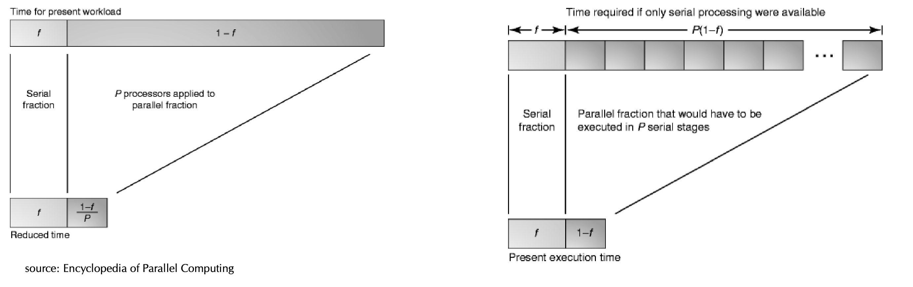

# computer architecture

parallel computing = simultaneous use of compute

_cluster_

- contains multiple nodes / **systems**
- common in high performance computing
- each node has many processors, connected with high bandwidth communication networks

_mainboard / system_

- can have multiple **sockets**

*socket*

- slot that can hold multiple **cpus**

_cpu_

- = central processing unit / processor
- <100 parallel threads
- multicore machines contain multiple **cores**

_gpu_

- = graphics processing unit
- can be integrated into the CPU or be a dedicated card (ie. PCI)
- hides latency with parallel execution
- >1000 parallel threads
- huge number of small **cores**

_core_

- smallest unit that can execute instructions from main memory
- equivalent to a standalone singlecore CPU
- synced with an interconnection network
- contain:
	- arithmetic logic unit ALU
	- floating point unit FPU
	- multiple cache levels to hide memory latency, branch predictions etc.
- instruction set:
	- SIMD = single instruction, multiple data (vector operation)

---

_UMA / NUMA_

- 2 types of multiprocessor systems
- based on how you place the main memory DRAM
- a) uniform memory access
     - = all CPUs access the same memory simultaniously
- b) non-uniform memory access
     - = each CPU might get access to a different memory at a different time
     - happens when systems has multiple sockets
     - most common
     - cache coherency is maintained

_processes vs. threads_

- **processes**:
     - can contain multiple threads
     - heavier, higher isolation, own address space
     - slow inter process communication
     - expensive context switches
- **threads**:
     - lightweight, lower isolation, shared address space
     - fast access to shared variables
     - cheap context switches
- **hyper-threads**:
     - intel term for: simultaneous multithreading SMT
     - logical cores = scheduling multiple thread instructions per core

*levels of parallelism*

- parallelism at bit-level:
	- vector operations
- pipeline parallelism:
	- overlaps the execution of multiple instructions by dividing the execution process into stages (ie. MIPS).
	- if there are no dependencies between instructions, this allows for a higher throughput of instructions executed per unit time.
- parallelism by multiple functional units:
	- instruction-level parallelism ILP
	- executing multiple instructions simultaneously using independent functional units like ALUs (arithmetic logical unit), FPUs (floating-point unit), load/store units or branch units.
- parallelism at process or thread level:
	- multiple cores on a single processor chip each with its own control flow.
	- multiprocessing,
	- multithreading.

*scheduling*

- static = fast, low overhead, can't deal with heterogenous workloads
- dynamic = only for large tasks
- workerpools = use chunk size based on workload

# metrics

_clock speed_

- modern processors do not run all cores with the same frequency
- breakeven efficiency = necessary utilization of a core to match the clock speed of the fastest core in the cpu

_bandwidth_

- number of bytes we can read/write from/to memory in a timeframe
- when we say bandwidth (theoretical) we actually mean throughput (practical metric)

_latency_

- delay between request and response
- when processes are on the same socket, the latency is lower

_speedup_

- $\large S_a(n,p) = \frac{T_{\text{seq}}(n)}{T_{\text{par}}(n,p)}$ = absolute speedup
- $\large S_r(n,p) = \frac{T_{\text{par}}(n, 1)}{T_{\text{par}}(n,p)}$ = relative speedup (strong scaling)
- $\large S(n,p) = \frac{p \cdot T_{\text{par}}(n, 1)}{T_{\text{par}}(p \cdot n,p)}$ = scaled speedup (weak scaling)
- what difference does parallelization make?
- where:
     - $n$ = input size
     - $p$ = number of processors
     - $T_{\text{par}}(n,p)$ = parallel runtime
     - $T_{\text{seq}}(n)$ = best sequential runtime
- use the relative speedup when there isn't a sequential implementation

_efficiency of parallelization_

- $\large E(n,p) = \frac{T_{\text{seq}}(n)}{p \cdot T_{\text{par}}(n,p)} = \frac{1}{p} \cdot S_a(n,p)$
- what difference does each processor make?



*amdahls law (strong scaling)*

- $\large S(n,p)=\frac{{T_{\text{seq}}^*(n)}}{s\cdot{T_{\text{seq}}^*(n)}+\frac{1-s}{p}\cdot{T_{\text{seq}}^*(n)}}=\frac{1}{s+\frac{1-s}{p}}\leq\frac{1}{s}$
- where:
     - $s \in [0;1]$ = sequential fraction
     - $1 -s$ = parallel fraction that is perfectly parallelizable by $p$ processors
     - $T_{\text{seq}}^*(n)$ = best sequential runtime
- strong scaling:
	-  fix $n$, increase $p$
	- ideally it should converge to $1/s$
- intuition:
	- speedup is bounded by sequential fraction

*gustafson-barsis law (weak scaling)*

- $\large S(n,p) =\frac{s+p \cdot (1-s)}{s+(1-s)}=s+p \cdot (1-s)$
- where:
	- $s + (1-s) = 1$
- weak scaling:
	- scale $n$ with $p$ (fix workload per core)
	- ideally the runtime should stay constant, the scaled speedup should be linear
	- find the right workload/core factor
- intuition:
	- speedup isn't bounded by sequantial fraction because the workload scales with the number of processors
	- if the parallel load would have been executed sequentially, it would have taken $p$ times longer

_cost_

- cost:
     - $C = p \cdot T_{\text{par}}(p,n)$
     - time of processor availability
- cost optimal:
     - $p \cdot T_{\text{par}}(p,n) \in O(T_{\text{seq}}(n))$
     - having the same asymptotic growth as the fastest-known sequential algorithm

_work_

- work:
     - $W$
     - time of processor utilization
     - number of instructions that are executed
- work optimal:
     - $W \in O(T_{\text{seq}}(n))$
     - having the same asymptotic growth as the fastest-known sequential algorithm
     - means perfect load balancing between each of $p$


# openmp

```
#pragma omp directive-name [args...]
```

- fork-join parallelism / single program multiple data SMPD.
- globally sequential, locally paralllel.
- master-thread runs in parallel-region just like any other thread in "thread team"

*directives overview*

- loop constructs - like `for`
- sections - independent execution of parallel regions
- task constructs - independent tasks, similar to sections
- single constructs - like `single`, where only one thread is working

*`for` directive*

- eliminate loop-carried dependencies:
	- read-after-write RAW: flow dependence
	- write-after-write WAW: output dependence
	- write-after-read WAR: antidependence
	- read-after-read RAR: input dependence
- loops must be in "canonical form":
	- loop counter variable must be a private integer, that's not modified inside the loop
	- loop invariant must not change during execution (ie. `i<k`)
	- loop increment must grow linearly (ie. not `i*=2`)
	- now `break` instruction. `goto`, `throw` only allowed if the destination is the loop again
- can have conditions, ie. `if(<cond>)`
- if loops are nested with no intermediary instructions, use `collapse(<depth>)`

*`task` directive*

- mostly used for recursion inside a parallel section. distributed among threads in a thread-team.
- `task shared(i)` - share intermediate results
- `taskwait` - barrier for previous task calls
- `depend(in/out/inout:var)` - completion dependency graph between tasks. you can also use `depend(iterator(...))` to run tasks inside a loop

*shared memory*

- variables can be `shared` or `private` / `firstprivate` / `lastprivate`
- private variables are local copies on each thread

*static vs. dynamic load balancing*

- static:
	- = precromputed assignment of tasks to workers
	- good: low overhead
	- bad: possibly inefficient if a worker gets all heavy tasks
- dynamic:
	- = tasks assigned as soon as workers are free again
	- good: fair distribution of work
	- bad: massive overhead

*synchronization*

- enable/disable barrier:
	- `barrier` - barrier synchronization for all threads in team
	- `no wait` - disable barrier synchronization at the end of parallel region
- directive args:
	- `reduction(<op>:var)` - use in a for-loop that works similar to `reduce()` in python
	- `master` - only ran by master thread. no implicit barrier at the end.
	- `single` - only ran by a single thread
	- `critical` - mutual exclusion in critical segment
	- `atomic` - mutual exclusion, special hardware instructions
- dependencies:
	- `depend(in: var)` - consumer
	- `depend(out: var)` - producer
	- `depend(inout: var)` - consumer that also updates

# optimization tricks

*false sharing*

- the cache sits between CPU and main memory MM
- the cache holds copies of chunks of data from MM as cache-lines/blocks
- multicore systems that are cache-coherent have shared caches at some level
- if a thread updates a cache-line, then the `dirty` flag gets set, which invalidates the cache from all other threads and forces them to load the most recent state from DRAM
- by using a specific write you can monitor cache misses on all levels with the `LIKWID` tool

example:

- 4 threads, each writing into `int counter[4];`
- cache line size = 64 Bytes (see:  `cat /proc/cpuinfo | grep cache`)
- integer size = 4 Bytes
- integers per cache line = 64/4 = 16 int
- runtime when just using `malloc()` = 1.374864
- runtime when using `posix_memalign((void**)&counter, 64, nt*64);` = 0.330840
- see: https://stackoverflow.com/a/6563142/13045051

*write-allocate policy*

- avoid write-misses (opposite to cache-misses)
- allocate memory before writes, so hopefully subsequent writes go to cache

*loop unrolling*

- increases instruction level parallelism if used with the right optimization flags during compilation.

```C
for(i=...) {
    sum += a * b[i]
}

// unrolling loop
for(i=...) {
    sum0 += a * b[i]
    sum1 += a * b[i + 1]
    sum2 += a * b[i + 2]
    sum3 += a * b[i + 3]
    ...
}
sum += sum0 + sum1 + ...
```

# roofline model

> S. Williams, A. Waterman, and D. Patterson. “Roofline: An Insightful Visual Performance Model for Multicore Architectures”. In: Communications of the ACM 52.4 (Apr. 2009), p. 65

see: https://crd.lbl.gov/divisions/amcr/computer-science-amcr/par/research/roofline/introduction/

performance models help us estimate how fast code can run at most.

we want to attain peak performance (as FLOPs/s)

- compute limit:
	- = max GFLOPs/s as floating point operations per processor
- communication limit:
	- = max GB/s as memory bandwidth to read data from DRAM to CPU (stream bandwidth)
- **arithmetic intensity AI**:
	- = FLOPs/Bytes of kernel is its ratio of computation vs. traffic
	- programs are kernels: they are thought of as "sequences of computational kernels" - ie. matrix-vector operations, FFT, Stencil, …
	- we want to know the performance of computational kernels
	- use `LIKWID` to measure

the fastest runtime in GFLOPs/s is bounded by the minimum of either:

- a) compute-bound = the machine's max GFLOPs/s
- b) bandwidth-bound = arithmetic intensity $\cdot$ the machine's max GB/s

# cuda

docs:

- there are no emulators, you need a nvidia gpu to write cuda
- https://docs.nvidia.com/cuda/cuda-c-programming-guide/index.html
- https://developer.nvidia.com/blog/cuda-refresher-cuda-programming-model/

*overview of accelerators*

- **hardware**:
	- nvidia: GPUs
	- amd: ROCm
	- intel: xeon phi series
	- fpgas (field programmable gate arrays)
- **software**:
	- openACC:
		- pragma-based, similar to openMP
	- openMP with offloading:
		- not market-ready, gcc and clang don't work well
	- openCL (open computing language):
		- portable, works on both multicore cpus and gpus, very low level and verbose
	- cuda:
		- nvidia's proprietary api for their gpus
		- c, c++, fortran bindings
		- wrappers in julia, python that use LLVM to generate code

*cuda terminology*

- **host** (cpu, memory) launches kernels on **device** (gpu, memory) and then copies results back to own memory
- a device can run multiple kernels concurrently

*cuda computer architecture*

- single instruction multiple thread SIMT
- cuda core/streaming processor SP $\in$ streaming multiprocessor SM $\in$ GPU
	- SP = one thread instruction at a time. optimized for floating-point operations. have their own registers, shared memory, cache.
	- warp = group of 32 threads in the SM, executing the same instruction at a same time, but on different data. smallest possible execution unit.
	- thread block = group of 1 to 64 warps
	- scheduler/dispatcher = compute resource manager

*cuda thread organization*

- thread $\in$ thread block $\in$ kernel grid
	- thread = runs on a single SP
	- thread block = runs on a single SM
	- kernel grid = runs on a single GPU

*memory*

- global memory: `cudaMalloc`
	- shared between all thread blocks
	- memory access pattern is important for latency:
		- memory alignment = utilize max space in memory blocks with respect to boundaries
		- memory coalescing = access contiguous chunks of memory
- unified memory (since version 6.0): `cudaMallocManaged`
	- unified virtual addressing UVA
	- accessible by host and device
	- simpler code, but reduces performance
- access pattern:
	- make sure data is aligned (starts at 0 index)
	- make sure data is calesced (contiguous)

*syntax*

```
kernel <<<num_Blocks,threads_per_block>>> (args...);

cudaDeviceSynchronize();
```

- kernels are functions
- max number depends on hardware specs
- threads and thread-blocks can be organized into 1D-3D arrays with own coordinates

# mpi

docs: https://www.mpi-forum.org/docs/mpi-3.1/

*mpi*

- = message passing interface
- interprocess communication IPC library for distributed memory computing
	- start: all machines call `MPI_Init` to each create a bunch of processes that make up the `MPI_COMM_WORLD`, visible globally by all processes, used for distributed communication.
	- end: all machines call `MPI_FINALIZE` to clean up memory.
- processes have a rank (id), and are part of a group
- messages have a tag (id), type, number of elems

*p2p communication*

- = point-to-point communication
- can be blocking or non-blocking
- sender: `MPI_Send`
- receiver: `MPI_Recv`

*collective communication*

- broadcast: `MPI_Bcast`
- distribute and collect vector elems: `MPI_Scatter`, `MPI_Gather`
- block until all receive: `MPI_Barrier`
- reduce: `MPI_Reduce`, `MPI_Allreduce`
